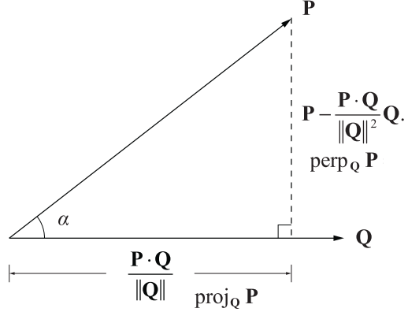
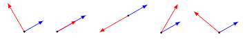
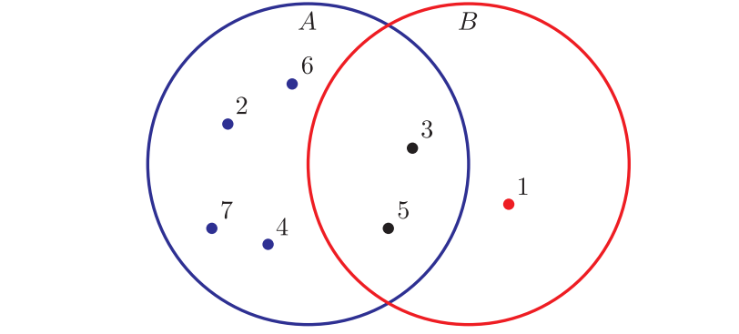

alias:: dot product, scalar product

- ## 📝Definition
	- An inner product is a generalization of the dot product. In a [[vector]] space, it is a way to multiply vectors together, with the result of this multiplication being a [[scalar]].
	- The dot product of two $n$-dimensional vectors $P$ and $Q$, is the **scalar** quantity given by the formula.
		- $$
		  P\cdot Q=\sum^{n}_{i=1}P_iQ_i
		  $$
	- Dot product is also called scalar product since the result is a scalar.
- ## 🧠Intuition
	- It **measure the difference** between the directions in which the two vectors point.
- # ✒Notation
	- Suppose $a, b$ are vectors. Then the expression of inner product is
	  $$
	  a^Tb = a_1b_1+a_2b_2+\cdots+a_nb_n
	  $$
	  There are other representation of *dot product*.
	  $$
	  \langle a,b\rangle  , \langle a|b\rangle  , (a,b),a\cdot b
	  $$
	- 📌Dot product represented in [[matrix]] format
		- $$
		  P^T\cdot Q=[P_1\quad P_2\quad...\quad P_n]\begin{bmatrix}Q_1\\Q_2\\\vdots\\Q_n\end{bmatrix}
		  $$
		- Tips: row vector $\cdot$ column vector = scalar
- ## ⛈Characteristics / Properties
	- 📌dot product is **element-wise** operation
		- $$
		  P\cdot Q=P_1\cdot Q_1+P_2\cdot Q_2+...+P_n\cdot Q_n
		  $$
		- $$
		  a^Tb = a_1b_1+a_2b_2+\cdots+a_nb_n
		  $$
	- 📌Properties of dot product.
		- Notation Version 1
			- Suppose $a, b, c$ are vectors and $\gamma$ is scalar
			- $$
			  \begin{align}
			  a^Tb &= b^Ta\\
			  (\gamma a)^Tb &= \gamma(a^Tb)\\
			  (a+b)^Tc &= a^Tc+b^Tc
			  \end{align}
			  $$
			- With preceding properties, it extends to
				- $$
				  (a+b)^T(c+d) = a^Tc+a^Td+b^Tc+b^Td
				  $$
				- in short, why the above would work? it is very easy to understand.
					- $(a+b)$ is a vector
					- $(c+d)$ is also a vector
					- $(a+b)$ has to transpose into $(a+b)^T$ , a.k.a. a row vector
					- $(a+b)^T(c+d)$ , row vector $\cdot$ column vector is a *scalar*.  (if their dim are the same)
		- Notation Version 2
			- Given any scalar $a$ and any three vectors $P, Q$, and $R$, the following properties hold.
			- $$
			  \begin{align}
			  P\cdot Q&= Q\cdot P \\
			  (aP)\cdot Q&=a(P\cdot Q)\\
			  P\cdot(Q+R)&= P\cdot Q+ P\cdot R\\
			  P\cdot P&=\lVert P\rVert^2\\
			  |P\cdot Q|&\leq \lVert P\rVert\lVert Q\rVert
			  \end{align}
			  $$
- ## 💫Support Operation
  Although inner product itself is operation, by combining different inner product can create 🌟**interesting and special** operations.
	- 📌 $i$-th element
		- Suppose we denote
			- $e_i$ , $i$-th unit vector
			- $a$, $n$-vector
		- We can have $e_{i}^{T}a=a_i$ , this can **filter out** the $i$-th element of vector $a$.🌟
		- Why? Because except $i$-th column of $e_{i}^{T}$ is $1$, others are all $0$.
		- TODO a diagram here could be better
	- 📌sum
		- $$
		  n\text{-dimension ones vector }\bold{1}\\
		  \bold{1}^Ta = a_1+\cdots+a_n
		  $$
	- 📌average / mean
		- $$
		  (\bold{1}/n)^Ta = (a_1+\cdots+a_n)/n
		  $$
	- 📌sum of squares
		- $$
		  a^Ta = a_1^2+\cdots+a_n^2
		  $$
	- 📌Projection and Perpendicular
		- $$
		  \begin{align}
		  \text{proj}_QP &= \frac{P\cdot Q}{\lVert Q\rVert^2}Q\\\\
		  \text{perp}_QP &= P-\text{proj}_QP\\
		  &=P-\frac{P\cdot Q}{\lVert Q\rVert^2}Q
		  \end{align}
		  $$
		- {:height 300, :width 300}
	- 📌Angle
		- Definition
			- angle between two nonzero vectors $a, b$ defined as
				- $$
				  \begin{align}
				  \angle(a,b)=\arccos\bigg(\frac{a^Tb}{\lVert a\rVert\lVert b\rVert}\bigg)
				  \end{align}
				  $$
			- $\angle(a,b)$ is the number in $[0,\pi]$ that satisfies
				- $$
				  a^Tb=\lVert a\rVert\lVert b\rVert\cos(\angle(a,b))
				  $$
			- Classification of angles
				- Let $\theta$ denote the angle between vector $a,b$
					- $$
					  \theta=\angle(a,b)
					  $$
				- $\theta=\pi/2=90\degree$
				- $\theta=0$: $a$ and $b$ are aligned $(a^Tb=\lVert a\rVert\lVert b)$
				- $\theta=\pi=180\degree$: $a$ and $b$ are anti-aligned $(a^Tb=-\lVert a\rVert\lVert b)$
				- $\theta\leq\pi/2=90\degree$: $a$ and $b$ make an acute angle $(a^Tb\geq0)$
				- $\theta\geq\pi/2=90\degree$: $a$ and $b$ make an obtuse angle $(a^Tb\leq0)$
				- From left to right are the angles stated above.
				  {:height 300, :width 300}
		- Definition
			- Given two $n$-dimensional vectors $P$ and $Q$, the dot product $P\cdot Q$ satisfies the equation. $a$ is the angle between $P$ and $Q$.
				- $$
				  P\cdot Q = \lVert P\rVert\cdot\lVert Q\rVert\cos{a}
				  $$
			- Fact
				- This leads to 2 facts.
				- **Fact**:  in light of theorem: if two vector $P\cdot Q=0$, they are **orthogonal**.
				- **Fact**: $P\cdot Q>0$, they are **on the same side**.  $P\cdot Q<0$, they are **on the opposite side**.
- ## 📈Diagram  
  {:height 300, :width 300}
- ## ✒Descriptive Explanation  
  A narrative... a descriptive words subject on the concept... 描述性解释…
- ## 👑Importance
  No matter good or bad, this subject plays an important role...
- ## 🌓Complement  
  What is the complement of this subject? e.g. vector-covector, constructor-destructor
- ## 📏Proof   
  To prove something...
- ## 🗃Example  
  Example is the most straightforward way to understand a mathematical concept.
- ## 🤳Applicability  
  What are the situations in which this subject can be applied?
	- 📌co-occurrence
		- $a, b$ are $n$-vectors that describe occurrence.  i.e. each of them is either 1(exist) or 0(not exist).
		- Then the *total sum of co-occurrence* is:
		  $$
		  a=(0,1,1,1,1,1,1)\quad b= (1,0,1,0,1,0,0)\\
		  a^Tb = 2
		  $$
		  meaning, there are $2$ co-occurrence. See the `3` and `5` of the following diagram.
		- {:height 300, :width 300}
	- 📌weights / features / scores
		- We have the following notation.
			- $f$ as $n$-vector for features, like ages, income, etc.
			- $w$ as $n$-vector for the weights for every feature, like the weight of income maybe 1.3, etc.
			- $s$ as scalar, the sum of as the credit score for a person.
		- Then we could have the following expression.
		  $$
		  s = w^Tf
		  $$
	- 📌document sentiment analysis
		- We have the following notation
			- $x$ as $n$-vector, standing for $n$ words, each element records the appearance of the word in a book
			- $t$ as $n$-vector are the corresponding type of the word. `-1=negative, 0=neutral, 1=positive` , e.g. "sad" is `-1`
		- Then the measure of the sentiment is:
		  $$
		  t^Tx
		  $$
- # 🧬Related Elements  / Byproduct
  The closest pattern to current one, what are their differences?
	- ## 📌Inner Product Function
	  id:: 63214f0c-c066-4f21-85f8-69acff34dc3b
		- Inner product function can be conceived of as the **byproduct of inner product**.
		- An inner product function is like:
		  $$
		  f(x)=a^Tx = a_1x_1+a_2x_2+\cdots+a_nx_n
		  $$
		- $a$:   is a $n$-vector
		- $x$:   is also a $n$-vector
		- Since it is an inner product function, $f(x)$ therefore can be seen as a **weighted sum function** where $a$​ is the weight vector.
- ## 🧪Composition  
  What kind of stuffs composite this subject?
- ## 🏷(Sub)Categories  
  What are the sub objects of this subject?
- ## ⚖Laws  
  The laws related to this math concepts.
- ## 🎯Intent  
  A short description what does this thing do?
- ## 🚀Benefit / Pros
   A scenario that illustrates the benefit this object provides.
- ## ⌨Sample Code
   Code fragments
- ## 🔎Implementation
   The code or technical stuffs implement this.
- ## 🕳Pitfalls / Cons
  Be aware of the pitfalls when using this stuffs... (especially considering edge cases)
- ## 📋Prerequisite
  Some techniques and objects only work under certain condition.
- ## 🐍Algorithm
  Algorithm relates to this stuff..
- ## 🥼Expert's Advice
  See what experts addressed.
- ## 🧱Structure
  Any other hierarchical issues?