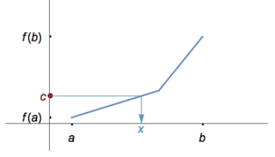
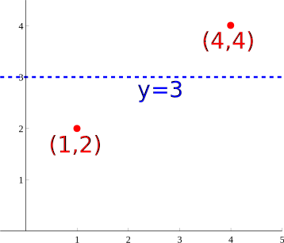
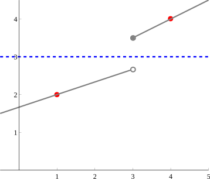

- # 🍴Quick Digest -> Intermediate Value Theorem
	- ## 📝Definition
	  if $f$ is a function which is [[Continuous]] on the interval $[a,b]$ and $M$ lies between the value $f(a)$ and $f(b)$, then there is at least one point $c$ between $a$ and $b$ such that $f(c)=M$.
	  (A function is **continuous on a closed interval** [a,b] if it is right-continuous at a, left-continuous at b, and continuous at all points between a and b.)
	- ## 🧠Intuition
	  Find an intuitive way of understanding this concept.
	- ## 🧮Expression
	  $$
	  \begin{align}
	  f(x)&=
	  \end{align}
	  $$
	- ## 📈Diagram
	  {:height 136, :width 222}
	- ## ✒Descriptive Explanation
	  The Intermediate Value Theorem is <u>profound</u> because it <u>takes information that is local</u> by nature, and allows you to <u>conclude a global result</u>. [[Continuity]] at a point is local information, because it only requires knowledge of the function's behavior near that point. But somehow, if we know this fact at every point on an interval, then the Intermediate Value Theorem tells us something about the overall, or global behavior - namely, that the function has to take on a particular value, or its graph has to cross a certain line.
	- ## 🌓Complement
	  What is the complement of this subject? e.g. vector-covector, constructor-destructor
	- ## 🗃Example
	  Example is the most straightforward way to understand a mathematical concept.
	- ## 🤳Applicability
	   What are the situations in which this subject can be applied?
	- ## 🧪Composition
	  What kind of stuffs composite this subject?
	- ## 🕳Pitfall
	  What should we be awared?
		- 📌Suppose that $f(1)=2$ and $f(4)=4$ . Must the graph $f$ of intersect the line $y=3$?
			- diagram
			  {:height 136, :width 222}
			- answer:
				- Not necessarily. Because it doesn't say this is a continuous function. Therefore the following function need not to intersect with the line.
				- A diagram prove that.
				  {:height 136, :width 222}
	- ## 🏷(Sub)Categories
	  What are the sub objects of this subject?
	- ## ⚖Laws
	  The laws related to this math concepts.
	- ## 🎯Intent
	   A short description what does this thing do?
	- ## 🙋‍♂️Related Elements
	   The closest pattern to current one, what are their differences?