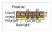

- 📝Definition
    - Liquid crystal displays (LCDs) are an example of the transmissive type. A liquid crystal is a material whose molecular structure enables it to rotate the polarization of light that passes through it, and the degree of rotation can be adjusted by an applied voltage.
    - {:height 200, :width 200}
    