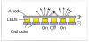
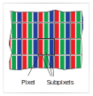

- 📝Definition
    - Light-emitting diode (LED) displays are of the emissive type. Each pixel is composed of one or more LEDs, which are semiconductor devices
      (based on inorganic or organic semiconductors) that emit light with intensity depending on the electrical current passing through them.
    - {:height 200, :width 200}
    
- 💫Operation
    - Display
        - The pixels in a color display are divided into three independently controlled subpixels—one red, one green, and one blue—each with its own LED made using different materials so that they emit light of different colors.
        - {:height 200, :width 200}
        