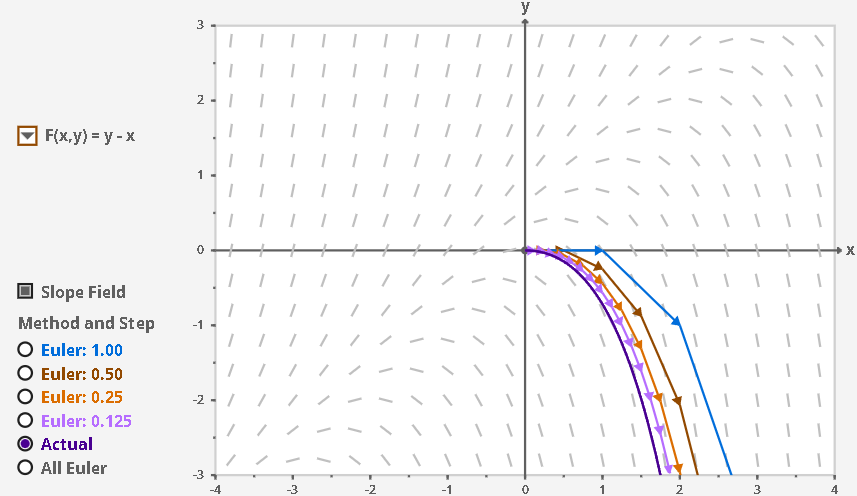

alias:: Euler

- # Euler's Method
	- ## 📝Definition
		- Given the differential equation :
			- $$
			  \frac{dy}{dx}=x+y
			  $$
		- Euler's method as Solution:
			- 1.Choose a step size $h$ (The smaller the step size, the more accurate the approximation.)
			- 2.Let $(x_0,y_0)$ be the initial condition.
			- 3.We can use the differential equation and step size to determine the value of the function at $x_1=x+h$:
				- $$
				  \begin{align}
				  x_1 &= x_0+h\\
				  y_1 &= y_0+(x_0+y_0)h\quad\text{linear approximation}
				  \end{align}
				  $$
			- 4.Iterate this process:
				- $$
				  \begin{align}
				  x_{k+1} &= x_k+h\\
				  y_{k+1} &= y_k+(x_k+y_k)h\quad\text{linear approximation}
				  \end{align}
				  $$
	- ## 📈Diagram
		- {:height 300, :width 500}
		- The preceding diagram shows the intuition of Euler method. You can try it [here](https://mathlets.org/mathlets/eulers-method/).
	- ## 🧠Intuition
		- A) Iterative process
		- B) Step size matter
		- C) Approximation is never perfect
	- ## 🗃Example
		- 📌An example using Euler's Method
			- Question:
				- Consider the differential equation $\frac{dy}{dx}=x+y$. Find the linear approximation for the solution function $f(x)$ that passes through the point $(0,1)$.
			- Thinking:
				- We don't know what this function is, but we do know a value of the function, as well as a value of the derivative, so we can use a [[Linear Approximation]]!
			- Solution:
				- Step 1, linear approximation
					- The linear approximation takes the form
					- $$
					  \begin{align}
					  f(x)&\approx f(0)+f'(0)x\\
					  &=1+\frac{dy}{dx}\bigg|_{(0,1)}x
					  1+x\end{align}
					  $$
				- Step 2, iterative process
					- We can use the result from last step to approximate when $x=0.1$.
						- $$
						  f(0.1)\approx1+0.1\approx1.1
						  $$
						- $$
						  \frac{dy}{dx}\bigg|_{(0.1,1.1)}=1.2
						  $$
					- We can use the result from last step to approximate when $x=0.2$.
						- $$
						  \begin{align}
						  f(x)& \approx f(0.1) + f'(0.1)(x-0.1)\\
						  &=1.1+1.2(x-0.1)
						  \end{align}
						  $$
						- $$
						  f(0.2)\approx1.1+1.2(0.1)=1.22
						  $$
				- keep going...