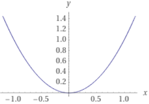
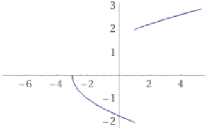
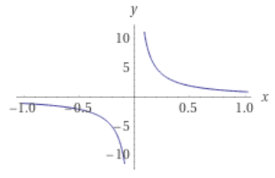
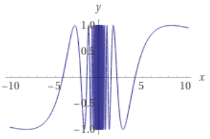
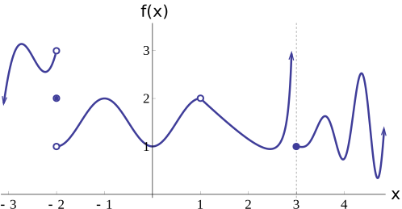
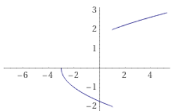
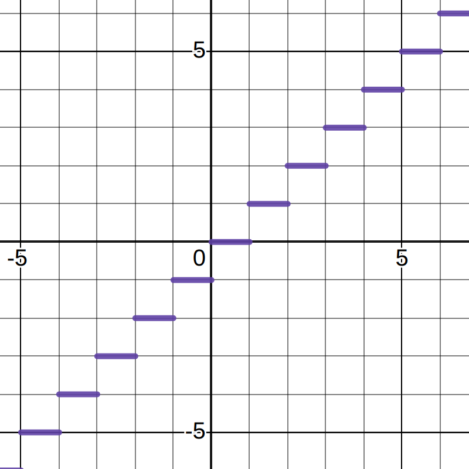

- # Limit
	- ## 📝Definition
	  If a function $f(x)$ <u>approaches</u> some value $L$ as $x$ approaches $a$ from <u>both</u> *the right and the left*, then the limit of $f(x)$ exists and equals $L$.
	- ## 🧪Composition
	  Limit is a limit only both of the following exist:
		- [[Right-hand limit]]
		- [[Left-hand limit]]
	- ## 🧠Intuition
	  Find an intuitive way of understanding this concept.
		- 📌Magic of Limit by adding $\lim_{b\to a}$
		  id:: 630e00ad-fe6c-4845-b1b1-c0ea4cba0651
			- Math is amazing, [these different interpretation](((630dd309-601e-461e-b09f-ee409b04543e))) somehow are correlated altogether!! If we were speaking in the philosophy of "limit", everything is different and fun!
			- $$
			  \begin{align}
			  \text{geometric: }&  &\text{slope of secant line}\quad&\text{---}\lim_{b\to a}\text{-->} &\text{slope of tangent line}\\
			  \text{symbolic: }&   &\frac{f(b)-f(a)}{b-a}\quad&\text{---}\lim_{b\to a}\text{-->} &f'(a)\\
			  \text{physical: }&   &\text{average rate of change}\quad&\text{---}\lim_{b\to a}\text{-->} &\text{instantaneous rate of change}\\
			  \end{align}
			  $$
	- ## 🧮Expression
	  If
	  $$
	  \lim_{x\to a^+}f(x)=\lim_{x\to a^-}f(x)=L
	  $$
	  then
	  $$
	  \lim_{x\to a}f(x)=L
	  $$
	  Alternatively,
	  $$
	  f(x)\to L \quad \text{as} \quad x\to a
	  $$
	  Remember that $x$ is <u>approaching</u> $a$ but does **not equal** $a$.
	- ## 📈Diagram
		- 📌One table summarize limit
			- | Index | Right-hand limit | Left-hand limit | R & L                                        | Example                                                      | Image                                                        |
			  | ----- | ---------------- | --------------- | -------------------------------------------- | ------------------------------------------------------------ | ------------------------------------------------------------ |
			  | 1    | exist✔           | exist✔          | $=$✔exist and equal                          | $f(x)=x^2$ looks at $x=0$                                 |  |
			  | 2   | exist✔           | exist✔          | $\neq$❌exist but not equal                   | $f(x) = \frac{\sqrt{(3-5x+x^3+x^2)}}{(x-1)}$ looks at $x=1$ |  |
			  | 3    | not exist❌       | not exist❌      | ❌$L$&$R$ both blows up to $\pm\infin$        | $f(x)=\frac{1}{x}$ looks at $x=0$                         |  |
			  | 4    | not exist❌       | not exist❌      | ❌oscillates and never settle down to a value | $f(x)=\sin(13/x)$ looks at $x=0$                          |  |
	- ## 🤳Applicability
	  There are many application taking advantages from limit.
		- To do an asymptotics, you can see here
			- ((63076a15-0dee-48d0-9112-fe2b1af3d855))
	- ## ⚖Laws
	  id:: 630610a7-3f17-43a2-b0a5-227754788bbb
	  Suppose:
	  $$
	  \lim_{x\to a}f(x)=L,\quad \lim_{x\to a}g(x)=M
	  $$
	  Then we get the following Limit Laws:
		- 📌Limit Law for Addition
		  $$
		  \lim_{x\to a}[f(x)+g(x)]=L+M
		  $$
		- 📌Limit Law for Subtraction
		  $$
		  \lim_{x\to a}[f(x)-g(x)]=L-M
		  $$
		- 📌Limit Law for Multiplication
		  $$
		  \lim_{x\to a}[f(x)\cdot g(x)]=L\cdot M
		  $$
		- 📌Limit Law for Division
		  id:: 630610a7-4253-4a78-b464-32c386453ebc
			- For:
			  $$
			  \lim_{x\to a}\frac{f(x)}{g(x)}
			  $$
			- If:
			  $$
			  \lim_{x\to a}f(x)=L\quad\text{and } \lim_{x\to a}g(x)=M
			  $$
			- then:
				- Case 1: If $M\neq0,\text{then }\lim_{x\to a}\frac{f(x)}{g(x)}=\frac{L}{M}$
				  id:: 6308de61-8153-4fdc-baaa-9d8a2521b141
				- Case 2: If $M=0,\text{but }L\neq0,\text{then }\lim_{x\to a}\frac{f(x)}{g(x)}$ [[DNE]]
				  id:: 6308dedb-1e62-442c-8d15-a960e234c452
				- Case 3: If both $M=0$ and $L=0$
				  id:: 6308dee0-0325-42bd-9491-46e21381dc9f
					- then $\lim_{x\to a}\frac{f(x)}{g(x)}$ might be exist, or it might not exist. There are 2 strategies to solve this in general:
						- Use [[Factorization]]. More work is necessary to determine whether the last type of limit exists, and what it is if it does exist.
						- Use [[L'Hôpital's Rule]] to solve.
	- ## 🗃Example
		- 📌example covering [[DNE]], [[Left-hand limit]], and [[Right-hand limit]].
		  id:: 6308cc61-3742-4fbf-bf64-89e8a1b797fe
			- the graph is the following
			  {:height 256, :width 456}
			- identify the continuity at $x=-2, x=1, x=3$.
			- for $x=-2$
				- left-hand limit is
				  $$
				  \lim_{x\to(-2)^-}f(x)=3
				  $$
				- right-hand limit is
				  $$
				  \lim_{x\to(-2)^+}f(x)=1
				  $$
				- therefore the left and right limit don't match, it is
				  $$
				  \lim_{x\to(-2)}f(x)=DNE
				  $$
				- but at this point, $f(-2)$ exist, the blue dot is solid
				  $$
				  f(-2)=2
				  $$
			- for $x=1$
				- left-hand limit is
				  $$
				  \lim_{x\to1^-}f(x)=2
				  $$
				- right-hand limit is
				  $$
				  \lim_{x\to1^+}f(x)=2
				  $$
				- therefore the left and right limit matched, and it is
				  $$
				  \lim_{x\to1}f(x)=2
				  $$
				- but at this point, $f(1)=DNE$ , the blue dot is hollow
				  $$
				  f(1)=DNE
				  $$
			- for $x=3$
				- left-hand limit is
				  $$
				  \lim_{x\to3^-}f(x)=DNE
				  $$
				- right-hand limit is
				  $$
				  \lim_{x\to3^+}f(x)=1
				  $$
				- therefore the left and right limit don't match, and it is
				  $$
				  \lim_{x\to3}f(x)=DNE
				  $$
				- but at this point, $f(3)=1$, the blue dot is solid.
				  $$
				  f(3)=1
				  $$
		- 📌example that [[Left-hand limit]] and [[Right-hand limit]] do not have to agree
		  id:: 6308cd95-5b26-44c8-9d4e-d11579701633
			- The following function demonstrates the left-hand limit and right-hand limit may not be equal at $x=1$.
			- $$
			  f(x) = \frac{\sqrt{(3-5x+x^3+x^2)}}{(x-1)}
			  $$
			- To calculate the limit, we can approaches the value as follow.
				- from left
				  $$
				  L\begin{cases}x=0\\x=0.5\\x=0.9\\x=0.99\end{cases}
				  $$
				- from right
				  $$
				  R\begin{cases}x=2\\x=1.5\\x=1.1\\x=1.01\end{cases}
				  $$
				- therefore the left and right don't agree
			- Here it is a diagram
			  {:height 105, :width 165}
		- 📌example of [[Floor Function]], which has very interesting characteristics on limit
			- here is the diagram
			  {:height 105, :width 165}
			- the limit is quite fun
			  $$
			  \begin{align}
			  \lim_{x\to2^-}\lfloor x\rfloor&=1\\
			  \lim_{x\to2^+}\lfloor x\rfloor&=2\\
			  \lim_{x\to2}\lfloor x\rfloor&=DNE\\
			  \lfloor2\rfloor&=2
			  \end{align}
			  $$
		- 📌example of using smart [[algebraic]] trick to solve limit
		  id:: 6308dfd3-1a08-418a-9320-7ab61e116719
			- Solve the limit of
			  $$
			  \lim_{x\to1}\frac{x^{10}-1}{x^2-1}
			  $$
			- Solution
				- the limit is with [[indeterminate form]] when $x=1, \frac{x^{10}-1}{x^2-1}=\frac{0}{0}$
				- the trick is divide $x-1$ on numerator and denominator and we got
				- $$
				  \lim_{x\to1}\frac{x^{10}-1}{x^2-1}=\lim_{x\to1}\frac{(x^{10}-1)/(x-1)}{(x^2-1)/(x-1)}
				  $$
				- see the numerator first
					- let $f(x)=x^{10}-1$, therefore $f(1)=0$
					- hence the numerator can be written like so
					- $$
					  \frac{x^{10}-1-0}{x-1}=\frac{f(x)-f(1)}{(x-1)}
					  $$
					- and this is exactly the definition of $f'(1)$
					- we know that $f'(x)=10x^9$, and so $f'(1)=10$
				- similarly, we can see the denominator
					- let $g(x)=x^2-1$
					- ...
					- $g'(x)=2x$
				- combine all the information we can have
				  $$
				  \lim_{x\to1}\frac{x^{10}-1}{x^2-1}=\lim_{x\to1}\frac{(x^{10}-1)/(x-1)}{(x^2-1)/(x-1)}=\lim_{x\to1}\frac{f'(x)}{g'(x)}=\lim_{x\to1}\frac{10x^9}{2x}=\frac{10}{2}=5
				  $$
		- 📌example using [limit laws](((630610a7-3f17-43a2-b0a5-227754788bbb))) to calculate the limit
			- Suppose that we have 3 functions:
			  $$
			  \begin{align}
			  \lim_{x\to-1}f(x)&=0\\
			  \lim_{x\to-1}g(x)&=17\\
			  \lim_{x\to-1}h(x)&=0
			  \end{align}
			  $$
			- Then we have:
			  $$
			  \begin{align}
			  \lim_{x\to-1}g(x)h(x)&=0\\
			  \lim_{x\to-1}\frac{g(x)}{f(x)}&=DNE\\
			  \lim_{x\to-1}f(x)+g(x)+h(x)&=17\\
			  \lim_{x\to-1}\frac{f(x)}{h(x)}&=\text{Cannot be determined based on the information given}\\
			  \lim_{x\to-1}\frac{f(x)+h(x)}{g(x)}&=0
			  \end{align}
			  $$
		- 📌example on solving the cases of [limit law division](((630610a7-4253-4a78-b464-32c386453ebc)))
			- example on solving [case 1](((6308de61-8153-4fdc-baaa-9d8a2521b141)))
				- $$
				  \begin{align}
				  \lim_{x\to2}\frac{1/x+x^2}{x-3}&=\frac{4.5}{-1}=-4.5\quad\text{(Case 1)}\\
				  \end{align}
				  $$
			- example on solving [case 2](((6308dedb-1e62-442c-8d15-a960e234c452)))
				- $$
				  \begin{align}
				  \lim_{x\to0^+}\frac{2\cos x+1}{x^2+x}&=\frac{2\times1+1}{0+0} = DNE\quad\text{(Case 2)}\\
				  \end{align}
				  $$
			- example on solving [case 3](((6308dee0-0325-42bd-9491-46e21381dc9f))), here using [[L'Hôpital's Rule]] is much simpler. But we use [[Factorization]] for learning purpose.
				- example 1
				  $$
				  \begin{align}
				  \lim_{x\to2}\frac{12/x-3x}{2-3x+x^2}&=-6\quad\text{(Case 3, elaborate👇)}\\
				  &=\lim_{x\to2}\frac{x(12/x-3x)}{x(2-3x+x^2)}\\
				  &=\lim_{x\to2}\frac{12-3x^2}{x(x^2-3x+2)}\\
				  &=\lim_{x\to2}-\frac{3x^2-12}{x(x^2-3x+2)}\\
				  &=\lim_{x\to2}-\frac{3(x^2-4)}{x(x^2-3x+2)}\\
				  &=\lim_{x\to2}-\frac{3(x+2)(x-2)}{x(x-1)(x-2)}\\
				  &=\lim_{x\to2}-\frac{3(x+2)\cancel{(x-2)}}{x(x-1)\cancel{(x-2)}}\\
				  &=\lim_{x\to2}-\frac{3(2+2)}{2(2-1)}=-6
				  \end{align}
				  $$
				- example 2
				  $$
				  \begin{align}
				  \lim_{x\to3}\frac{2x^2-10x+12}{x^3-6x^2+9x}&=\lim_{x\to3}\frac{2(x^2-5x+6)}{x(x^2-6x+9)}\\
				  &=\lim_{x\to3}\frac{2(x-2)(x-3)}{x(x-3)^2}\\
				  &=\lim_{x\to3}\frac{2(x-2)}{x(x-3)}\\
				  &=\lim_{x\to3}\frac{2(3-2)}{3(3-3)}\\
				  &=\lim_{x\to3}\frac{2\times1}{0}\\
				  \text{therefore, the result is }DNE
				  \end{align}
				  $$
				- example 3
				  $$
				  \begin{align}
				  \lim_{x\to0}\frac{3x^3+x^2}{x^3+x^2+x}&=\lim_{x\to0}\frac{x^2(3x+1)}{x^2(x+1+\frac{1}{x})}\\
				  &=\lim_{x\to0}\frac{3x+1}{x+1+\frac{1}{x}}\\
				  &=\lim_{x\to0}\frac{3\times0+1}{0+1+\frac{1}{0}}\\
				  &=\lim_{x\to0}\frac{1}{1+\infin}\\
				  &=\text{because denominator is + infinity, therefore the whole is 0}\\
				  &=0
				  \end{align}
				  $$
				- example 4
				  $$
				  \begin{align}
				  \lim_{x\to-1}\frac{2x^2+7x+5}{x+1} &= \lim_{x\to-1}\frac{2(x^2+\frac{7}{2}x+\frac{5}{2})}{x+1}\\
				  &= \lim_{x\to-1}\frac{2(x+1)(x+\frac{5}{2})}{x+1}\\
				  &= \lim_{x\to-1}\frac{2\cancel{(x+1)}(x+\frac{5}{2})}{\cancel{x+1}}\\
				  &= \lim_{x\to-1}2(-1+\frac{5}{2})=3\\
				  \end{align}
				  $$
	- ## ✒Descriptive Explanation
	  A narrative... a descriptive words subject on the concept... 描述性解释…
	- ## 🌓Complement
	  What is the complement of this subject? e.g. vector-covector, constructor-destructor
	- ## 🏷(Sub)Categories
	  What are the sub objects of this subject?
	- ## 🎯Intent
	   A short description what does this thing do?
- # 🧬Related Elements
   The closest pattern to current one, what are their differences?
	- {{embed ((6322bf32-04a2-4be3-b166-6e9d1600a8e9))}}