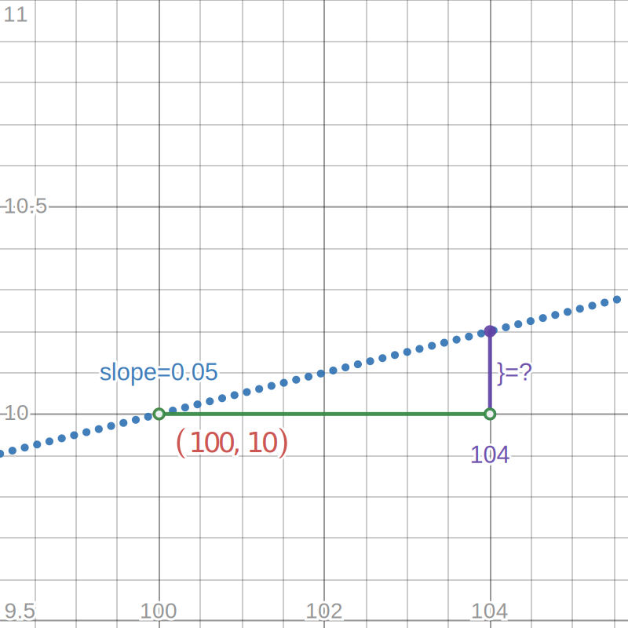
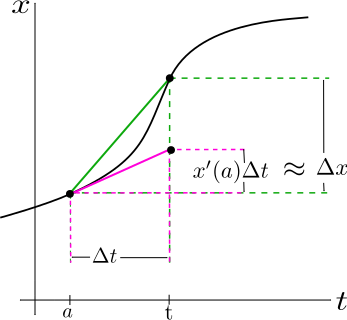
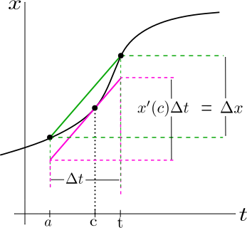

- # 📝Definition
	- By [Wolfram Math World](https://mathworld.wolfram.com/LinearApproximation.html) (more mathematical "strict definition"), A linear approximation to a function $f(x)$ at a point $x_0$ can be computed by taking the first term in the Taylor series:
	  $$
	  f(x_0+\Delta x)=f(x_0)+f'(x_0)\Delta x+...
	  $$
	- By [MIT OpenCourseWare](https://ocw.mit.edu/courses/18-01-calculus-i-single-variable-calculus-fall-2020/) (more intuitive), The linear approximation for a function $f$ near a point $x=a$ is given by the following equivalent formulas:
	  id:: 630c7a95-817b-4776-9c13-7022c5fb3baa
	  $$
	  \Delta f\approx\frac{df}{dx}\bigg|_{x=a}\cdot\Delta x\quad\text{for }\Delta x\text{ near 0}\\
	  f(x)\approx f'(a)(x-a)+f(a)\quad\text{for }x \text{ near }a
	  $$
- # 🧠Intuition
  For me, the linear approximation is a tool using [[Derivative]] to **approximate** a value of a function. Note the word "near" which means the distance from the point where we differentiate should be really small. If not small, it is ok but the error would be big... See [this](((630c7c7d-b3a9-4103-9139-b42624f66620))) quick example.
- # 🧮Expression
	- 📌Linear approximations of basic functions
		- $(1+x)^r$ near $x=0$
		  $$
		  1+rx
		  $$
		- $\sin{(x)}$ near $x=0$
		  $$
		  x
		  $$
		- $\cos{(x)}$ near $x=0$
		  $$
		  1
		  $$
		- $e^x$ near $x=0$
		  $$
		  1+x
		  $$
		- $\ln{(1+x)}$ near $x=0$
		  $$
		  x
		  $$
- ## 📈Diagram
  {:height 300, :width 300}
- ## ✒Descriptive Explanation
  A narrative... a descriptive words subject on the concept... 描述性解释…
- ## 🌓Complement
  What is the complement of this subject? e.g. vector-covector, constructor-destructor
- ## 📏Proof 
  To prove something...
- ## 🗃Example
  Example is the most straightforward way to understand a mathematical concept.
	- 📌easy example on understanding the concept of linear approximation
	  id:: 630c7c7d-b3a9-4103-9139-b42624f66620
		- Question:
			- Given a function:
			  $$
			  g(x)=\sqrt{x}
			  $$
			  What is the value of $g(104)$? Use linear approximation rather than calculator to do this.
		- Solution:
			- Because 104 is near 100, so we can set $a=100$.
			- Then we calculate the first derivative
			  $$
			  g'(x)=\frac{1}{2\sqrt{x}}
			  $$
			- Plug the $x=a=100$
			  $$
			  g'(100)=\frac{1}{20}=0.05
			  $$
			- And also we know the value at $x=100$ is:
			  $$
			  g(100)=\sqrt{100}=10
			  $$
			- Therefore we can draw the diagram
			  {:height 300, :width 300}
			- From $x=100$ to $x=104$, the difference can be "**approximated**" as the $?$ on the purple line. Imagine the $(100, 10)$ as the origin, then the height of purple line is:
			  $$
			  0.05\times(104-100) = 0.2 = \Delta g(x)
			  $$
			- Therefore,
			  $$
			  \begin{align}
			  g(104) &\approx g(100)+\Delta g(104-100)\\
			  &=10+0.2=10.2
			  \end{align}
			  $$
		- Conclusion. Now you can have a taste what linear approximation does and solves.
	- 📌example on doing an approximation using linear approximation
		- Question:
			- Find the linear approximation of the following function near $x=0$
			  $$
			  f(x)=\frac{1}{a+bx}, a\neq0
			  $$
		- Solution:
			- Using the [formula](((630c7a95-817b-4776-9c13-7022c5fb3baa))), We have linear approximation as follow:
			  $$
			  \begin{align}
			  f(x)&\approx f'(a)(x-a)+f(a)\\
			  &\approx f'(0)\cdot(x-0)+f(0)\\
			  &\approx \frac{1'(a+bx)-1\cdot(a+bx)'}{(a+bx)^2}(x-0)+f(0)\\
			  &\approx \frac{-b}{a^2}x+\frac{1}{a}
			  \end{align}
			  $$
- ## 🤳Applicability
   What are the situations in which this subject can be applied?
- ## 🧪Composition
  What kind of stuffs composite this subject?
- ## 🏷(Sub)Categories
  What are the sub objects of this subject?
- ## ⚖Laws
  The laws related to this math concepts.
- ## 🎯Intent
   A short description what does this thing do?
- # 🧬Related Elements
	- {{embed ((ea90b1d5-b3bd-420b-bb60-0ce4c686c9de))}}
	- ## 📌 [[MVT]] vs. Linear Approximation
	  id:: 632684c3-4b04-44e4-bdca-d9ecac2e95ae
		- Preface
			- They are closely related concepts.
		- Linear Approximation
			- $$
			  \frac{\Delta f}{\Delta x}\approx f'(a)
			  $$
			- ⭐The linear approximation says change in $f$ over the change in $x$, that's the left-hand side of this thing, is **approximately** $f'$ of $a$ for $b$ **near** $a$ and $(b-a)$ is equal to $\Delta x$.
		- MVT
			- $$
			  \frac{\Delta f}{\Delta x}=f'(c)
			  $$
			- ⭐This statement address this change in $f$ is **actually equal to something** not approximately equal to it. It's equal to $f'$ of some $c$. And the problem here is that we don't know exactly which $c$.
		- Comparison
			- With preceding assumption, we can use different method to address the same issue.
			- Let
			  $$
			  \begin{align}
			  \Delta x&=x(t)-x(a)\\ \Delta t&=t-a
			  \end{align}
			  $$
			- In terms of $\Delta x$
				- Use the linear approximation of $x(t)$ at $t=a$ to approximate $\Delta x$.
					- $$
					  \Delta x \approx x'(a) \,  \Delta t
					  $$
				- Use MVT to say about $\Delta x$
					- The definition of the average rate of change gives the following equation for $\Delta x$
					- $\Delta x = m_{sec} \,  \Delta t \qquad \text{where }\,  m_{sec}\, = \text{slope of secant line through } (a,x(a))\text{ , }(t,x(t))$
					- Therefore we have
					- $$
					  \Delta x = x'(c) \,  \Delta t \quad \text{for some $c$ where $a<c<t$}
					  $$
		- Conclusion
			- Finally, we enclose the geometric pictures of linear approximations and the MVT.
			- {:height 300, :width 300}{:height 300, :width 300}
			- The LEFT figure below corresponds to
				- linear approximation of $x(t)$ near $a$
				- $\Delta x \approx x'(a) \Delta t$
			- The RIGHT figure below corresponds to
				- an equality for $\Delta x$ given by the MVT
				- $\Delta x = x'(c) \Delta t$