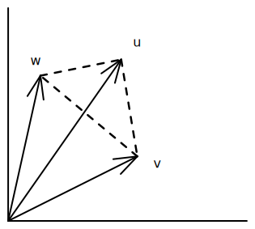

- ## 📝Definition
	- A sum of the elements from some set with constant coefficients placed in front of each.
- # 👑Importance
	- Linear combination is the heart of [[Linear Algebra]].
- ## 🧠Intuition
	- 📌Understanding Linear combination with one expression
		- $$
		  cv+dw=c\begin{bmatrix}1\\1\end{bmatrix}+d\begin{bmatrix}2\\3\end{bmatrix}=\begin{bmatrix}c+2d\\c+3d\end{bmatrix}
		  $$
		- Linear combination is just the following, very simple.
			- **adding** 2 vectors
			- **multiply** vector by numbers
	- TODO use Rhino&Grasshopper to visualize the combination of a point, a line, a plane and R3.
- ## ✒Notation
	- We denote as the following
		- scalar as $\beta_1,\cdots,\beta_n$ ,(also called the coefficients of the linear combination)
		- vector as $a_1,\cdots,a_n$
	- Then the expression of linear combination is.
		- $$
		  \beta_1\alpha_1+\cdots+\beta_n\alpha_n
		  $$
- ## 💫Support Operation
  There are several special linear combination taking advantage of its nature.
	- 📌Use linear combination as Sum
		- when $\beta_1=\cdots=\beta_n=1$
	- 📌Use linear combination as Mean
		- when $\beta_1=\cdots=\beta_n=\frac{1}{n}$
	- 📌Affine combination
		- when $\beta_1+\cdots+\beta_n=1$
	- 📌convex combination / mixture / weighted average
		- when $\beta_1+\cdots+\beta_n=0$
- ## 🗃Example
	- 📌Line and Segment
		- Use $c$ to represent a point on a line formed by $a,b$. Where $\theta$ is a scalar $0\leq\theta\leq1$
		  $$
		  c = (1-\theta)a+\theta b
		  $$
	- 📌Linear Combination Problem Set
		- 💬Question:
			- (1)Restricted by $0\leq c\leq1$ and $0\leq d\leq1$, shade in all the combinations $c\bold{v}+d\bold{w}$.
			- (2)Restricted only by $c\geq0$ and $d\geq0$ draw the "cone" of all combinations $c\bold{v}+d\bold{w}$
		- ✏Solution:
			- (1)The combinations $cv + dw$ with $0 \leq c \leq 1$ and $0 \leq d \leq 1$ fill the parallelogram with sides $v$ and $w$.
				- {:height 200, :width 200}
			- (2)With $c \geq 0$ and $d \geq 0$ we get the **infinite** “cone” or “wedge” between $v$ and $w$.
				- {:height 200, :width 350}
	- 📌Linear Combination Problem Set
		- 💬Question: Under what restriction on $c,d,e$ will the combination $cu+dv+ew$ fill in the dashed triangle?
			- {:height 200, :width 200}
		- ✏Solution:
			- To fill the triangle keep $c \geq 0, d \geq 0, e \geq 0$, and $c + d + e = 1$.
			- TODO explain why
	- 📌Linear Combination Problem Set
		- 💬Question: Describe geometrically all linear combination of
			- $$
			  \text{(a)}\space\begin{bmatrix}1\\2\\3\end{bmatrix}\text{ and }\begin{bmatrix}3\\6\\9\end{bmatrix}\quad\quad\quad
			  \text{(b)}\space\begin{bmatrix}1\\0\\0\end{bmatrix}\text{ and }\begin{bmatrix}0\\2\\3\end{bmatrix}\quad\quad\quad
			  \text{(c)}\space\begin{bmatrix}2\\0\\0\end{bmatrix}\text{ and }\begin{bmatrix}0\\2\\2\end{bmatrix}\text{ and }\begin{bmatrix}2\\2\\2\end{bmatrix}\quad
			  $$
		- ✏Solution:
			- $(a)$ is a line because they are [[linear dependent]].
			- $(b)$ is a plane because they are [[linear independent]].
			- $(c)$ is $\mathbb{R}^3$ because they are [[linear independent]].
	- 📌Linear Combination Problem Set
		- 💬Question: Write down three equations for $c,d,e$ so that $cu+dv+ew=b$. Can you somehow find $c,d,e$ for this $b$?
			- $$
			  u=\begin{bmatrix}2\\-1\\0\end{bmatrix}\quad\quad
			  v=\begin{bmatrix}-1\\2\\-1\end{bmatrix}\quad\quad
			  w=\begin{bmatrix}0\\-1\\2\end{bmatrix}\quad\quad
			  b=\begin{bmatrix}1\\0\\0\end{bmatrix}
			  $$
		- ✏Solution:
			- The equations $cu + dv + ew = b$ are
			- $$
			  \begin{align}
			  2&c&-&d\space&=1&\quad\quad&\text{So }d&=2e\quad\quad &c&=3/4\\
			  -&c&+2&d-&e=0&\quad\quad&\text{then }c&=3e\quad\quad &d&=2/4\\
			  &\space&-&d+&2e=0&\quad\quad&\text{then }4e&=1\quad\quad &e&=1/4\\
			  \end{align}
			  $$