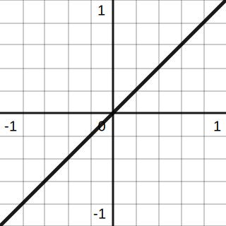

# 📝Definition
- A linear equation is an algebraic equation of the form
    - $$
      y=mx+b
      $$
    
- involving only a constant and a first-order (linear) term, where $m$ is the slope and $b$ is the $y$-intercept. The above form is aptly known as slope-intercept form; alternatively, linear equations can be written in a number of other forms including standard form, intercept form, etc.
- Occasionally, the above is called a "linear equation of **two** variables," where $y$ and $x$ are the variables. Equations such as
    - $x=3$ and $y=2$ are linear equations of a **single** variable
    - $2x+4y+5z-6=0$ is an example of a linear equation with **three** variables.
    
# 🧠Intuition
- Find an intuitive way of understanding this concept.
- 📌Interpretation of the [[Derivative]] of Linear Equation
    - If I recall the derivative in my college, I remember that the derivative of a linear function is a constant. Before this class, I only 死记硬背 this rule. But now I can see in the geometrical perspective.
    - {:height 200, :width 200}
    - Because <u>the slope is always the same</u> no matter what $x$ is, therefore the derivative of <u>a linear equation is a constant</u>.
    
# 🧬Related Elements
- The closest pattern to current one, what are their differences?
