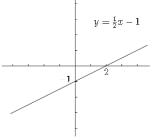

# 📝Definition
- A function that satisfies [[#^971516df866e8f6c|superposition]] is called **linear**.
- Another definition is that the function $f: \mathbb{R}^n\to\mathbb{R}$  is **linear** which it MUST satisfy following 2 properties:
    - [[#^4aa838e2d7c7c5f6|Homogeneity]]
    - [[#^1dc211ccfb97147e|Additivity]]
    
# 🧠Intuition
- The word "linear" always means "straight line".

# ✒Notation
$$
\begin{align}
f(x)=mx+b
\end{align}
$$
- 📌Point-slope form
    - $$
      y-y_0=m(x-x_0)
      $$ ^d97abe5f68a8a374
    
# ⛈Characteristics / Properties
- 📌Slope
    - If a line goes through $(x_0, y_0)$ and has slope $m$ then its equation is
        - ![[#^d97abe5f68a8a374]]
        
    - If a line goes through $(x_1, y_1)$ and $(x_2, y_2)$, its slope is equal to
        - $$
          \frac{y_2-y_1}{x_2-x_1}
          $$
        
- 📌Homogeneity ^4aa838e2d7c7c5f6
    - 齐次性
    - $f(\alpha x)=\alpha f(x)$
    - emphasize on scaling
    
- 📌Additivity ^1dc211ccfb97147e
    - 可加性
    - $f(x+y)=f(x)+f(y)$
    - emphasize on adding
    
- 📌Superposition ^971516df866e8f6c
    - Definition: ^18b1da8bd04c3dd4
        - Suppose $f$ is an [[Inner Product#Inner Product Function|inner product function]], $f$ can therefore be written as $a^T$. We have:
          $$
          \begin{align}
          f(\alpha x+\beta y)&=a^T(\alpha x+ \beta y)\\
          &=a^T(\alpha x)+a^T(\beta y)\\
          &=\alpha(a^Tx)+\beta(a^Ty)\\
          &=\alpha f(x)+\beta f(y)
          \end{align}
          $$
        - $x, y$ are $n$-vector.  $\alpha,\beta$​ are scalar.
        
# 📈Diagram
- {:height 200, :width 200}

# ✒Descriptive Explanation
A narrative... a descriptive words subject on the concept... 描述性解释…

# 🌓Complement
What is the complement of this subject? e.g. vector-covector, constructor-destructor

# 📏Proof 
To prove something...

# 🗃Example
Example is the most straightforward way to understand a mathematical concept.
- 📌Average Function - an example of linear function
    - The average of a $n$-vector can be defined as:
        - $$
          f(x)=(x_1+x_2+\cdots+x_n)/n
          $$
        
    - It can be denoted as avg($x$) . It also can be written as:
        - $$
          f(x)=a^Tx,\text{   st. }\\a=(\frac{1}{n},\frac{1}{n},\cdots,\frac{1}{n})^T=\bold{1}/n
          $$
          meaning times $1/n$​ for every elements.
        
- 📌Max Function - an example of NOT linear function
    - The maximum of a $n$-vector can be expressed as followed:
        - $$
          f(x)=\text{max}\{x_1,\cdots,x_n\}
          $$
        
    - Obviously, it is not a linear function.
    
# 🤳Applicability
 What are the situations in which this subject can be applied?

# 🧪Composition
What kind of stuffs composite this subject?

# 🏷(Sub)Categories
What are the sub objects of this subject?

# ⚖Laws
The laws related to this math concepts.

# 🎯Intent
 A short description what does this thing do?

# 🌱Related Elements
 The closest pattern to current one, what are their differences?
## Inner Product Representation of a Linear Function
- The logic can be back and forth.
  | Hypothesis/Conclusion                                        | Relation | Hypothesis/Conclusion |
  | ------------------------------------------------------------ | -------- | --------------------- |
  | A function defined as the inner product of its argument with some fixed vector. | 🔄        | A function is linear. |
- We therefore say $a^Tx$ the inner product representation of $f$.
- See [[Inner Product#Inner Product Function|here]] what a inner product function is.
