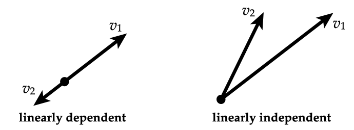

# 📝Definition
- The [[set]] of $n$- [[vector]] $\{a_1, ..., a_k\}$ (with $k\geq1$) is linearly independent if it is not linear dependent, i.e.
    - $$
      \beta_1\alpha_1+\cdots+\beta_k\alpha_k=0
      $$
    - holds only when $\beta_1=\cdots=\beta_k=0$
    
# 🧠Intuition
- No $a_i$ is a [[Linear Combination]] of the others.

# 📈Diagram
- {:height 300, :width 300}

# 🌓Complement
- [[Linear Dependence]]

# 🗃Example
- 📌example of linear independent vectors
    - the unit $n$-vectors $e_1,...,e_n$ are linearly independent.
    
# ⛈Characteristics / Properties
- 📌Independence-dimension inequality ^4454aaabc8108e5d
    - This characteristic means a linearly independent set of $n$-vectors can have **at most** $n$ elements.
    - a.k.a. any set of $n + 1$ or more $n$-vectors is linearly dependent.
    - This property holds extremely important for the concept of [[Basis]]
    
# 💫Operation
- 📌 [[Linear Combination]] of linearly independent vectors
    - suppose $x$ is linear combination of linearly independent vectors $a_1,...,a_k$:
        - $$
          x=\beta_1\alpha_1+\cdots+\beta_k\alpha_k
          $$
        
    - the coefficients $\beta_1,...\beta_k$ are **==unique==**, i.e. if
        - $$
          x=\gamma_1\alpha_1+\cdots+\gamma_k\alpha_k
          $$
        
    - then $\beta_i=\gamma_i$ for $i=1,...,k$
    - this means that (in principle) we can deduce the coefficients from $x$
    - to see why, note that
        - $$
          (\beta_1-\gamma_1)\alpha_1+\cdots+(\beta_k-\gamma_k)\alpha_k=0
          $$
        - and so (by linear independence) $\beta_1-\gamma_1=\cdots=\beta_k-\gamma_k=0$
        
    - The inverse is also true: If each linear combination of a list of vectors can only be expressed as a linear combination with one set of coefficients, then the list of vectors is linearly independent.
    - 🧠Intuition: You can't find another vector which has the same output unless their coefficients are identical. "我就是我自己"
    