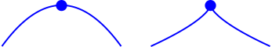

alias:: Local Maxima

- {{embed ((6343704b-3817-4ae2-84c9-5093e818fc10))}}
- ## 📝Definition
	- $f$ has a local maximum at $x=a$ if $f(a)\geq f(x)$ for all $x$ "near $a$" (within some small distance of $a$).
- ## 📈Diagram
	- diagram of local maxima
	  id:: 6304486e-5a9c-4dd5-802b-31833c657086
	  