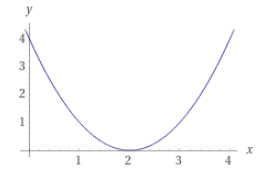
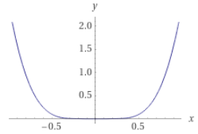
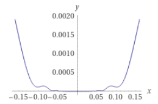
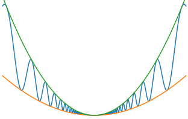

alias:: Local Minima, local minimizer

- #minimum
- {{embed ((6343704b-3817-4ae2-84c9-5093e818fc10))}}
- # 📝Definition
	- $f$ has a local minimum at $x=a$ if $f(a)\leq f(x)$ for all $x$ "near $a$" (within some small distance of $a$).
	- A point $x^∗$ is a local minimizer if there is a neighborhood $N$ of $x^∗$ such that $f(x^∗) ≤ f(x)$for all $x ∈ N$.
- # 🧠Intuition
	- Find an intuitive way of understanding this concept.
- # 📈Diagram
	- diagram of local minima
	  id:: 63044790-b04b-4bbd-a5e7-febc63f5e4a1
	  
- # 🏷(Sub)Categories
	- ## Weak local minimizer
	  id:: 9925747f-f4e5-4f70-b199-cac18fbd1614
		- 📝Definition
			- copy definition from local minimizer, + when $N$​ is an open set that contains $x^*$​​ , e.g. $N=[0,2], x^*=2$​
		- 🗃Example
			- $f(x)=2$​, where every point is a weak local minimizer
	- ## Strict/Strong local minimizer
	  id:: 63435c61-829e-44f4-b0c0-fda0f9c59525
		- 📝Definition
			- A point $x^∗$​​ is a strict local minimizer if there is a neighborhood $N$​​ of $x^∗$​​ such that $f(x^∗) < f(x)$​​for all $x ∈ N$ with $x\neq x^*$​​​.
		- 🗃Example
			- 📌$f(x)=(x-2)^2$
				- {:height 200, :width 200}
	- ## Isolated local minimizer
	  id:: 63435c91-14a2-4553-9cf8-e2406151db66
		- 🧠Intuition
			- isolated local minimizer $\subset$​​ strict local minimizer
		- 🗃Example
			- 📌$f(x)=x^4cos(1/x)+2x^4$
				- {:height 200, :width 200}
				  {:height 200, :width 200}
				  {:height 200, :width 200}
				- Nothing special in the beginning, but if we zoom in around 0, we can notice that the curve **oscillates** very much!! Therefore, if we think about $x_j\to0$, there are infinite points are local minimizer whose value=0. Therefore $j\to\infin$​, there are many many **strict local minimizers** but NONE of them are **isolated local minimizer**.
- # 🐍Algorithm
	- 📌Goal - Recognizing a local minimum
		- Intent
			- How to recognize a local minimum without examining all the points?
		- Description
			- In particular, if $f$ is twice continuously differentiable, we may be able to tell that $x^∗$ is a [[local minimizer]] (and possibly a strict local minimizer) by examining just the gradient $\nabla f(x^∗)$ and the Hessian $\nabla^2 f(x^∗)$.
		- Strategy or Theorem
			- The [theorems](((6343884d-b11b-4a30-9b51-8e1433aeeb48))) related to elementary [[Calculus]] , provide the foundations for [[Unconstrained Optimization]] algorithms. In one way or another, **all algorithms seek a point where** $\nabla f(·)$ vanishes.
			-
- # ⚖Theorem
	- 📌Theorems Related to Local Minimum
	  id:: 6343884d-b11b-4a30-9b51-8e1433aeeb48
		- 📌 [[Taylor Theorem]]
		- 📌First-Order Necessary Conditions
			- This is the theorem [[First Derivative Test]] based on.
			- If $x^∗$ is a **local minimizer** and $f$ is [[continuously]] [[differentiable]] in an open neighborhood of $x^∗$, then we have:
				- $$
				  \nabla f(x^∗) = 0
				  $$
			- Fun fact: the point $x^*$ are also called [[Stationary Point]].
		- 📌Second-Order Necessary Conditions
			- This is the theorem [[Second Derivative Test]] based on.
			- $x^∗$ is a **local minimizer** of $f$ and $\nabla^2 f$ exists and is [[Continuous]] in an open neighborhood of $x^*$​, then we have
				- $$
				  \nabla f(x^∗) = 0 \text{ and }∇^2 f(x^∗) \text{ is positive semidefinite}
				  $$
		- 📌Second-Order Sufficient Conditions
			- $\nabla^2 f$ is **continuous** in an open neighborhood of $x^∗$ and that $∇ f(x^∗)= 0$ and $∇^2 f(x^∗)$​ is **positive definite**, then we have:
				- $$
				  x^∗ \text{ is a strict local minimizer of }f
				  $$
		- 📌Theorem 2.5
			- When $f$ is [[Convex Function]] , then we have:
				- $$
				  \text{any local minimizer }x^∗ \text{ is a global minimizer of }f
				  $$
			- if in addition $f$ is [[differentiable]] , then we have:
				- $$
				  \text{any stationary point } x^∗\text{ is a global minimizer of }f
				  $$