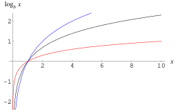

- 📝Definition
	- The logarithm $\log_bx$ for a base $b$ and a number $x$ is defined to be the [inverse function](((6337202d-82b6-4aaf-afac-c05f25c83e91))) of taking $b$ to the power $x$, i.e., $b^x$. Therefore, for any $x$ and $b$,
		- $$
		  x=\log_b(b^x)
		  $$
	- or equivalently,
		- $$
		  x=b^{\log_b(b^x)}
		  $$
- 📈Diagram
	- {:height 300, :width 400}
- ⛈Characteristics / Properties
	- 📌 [[Singularity]]
		- For any base, the logarithm function has a singularity at $x=0$.
- 🌓Complement
	- [[exponential]]
- 👑Importance
	- Logarithm is very important in [[Calculus]].