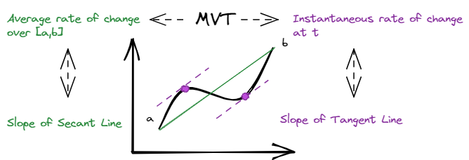

# 📝Definition
- Let $f(x)$ be differentiable on the open interval $(a,b)$ and [[Continuous]] on the closed interval $[a,b]$. Then there is at least one point $c$ in $(a,b)$ such that
  $$
  f'(c)=\frac{f(b)-f(a)}{b-a}
  $$

# 🎯Intent
- The MVT is to link 2 domains together
    - average rate of change / [[Secant Line]]
    - instantaneous rate of change / [[Tangent Line]]
    
# 🧠Intuition
- Equivalently, in geometric terms, there is **at least one point** $c$, with $a<c<b$, at which the tangent line is parallel to the secant line through $(a,f(a))$ and $(b,f(b))$:
  {:height 500, :width 500}
  MVT is the bridge connecting those 2 domains.

# 🤳Applicability
- What are the situations in which this subject can be applied?
- 📌Bounding the average rate of change using MVT
    - With the definition of MVT, it implies that the average rate of change must be within the range of possible values of the derivative.
    - If
        - $$
          m\leq x'(c)\leq M \quad\text{for all $c$ with }a<c<b
          $$
        - $m$ is a [[lower bound]] on $x'(c)$ over the interval $(a,b)$
        - $M$ is a [[upper bound]] on $x'(c)$ over the interval $(a,b)$
        
    - Then
        - $$
          m\leq \frac{x(b)-x(a)}{b-a}\leq M \quad\text{ bounds on the average rate of change }
          $$
        
    - In other words, the following are equals.
        - a lower bound on the <u>derivative</u> **is also** a lower bound on the <u>average rate of change</u>
        - and an upper bound on the <u>derivative</u> **is also** an upper bound on the <u>average rate of change</u>
        
    - Since $(b-a)>0$, the inequality doesn't change.
        - This is called the bounds on the total change.
        - $$
          m\cdot(b-a)\leq x(b)-x(a)\leq M\cdot(b-a) \quad\text{ bounds on the total change }
          $$
        
    - Sometimes we know the maximum and minimum values of $x(t)$.
        - We can write the form as.
        - $$
          \min _{a \leq t \leq b} x'(t)\quad\leq\quad \frac{x(b)-x(a)}{b-a}\quad\leq\quad \max _{a \leq t \leq b} x'(t) \quad
          $$
        - Similarly, we have
        - $$
          \min _{a \leq t \leq b} x'(t)\cdot(b-a)\quad\leq\quad x(b)-x(a)\quad\leq\quad \max _{a \leq t \leq b} x'(t) \cdot(b-a)\quad
          $$
        
    - Conclusion⭐
        - The MVT then gives us the following inequalities for **the average rate of change** and **the total change**.
        - $$
          m\quad\leq\quad \min _{a \leq t \leq b} x'(t)\quad\leq\quad \frac{x(b)-x(a)}{b-a}\quad\leq\quad \max _{a \leq t \leq b} x'(t)\quad\leq\quad M
          \\
          m\cdot(b-a)\quad\leq\quad \min _{a \leq t \leq b} x'(t)\cdot(b-a)\quad\leq\quad x(b)-x(a)\quad\leq\quad \max _{a \leq t \leq b} x'(t)\quad\leq\quad M\cdot(b-a)
          $$
        
- 📌An application using MVT on estimating fire
    - At every moment in July, a wildfire is growing at a rate of at least 2 square kilometers/day. On July 15, it was $50$ square kilometers in area.
        - The strongest statement that we can make about its area on July 25 is that it had "**at least**" an area of **70** square kilometers.
        - The strongest statement that we can make about its area on July 5 is that it had "**at most**" an area of **30** square kilometers.
        
    - let $A(t)$ (with units $\text{km}^2$) be the area of the fire at time $t$ (with units $\text{days}$), then
        - $$
          A'(t)\geq2\quad\text{for all }0\leq t\leq31
          $$
        - Then we understood the **70,30**. Also we should be careful on the terms "**at least**" and "**at most**".
        
# 🗃Example
- Example is the most straightforward way to understand a mathematical concept.
- 📌Example MVT on different functions
    - 
    - 1st row, can apply MVT since they are continuous✅ and differentiable✅.
    - 2nd row, can NOT apply MVT since they are differentiable but **not continuous**❌.
    - 3rd row, can NOT apply MVT since they are continuous but **not differentiable**❌.
    
- 📌Example using MVT to determine the inequality of tangent function
    - Question:
        - Is the following inequality true for any $\phi <\theta$ in $\left( -\frac{\pi }{2},\frac{\pi }{2}\right)$?
            - $$
              \tan (\theta )-\tan (\phi )\, \geq \,  \theta -\phi \qquad \left(\text{for all }\, \,  -\frac{\pi }{2}<\phi <\theta <\frac{\pi }{2}\right)
              $$
            
        - Is the same inequality with absolute values true for any $\theta$ and any $\phi$ in $\left( -\frac{\pi }{2},\frac{\pi }{2}\right)$?
            - $$
              \left|\tan (\theta )-\tan (\phi )\right|\geq \left| \theta -\phi \right|\qquad \text{ for all } \theta ,\phi \, \, \text{in}\, \, \left(-\frac{\pi }{2},\frac{\pi }{2}\right)
              $$
            
    - Answer
        - True✅
        - True✅
        
    - Strategy
        - Prove the direction $\theta>\phi$
        - Prove the direction $\theta<\phi$
        
    - Solution:
        - ==First==, let $\theta >\phi$. The MVT implies that
            - $$
              \frac{\tan (\theta )-\tan (\phi )}{\theta -\phi }\, \geq \, \min _{-\frac{\pi }{2}<\theta <\frac{\pi }{2}} \tan '(\theta )\qquad \text{for any } -\frac{\pi }{2}<\phi <\theta <\frac{\pi }{2}.
              $$
            
        - Now
            - $$
              \frac{d}{d\theta } \tan (\theta ) = \, \sec ^2(\theta )\,  \geq 1 \qquad \text{ for all } -\frac{\pi }{2}<\theta <\frac{\pi }{2}.
              $$
            
        - So the MVT implies
            - $$
              \frac{\tan (\theta )-\tan (\phi )}{\theta -\phi }\geq 1 \qquad \text{ for all } -\frac{\pi }{2}<\phi <\theta <\frac{\pi }{2}
              $$
            
        - We can multiply both sides by the positive number $\theta -\phi$ to get the first inequality in the question.
            - $$
              \tan (\theta )-\tan (\phi )\, \geq \theta -\phi \qquad \text{ for all } -\frac{\pi }{2}<\phi <\theta <\frac{\pi }{2}
              $$
            
        - ==Second==, notice that
            - $$
              \frac{\tan (\theta )-\tan (\phi )}{\theta -\phi }\, =\, \frac{\tan (\phi )-\tan (\theta )}{\phi -\theta }.
              $$
            - That is because negate both the numerator and denominator.
            
        - So rewriting the third inequality above in terms of the fraction on the R.H.S.(right hand side), we obtain
            - $$
              \frac{\tan (\phi )-\tan (\theta )}{\phi -\theta }\geq 1 \qquad \text{ for all } -\frac{\pi }{2}<\phi <\theta <\frac{\pi }{2}.
              $$
            
        - Now, interchanging $\theta$ and $\phi$, we get
            - $$
              \frac{\tan (\theta )-\tan (\phi )}{\theta -\phi }\geq 1 \qquad \text{ for all } -\frac{\pi }{2}<\theta <\phi <\frac{\pi }{2}
              $$
            
        - ==Finally==, combining the two cases $\theta >\phi \,$ and $\theta <\phi \,$, we have
            - $$
              \frac{\tan (\theta )-\tan (\phi )}{\theta -\phi }\geq 1 \qquad \text{ for all } \theta ,\phi \, \, \text{in}\, \, \left(-\frac{\pi }{2},\frac{\pi }{2}\right).
              $$
            
        - Since the quantities on **both sides** are positive, the inequality above is equivalent to
            - $$
              \left|\frac{\tan (\theta )-\tan (\phi )}{\theta -\phi }\right|\geq 1 \qquad \text{ for all } \theta ,\phi \, \, \text{in}\, \, \left(-\frac{\pi }{2},\frac{\pi }{2}\right).
              $$
            
        - Finally, multiplying both side by $|\theta -\phi |$, which is positive, we have
            - $$
              |\tan (\theta )-\tan (\phi )|\geq |\theta -\phi | \qquad \text{ for all } \theta ,\phi \, \, \text{in}\, \, \left(-\frac{\pi }{2},\frac{\pi }{2}\right).
              $$
            
    - Graph:
        - {:height 200, :width 200}
        - Geometrically, the last inequality says that the vertical distance between two points on the graph of $\tan(\theta)$ is **always** greater than or equal to to the horizontal distance between the two points. Or in other words, all secant lines have slope at least $1$.
        
# 📏Proof
- To prove something...
- 📌Proof of MVT
    - To prove the Mean Value Theorem, we will
        - start by proving a *special case* in which the function has the same values at the two end points,
        - and then use this special case to prove the *full theorem*.
        
    - To prove the special case, we will rely on the  [[Extreme Value Theorem]] , which says that any function which is continuous on a closed interval must attain both its maximum and minimum values in that closed interval.
      This theorem requires deeper analysis of the real numbers and we will not prove it here. The point is that we need continuity to guarantee that the function attains both its maximum and minimum.
  **Proof of the special case**
  - Suppose a function $x_0(t)$ satisfies the hypothesis of the MVT, that is, $x_0(t)$ is continuous on $[a,b]$, and differentiable on $(a,b)$.
  - In this special case, suppose also that $x_0(a)=x_0(b)$. By the Extreme Value Theorem, $x_0(t)$ attains both its maximum and minimum in $[a,b]$. In other words, there is at least one point $t_1$ in $[a,b]$ such that $\displaystyle \  x_0(t_1)\, =\, \min _{a\leq t\leq b} x_0(t)$, and at least one point $t_2$ in $[a,b]$ such that $\displaystyle \  x_0(t_2)\, =\, \max _{a\leq t\leq b} x_0(t)$.
  - There are only two possibilities. The maximum and minimum are either equal or not.
      - Case 1:
          - $$
            \max _{a\leq t\leq b} x_0(t)=\min _{a\leq t\leq b} x_0(t)
            $$
          - $x_0(t)$ must be constant over $[a,b]$, so $x'_0(t)=0$ for all $a<t<b$. In particular, there is at least one point $c$, with $a<c<b$ at which $x'_0(c)=0$.
          
      - Case 2:
          - $$
            \max _{a\leq t\leq b} x_0(t)\neq\min _{a\leq t\leq b} x_0(t)
            $$
          - Since $x_0(a)=x_0(b)$, they cannot both be at the end points. Hence at least one of $\max _{a\leq t\leq b} x_0(t)$ and $\min _{a\leq t\leq b} x_0(t)$ must be achieved in $(a,b)$. Hence, there must be a $c$, with $a<c<b$ such that $x_0(c)=\max _{a\leq t\leq b} x_0(t)$ or $x_0(c)=\min _{a\leq t\leq b} x_0(t)$. Now, recall the derivative of a differentiable function at a local maximum or minimum. By the hypothesis, $x_0(t)$ is differentiable in $(a,b)$, so $x'_0(c)=0$ since $c$ is either a local maximum or a minimum.
          
  - In both cases, there is a point $c$, with $a<c<b$, s.t.
      - $$
        x'_0(c)=0=\frac{0}{b-a}=\frac{x_0(b)-x_0(a)}{b-a}\quad\text{since }x_0(a)=x_0(b)
        $$
      - The preceding special case of the MVT is called **Rolle's Theorem**.
      
  **Proof of full theorem**
  - Let us now use the special case above to prove the MVT for functions with possibly different endpoint values.
  - Suppose a function $x(t)$ satisfies the hypothesis of the MVT, that is, $x(t)$ is continuous on $[a,b]$, and differentiable on $(a,b)$. Let
      - $$
        \displaystyle x_0(t)\, =\,  x(t)-\left(x(a)+ \frac{x(b)-x(a)}{b-a}(t-a)\right).
        $$
      
  - That is, construct a function $x_0(t)$ by subtracting from $x(t)$ the line that goes through $(a,x(a))$, $(b,x(b))$. Then $x_0(t)$ also satisfies the hypothesis of the MVT, and $x_0(a)=x_0(b)=0$. So we can apply Rolle's Theorem to $x_0(t)$, and know that there is a $c$ in $(a,b)$, such that $x'_0(c)=0$.
  - Now we can rearrange the equation above and get $x(t)$ in terms of $x_0(t)$.
      - $$
        x(t)=\displaystyle  x_0(t)+ \left(x(a)+ \frac{x(b)-x(a)}{b-a}(t-a)\right)
        $$
      
  - Taking the derivative on both sides. we get
      - $$
        x'(t)=\displaystyle  x_0'(t)\, + \, \frac{x(b)-x(a)}{b-a}
        $$
      
  - And at the point $c$ in $(a,b)$ at which $x'_0(c)=0$, the equation above reduces to
      - $$
        \begin{align}
        x'(c) &=  x_0'(c)+ \frac{x(b)-x(a)}{b-a}\\
        &= \frac{x(b)-x(a)}{b-a}
        \end{align}
        $$
      
  - Thus, we have found a $c$ we need for the conclusion of the MVT.
  
  **Supplementary link**
  - https://www.desmos.com/calculator/vdhfhltxcr
  
# 🧬Related Elements
![[Linear Approximation#📌 MVT vs. Linear Approximation]]

![[First Fundamental Theorem of Calculus#📌Comparing FTC1 and MVT]]

![[average#MVT, FTC1, and average value]]