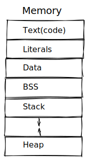
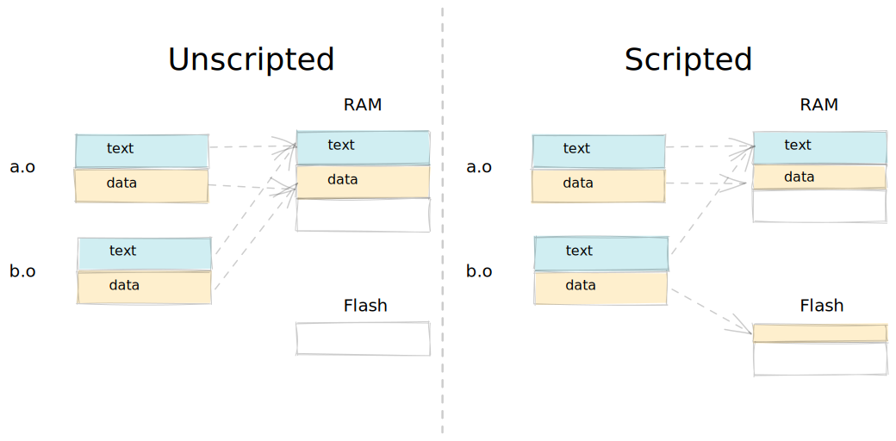

- Code generators and linkers usually separate entities into different program section, such as:
	- "text" or "code" for machine instruction
	- "literal" for initialized read-only data
	- "data" for initialized read-write data
	- "bss" for uninitialized read-write data
- The [[Linker]] is responsible for arranging these sections in memory. User can use "linker script" to do that.
- Such arrangement is the program's memory map.
  {:height 300, :width 300}
- Controlling Memory Map
	- This can benefit the embedded system which has objects declared at different space.
	- {:height 300, :width 300}
-