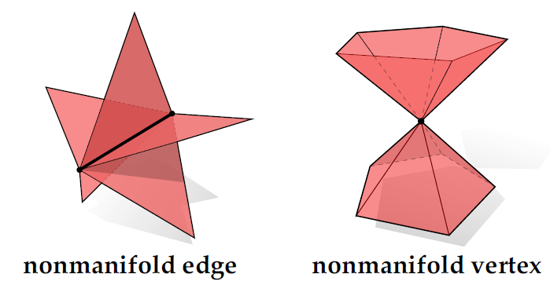

alias:: non-manifold geometry

- 📈Diagram
	- {:height 300, :width 300}
- 🕳Pitfalls / Cons
	- 📌Why not Nonmanifold?
		- Not easy to process.
- 🌓Complement
	- [[manifold]]
- 🧠Intuition
	- **nonmanifold** are those meeting at an edge, or multiple “cones” of vertices meeting at a vertex.
	- {{embed ((54d8471c-1468-4200-848c-878dd479f50e))}}