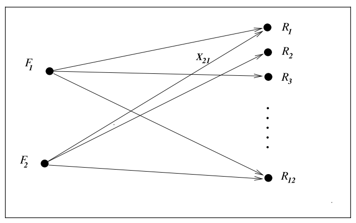
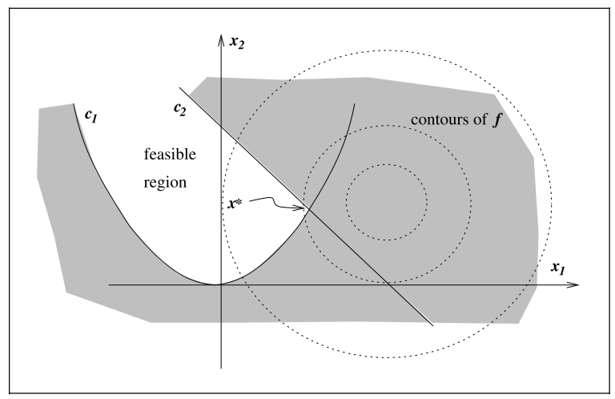

- # 🧪Composition
	- `objective` : sth. need to be first defined with quantitative measure.
	- `variable / unknown` : the characteristics of the system, which can optimize the objective
	- `constraint`  : the constraint of variables
	- `modeling`  : the process identifying objectives, variables, and constraints for a given problem
	- `algorithm`  : no universal one, but should find the tailored one related to the objective
	- `optimality condition`  : mathematical expression checking whether it is a good solution
	- `sensitivity analysis`  :	possible solution to improve
- # ✒Notation
	- Optimization is the minimization / maximization of a function subject to constraints on its variables.
	- Let's denote
		- $x$​ - variable, unknown, parameters(vector向量)
		- $f$ - objective function目标函数(scalar function) of $x$
		- $c_i$ - constraint function约束函数(scalar function) of $x$​​ where must be satisfied
		- $\Omega$ - feasible domain可行域
	- Then the optimization can be expressed as
		- $$
		  \min_{x\in\R^n}\space f(x)\space\space\text{subject to}\space\space
		          \begin{cases}
		                  c_i(x)=0, & i\in\Epsilon  \text{, Equality等式}\\
		                  c_i(x)\geq0, & i\in I\text{, Inequality不等式}
		          \end{cases}\\
		  \Omega = \{x: C_i(x)=0, i\in\Epsilon,C_i(x)\geq0,i\in\ I  \}
		  $$
- # 🏷(Sub)Categories
	- ## Stochastic Optimization and Deterministic Optimization
		- **Certainty**:
			- Deterministic optimization
		- **Uncertainty**:
			- stochastic optimization => a number of **possible scenarios** to optimize the **expected** performance
			- chance-constrained optimization => ensure x​ **satisfy** constraints with **some probability**
			- robust optimization =>  certain constraints to hold for **all possible values** of the **uncertain data**.
	- ## Global Optimization and Local Optimization
		- **Difficulty**: local optimization $<$ global optimization
		- In linear programming / [[Convex Programming]] :
			- global solution = local solution
		- In non-linear programming:
			- tend to find local solution, since global is hard to find
	- ## Constrained Optimization vs. Unconstrained Optimization
		- **Difficulty**: unconstrained optimization无约束优化 $<$ constrained optimization约束优化
		- **Unconstrained optimization**
			- e.g. $E = I = \empty$
		- **Constrained optimization**
			- e.g. $0\leq x_i\leq 100,\sum_ix_i\leq1$
	- ## Continuous Optimization vs. Discrete Optimization
		- **Difficulty**: continuous optimization $<$ discrete optimization.
		- **continuous optimization**
			- $x$​ is infinite, real number
		- **discrete optimization**
			- $x$ is finite, the output may be changed significantly as we vary $x$
			- **integer programming** : constraints, which have the form $x_i ∈ Z$,where $Z$ is the set of **integers**($x_i ∈\{1,2,5\}$), or **binary constraints**($x_i ∈\{0, 1\}$​)
			- **mixed integer programming**(MIP) : both integer or binary constraints.
- # 🗃Example
	- 📌A Transportation Problem
		- {:height 400, :width 400}
		- Notation
			- $F_i$ : factory
			- $a_i$: tons of certain products by factory $F_i$
			- $R_i$: Retail outlets
			- $b_i$: demands of tons of the product by retail outlet $R_i$
			- $c_{ij}$: cost of shipping per ton of the product from $F_i$ to
			- $x_{ij}, i=1,2, j=1,...,12$:  where $x_{ij}$ is the number of tons of product shipped from factory $F_i$ to retail outlet $R_j$
		- To conclude, the optimization can be written as:
			- $$
			  \begin{aligned}
			  \text{min}&\sum_{ij}c_{ij}x_{ij}\\
			  \text{subject to }&\sum_{j=1}^{12}x_{ij}\leq a_i,\quad i=1,2\\
			  &\sum_{i=1}^{2}x_{ij}\geq b_j,\quad j=1,...,12\\
			  &x_{ij}\geq0,\quad i=1,2, \quad j=1,...,12
			  \end{aligned}
			  $$
		- ⭐This is a **linear** problem.
			- But if there is a fee for storing product, then the cost is 
			  $$
			  \sum_{ij}c_{ij}\sqrt{{\epsilon}+x_{ij}}
			  $$
		- ⭐ This is a **non-linear** problem!
	- 📌an example of numerical optimization
		- Let's look at this function
			- $$
			  \min\quad(x_1-2)^2+(x_2-1)^2\space\space \text{subject to}        
			  \begin{cases}
			                  x_1^2-x_2\leq0,  \\
			                  x_1+x_2\leq2.
			          \end{cases}
			  $$
		- Solution
			- Interpret the function
				- $(x_1-2)^2+(x_2-1)^2$​ is a bunch of contour(等值线)
				- $x_1^2-x_2\leq0$ is parabolic curve
				- $ x_1+x_2\leq2$​ is a linear curve
			- The above equation can be illustrated as followed:
				- {:height 400, :width 400}
			- The above equations can be written as followed:
				- $$
				  f(x) =(x_1-2)^2+(x_2-1)^2, \quad x=\begin{bmatrix}x1\\x2\end{bmatrix},\\
				  c(x)=\begin{bmatrix}\quad c_1(x)\quad\\\quad c_2(x)\quad\end{bmatrix}=\begin{bmatrix}-{x_1}^2+x_2\\\quad-x_1+-x_2+2\quad\end{bmatrix}, I=\{1,2\}, E=\empty
				  $$
			- The $x^*$ is the minimal solution.
- # 🐍Algorithm
	- Optimization algorithms are all **iterative** process.
	- The wisdom is to **manage the tradeoffs** between convergence rate and storage requirements, and between robustness and speed, and so on, are central issues in numerical optimization. Because no algorithm is perfect and they all have pros and cons.
- # 🥼Expert's Advice
	- According to Boyd, [[Calculus]] in optimization is just 19-century view, e.g. [[Local Minima]] , [[Local Maxima]] . Modern optimization is more than that.