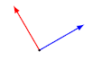

- ## Orthonormal vectors
	- 📝Definition
		- The set of $n$-vectors $a_1,...,a_k$ are orthonormal must **hold both**:
			- they are (**mutually**) orthogonal if $a_i\bot a_j$ for $i\neq j$
			- they are normalized if $\lVert a_i\rVert=1$ for $i=1,...,k$
	- ✒Notation
		- They can be expressed using [[Inner Product]] as
			- $$
			  a^{T}_{i}a_j=
			  \begin{cases}
			  1\quad i=j\\
			  0\quad i\neq j
			  \end{cases}
			  $$
	- ⛈Characteristics / Properties
		- 📌 [[linearly independent]]
			- orthonormal sets of vectors are linearly independent.
			- by [independence-dimension inequality](((4712e003-a96d-40c6-9070-1dad93658e9a))), must have $k\leq n$
- ## Orthonormal Basis
	- 📝Definition
		- When $k=n,a_1,...,a_n$ are an orthonormal basis.
	- 🗃Example
		- 📌example of Orthonormal Basis
			- example 1: standard unit $n$-vectors $e_1,...,e_n$
			- example 2: the following 3-vectors
				- $$
				  \begin{bmatrix}0\\0\\-1\end{bmatrix},\quad
				  \frac{1}{\sqrt{2}} \begin{bmatrix}1\\1\\0\end{bmatrix},\quad
				  \frac{1}{\sqrt{2}} \begin{bmatrix}1\\-1\\0\end{bmatrix}
				  $$
			- example 3: the following 2-vectors
				- {:height 100, :width 100}
- ## Orthonormal Expansion
	- 📝Definition
		- if $a_1,...,a_n$ is an orthonormal basis, we have for any $n$-vector $x$
			- $$
			  x=(a_{1}^{T}x)a_1+\cdots+(a_{n}^{T}x)a_n
			  $$
		- called orthonormal expansion of $x$ in the orthonormal basis.