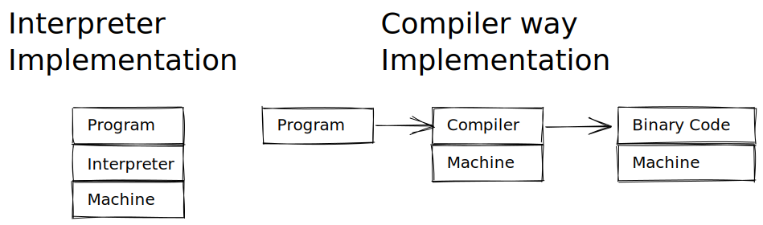

# 📝Definition
A language for expressing [[program]]s.

# 🔎Implementation
 The code or technical stuffs implement this.
- Two major strategies to implement a programming language
    - [[Interpreter]]s run the program
    - [[Compiler]]s translate the program
    - {:height 300, :width 300}
    
# 🏷(Sub)Categories
What are the sub objects of this subject?
- 📌Categories in terms of language implementations
    - Compilers dominate low-level languages
        - [[C]]
        - [[C++]]
        - Go
        - Rust
        
    - Interpreters dominate high-level languages
        - [[Python]]
        - Ruby
        
    - Interpreter + [[JIT]](just in time) compiler both are involved
        - Java
        - JavaScript
        - WebAssembly
        