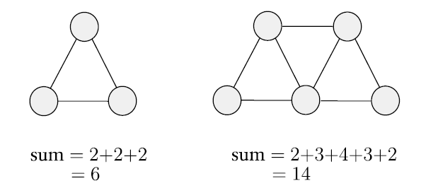

# 📝Definition
- A proof is a convincing logical argument that a statement is true.
- A rigorous mathematical argument which unequivocally demonstrates the truth of a given [[proposition]]. A mathematical statement that has been proven is called a [[theorem]].

# 🏷(Sub)Categories
## 📌Proof by Construction
### 📝Definition
- To prove such a theorem is by demonstrating **how to construct the object**. This technique is a proof by construction.

## 📌[[proof by contradiction]]

## 📌Proof by Induction
### 📝Definition
- Proof by induction is an advanced method used to show that all elements of an infinite set have a specified property. Each statement follows in
  the same way from the preceding one, so that the general theorem $A$ can be established for all $n$.

# 🗃Example
- 📌example of proof 1
    - Theorem
        - For every [[Graph]] $G$, the sum of the degrees of all the nodes in $G$ is an even number.
        
    - Get some intuition
        - First, pick a few graphs and observe this statement in action. Here are two examples.
        - {:height 300, :width 300}
        - Next, try to find a counterexample; that is, a graph in which the sum is an odd number... Hum... I know how can I prove.
        
    - Proof
        - Every edge in $G$ is connected to two nodes. Each edge contributes $1$ to the degree of each node to which it is connected.
        - Therefore, each edge contributes $2$ to the sum of the degrees of all the nodes.
        - Hence, if $G$ contains $e$ edges, then the sum of the degrees of all the nodes of $G$ is $2e$, which is an **even** number.
        
- 📌example of proof 2
    - Theorem
        - For any two sets $A$ and $B$, $\overline{A\cup B} = \overline{A} \cap \overline{B}$.
        
    - Proof
        - We prove this assertion by showing that every element of one also is an element of the other and vice versa.
        - Suppose that $x$ is an element of $\overline{A\cup B}$.
            - Then $x$ is not in $A\cup B$ from the definition of the complement of a set.
                - Therefore, $x$ is not in $A$ and $x$ is not in $B$, from the definition of the union of two sets. In other words, $x$ is in $\overline{A}$ and $x$ is in $\overline{B}$.
                    - Hence the definition of the intersection of two sets shows that $x$ is in $\overline{A} \cap \overline{B}$.
                    
        - For the other direction, suppose that $x$ is in $\overline{A} \cap \overline{B}$.
            - Then $x$ is in both $\overline{A}$ and $\overline{B}$.
                - Therefore, $x$ is not in $A$ and $x$ is not in $B$, and thus not in the union of these two sets.
                    - Hence $x$ is in the complement of the union of these sets; in other words, $x$ is in $\overline{A\cup B}$.
                    
        - We prove both direction and it completes the proof.
        
# 🥼Expert's Advice
- Michael Sipser on finding proofs
    - 📌Break down multipart statement
        - Regular statement 1. $P,Q$ are statements, to prove "$P$ if and only if $Q$”
            - It is often written as "$P$ iff $Q$".
            - This notation is shorthand for a two-part statement.
                - The first part is “$P$ only if $Q$,” which means: If $P$ is true, then $Q$ is true, written $P\Rightarrow Q$. The first of these parts is the **forward direction** of the original statement.
                - The second is “$P$ if $Q$,” which means: If $Q$ is true, then $P$ is true, written $P\Leftarrow Q$.  The second is the reverse direction. We write “$P$ if and only if $Q$” as $P\Leftarrow Q$.
                
            - To prove a statement of this form, you must prove each of the two directions. Often, one of these directions is easier to prove than the other. In the end, you will prove "$P$ if and only if $Q$", $P\iff Q$
            
        - Regular statement 2. $A,B$ are sets, to prove "$A$ and $B$ are equal"
            - The first part states that $A$ is a subset of $B$.
            - The second part states that $B$ is a subset of $A$. Thus one common way to prove that $A = B$ is to prove that every member of $A$ also is a member of $B$, and that every member of $B$ also is a member of $A$.
            
    - 📌Use Intuition
    - 📌Try to find an object that fails to have the property, called a **counterexample**.
    