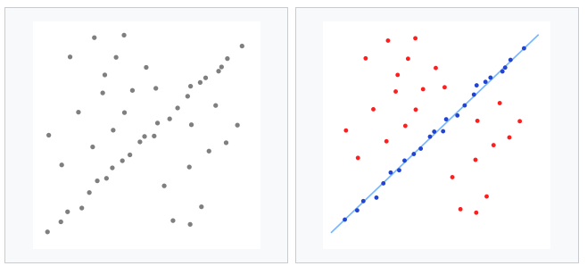

alias:: Random sample consensus

- #optimization
- 📝Definition
	- It can be interpreted as **an outlier detection method**!! Inlier和Outlier很重要，这个算法还有把inlier看作是一个很重要的指标。如下图的Line Fitting问题，如果是用 simple least squares method的话就很容易出问题。因为后者把outlier也当作关键信息，而RANSAC也会process outliers，但是它却会exclude它们。
- 📈Diagram
	- {:height 300, :width 300}
- 🐍Algorithm
	- 随机筛选一些subset of data，然后fit model出来
	- 找剩余的data来测试这个model，如果能通过，那就称为inlier data
	- 不断重复，如果fit的data太少了，这个model就会被reject
	- 若良好，那么这个dataset就是consensus set
	- 这个model不断完善，这个consensus set越来越大
- 🚀Benefit / Pros
	- 若含超过50%的inliers，那么RANSAC会非常robust
- 🕳Pitfalls / Cons
	- 反之，若只有例如30%的inlier，那么RANSAC没法找出好东西
	- RANSAC是model-dataset one-one对应的关系，即一个dataset不可能有两个model。比如是一个折线的scatter plot，那就需要两个model，RANSAC不适合这种情况
	- no upper bound计算时间，因此需要根据数据集的复杂程度决定iteration大小
	- ⭐RANSAC的threshold是problem-specific thresholds，例如在我找折线的那个电池，是算的threshold是data point的Y值的差异。那么，当我的模型从1mm变成1000mm，threshold就要改变了