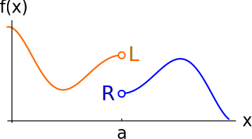

# Right-hand limit
## 📝Definition
Suppose $f(x)$ gets really close to $R$ for values of $x$ that get really close to (*but are not equal to*) $a$ **from the right**. Then we say $R$ is the **right-hand limit** of the function $f(x)$ as $x$ approaches $a$ from the right.
## 🧠Intuition
Find an intuitive way of understanding this concept.
## 🧮Expression
$$
\begin{align}
f(x)\to R \space \text{as}\space x\to a^+\\
\text{or}\\
\lim_{x\to a^+}f(x)=R
\end{align}
$$
## 📈Diagram
The blue dot.

## 🌓Complement
[[Left-hand limit]]
## 🗃Example
- 📌example(1) can see [[Limit#^eb759c09775a3ef2|here]]
- 📌example(2) can see [[Limit#^ce329b5cb925a1c0|here]]

## ✒Descriptive Explanation
A narrative... a descriptive words subject on the concept... 描述性解释…
## 🤳Applicability
 What are the situations in which this subject can be applied?
## 🧪Composition
What kind of stuffs composite this subject?
## 🏷(Sub)Categories
What are the sub objects of this subject?
## 🎯Intent
 A short description what does this thing do?
## 🙋‍♂️Related Elements
 The closest pattern to current one, what are their differences?
