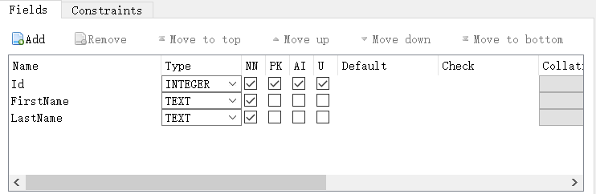

### 📌 **SQLite C# 101**
	- Solution Overview
		- Suppose you have 2 projects in Visual Studio.
		- `DemoLibrary`, the project with data structure
		- `WinFormUI`, the project with UI
	- Define Data Structure in  `DemoLibrary`
		- The following is a simple data structure for a person.
		- ```c#
		  public class PersonModel
		  {
		    public int Id { get; set; }
		    public string FirstName { get; set; }
		    public string LastName { get; set; }
		  - public string FullName
		    {
		        get
		        {
		            return $"{ FirstName } { LastName }";
		        }
		    }
		  }
		  ```
	- Setup in DB Browser
		- 1️⃣ Init `.db` file for the project
			- In DB Browser for SQLite, click <u>File</u> > <u>New Database</u> > {<u>Location of Executable Project</u>} > <u>Name`.db`</u>
			- Normally, the `.db` file should be in the executable project. e.g. The <u>**root path**</u> of WinForm / WPF / UWP, etc.
		- 2️⃣Include `.db` file in your porject
			- In Visual Studio > Solution Explorer > Show All Files > Right Click the `.db` File > Include in Project
		- 3️⃣Create table matching data structure
			- In DB Browser for SQLite, click <u>Database Structure</u> > <u>Create Table</u>
			- {:height 200, :width 400}
			- The field is the **Property** you defined in C# class. The preceding image is the table matching the data structure you defined.
			- The options of `Type` are:
				- `INTEGER`
				- `TEXT`
				- `BLOB`, files
				- `REAL`, floating number
				- `NUMERICAL`
			- The flags are:
				- `NN` = `Not Null`
				- `PK` = `Primary Key`
				- `AI` = `Auto Increment`
				- `U` = `Unique`
	- Add References
		- 1️⃣Nuget Packages
			- `System.Data.SQLite.Core`  , installed in <u>project with data structure</u> and <u>UI executable</u>, e.g. `DemoLibrary`&`WinFormUI`
			- `Dapper` , installed in <u>project with data structure</u>, e.g. `DemoLibrary`
		- 2️⃣Search in Assemblies
			- `System.Configuration`  , project with data structure installed in  `DemoLibrary`
	- Set-up Configuration in UI Executable
		- In `WinFormUI`, locate at `App.Config`. Add `connectionStrings` tab into the `configuration`.  `Data Source` points to where `.db` locates.
		- ``` 
		  <configuration>
		  	<connectionStrings>
		  		<add name="Default" 
		  			 connectionString="Data Source=./DemoDB.db;Version=3;" 
		  			 providerName="System.Data.SqlClient"/>
		  	</connectionStrings>
		  </configuration>
		  ```
	- Create methods load and save data
		- ``` c#
		  public class SqliteDataAccess
		  {
		      //this is the method loading data from database
		      public static List<PersonModel> LoadPeople()
		      {
		          using(IDbConnection cnn = new SQLiteConnection(LoadConnectionString()))
		          {
		              //query database
		              var output = cnn.Query<PersonModel>(
		                  "select * from Person",
		                  new DynamicParameters());
		              return output.ToList();
		          }
		      }
		  
		      //this is the method saving data from database
		      public static void SavePerson(PersonModel person)
		      {
		          using (IDbConnection cnn = new SQLiteConnection(LoadConnectionString()))
		          {
		              //match the input with the data structure
		              cnn.Execute(
		                  "insert into Person (FirstName, LastName) values (@FirstName, @LastName)", 
		                  person);
		          }
		      }
		  
		      //private function for init connection to database
		      private static string LoadConnectionString(string id = "Default")//the default here is in `App.Config`
		      {
		          return ConfigurationManager.ConnectionStrings[id].ConnectionString;
		      }
		  }
		  ```