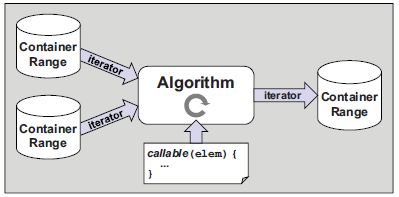

# 🧱Structure
There are 3 pillars of standard template library.
- **data structures** and **algorithms**
	- combine different data structures with different algorithms
	- some combinations can be a problem
- **iterators** as glue interface
	- passed as half-open ranges (including begin, excluding end)


> [!important] Generic rather than [[Object-oriented Programming Paradigm|OOP]]
> The philosophy of STL is generic and there are no base class, maybe procedural programming perspective as well?
> - Everything behaves like a container is a *container*.
> - Everything behaves like an iterator is an *iterator*.
> - Everything you can call is a *callable*.


# 🏷(Sub)Categories
It devoted to:
- containers, e.g. `vector`, `set`, `map`
- iterators, e.g. `vector<int>::iterator`, `set<string>::iterator`
- algorithms, e.g. `for_each`, `find`, `sort`

-

-

- TODO learn how to use this `std` algorithm
  ``` c++
  std::all_of(begin, end, a lambda predicate function)
  ```

-

-
