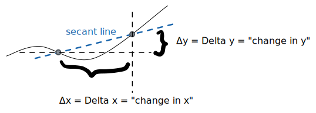
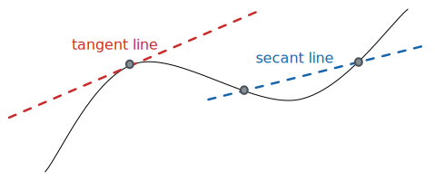

alias:: 割线

- ## 📝Definition
	- A secant line, also simply called a secant, is a line passing through two points of a curve. As the two points are brought together (or, more precisely, as one is brought towards the other), the secant line tends to a [[Tangent Line]].
	  
	  The **secant line** of a function $f(x)$ over the interval $a\leq x\leq b$, is the line that passes through the points $(a,f(a))$ and $(b,f(b))$.
- ## 🧠Intuition
	- Secant line emphasizes the <u>slope</u> and the <u>average rate of change</u> of the function $f(x)$ over the interval $a\leq x\leq b$.
	  $$
	  \text{slope}=\frac{\Delta y}{\Delta x}=\frac{f(b)-f(a)}{b-a}
	  $$
	  {:height 300, :width500}
- ## 🧮Expression
	- The equation for the secant line is:
	  $$
	  y=\frac{f(b)-f(a)}{b-a}(x-a)+f(a)
	  $$
- ## 📈Diagram
	- 📌Difference Between a Secant Line and a [[Tangent Line]] 
	  id:: 630dd42f-05af-4871-9d9c-b1234f6d866f
	  {:height 300, :width 300}