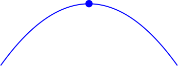
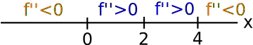
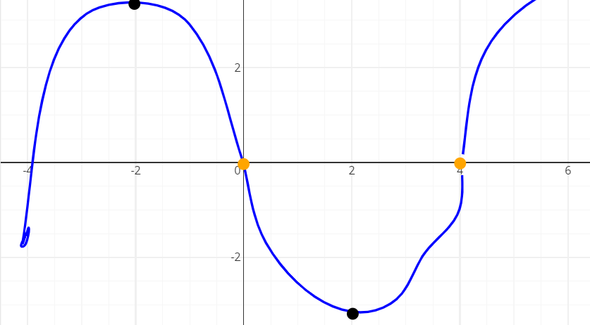

# 📝Definition
- After establishing the [[Critical Point]]s of a function, the second-derivative test uses the value of the second derivative at those points to determine whether such points are a [[Local Maximum]] or a [[Local Minimum]] .

# 🧠Intuition
- To determine local extrema of a function under certain conditions.

# 🤳Applicability
- 📌Finding [[Local Minima]] and [[Local Maxima]]
    - Suppose that $x=a$ is a [[Critical Point]] of $f$, with $f'(a)=0$
        - if $f''(a)>0$, then $f$ has a local minimum at $x=a$.
          
        - if $f''(a)<0$, then $f$ has a local maximum at $x=a$.
          
        - if $f''(a)=0$, or does not exist, then the test is inconclusive. Meaning there might be a:
            - local maximum or
            - a local minimum, or
            - neither
            
# 🗃Example
- 📌Find [[Local Extrema]] and [[Inflection Point]] of function $f$
    - Given info:
        - for first derivative:
          
        - for second derivative:
          
        
    - Solution
        - For inflection point
            - we notice that the sign of second derivative is changed at:
                - $x=0$
                - $x=4$
                
        - For local extrema,
            - we notice that the sign of first derivative is changed at:
                - $x=-2$, from $+$ to $-$
                - $x=2$, from $-$ to $+$
                
    - Answer, therefore we knew
        - Inflection Points:
            - $x=0$
            - $x=4$
            
        - Local Maximum
            - $x=-2$
            
        - Local Minimum
            - $x=2$
            
        - Diagram
          {:height 250, :width 250}
        
# 🌓Complement
- [[First Derivative Test]].
- 📌Comparison between The First Derivative Test and the Second Derivative Test ^f423d20186d6aeab
    - Question🤔:
        - You may wonder what is the **difference**? Because both first test and second test can determine whether critical points are local minima or maxima.
        
    - Answer:
        - The conclusion is that both first test and second test have their pros and cons.
        - That is,
            - The First Derivative Test requires a bit more data, but is often able to provide more information as a result.
            - The Second Derivative Test requires just one value of $f''$, but it is sometimes inconclusive.
            
        - It is important to be comfortable using both tests!
        