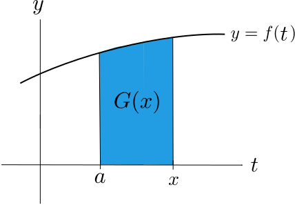
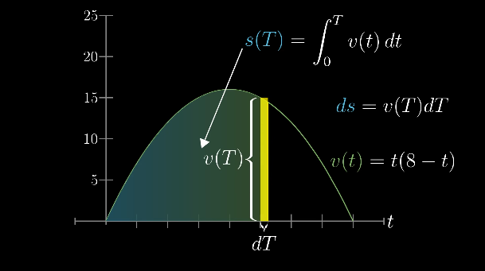
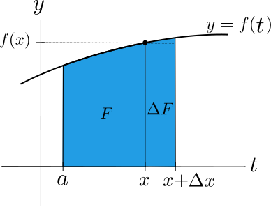
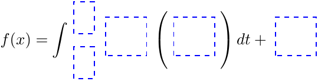

# 📝Definition
- Given a continuous function $f(x)$, if
    - $$
      \displaystyle G(x)=\int _{a}^{x} f(t)\, dt \qquad (\, \, t\, \, \text{between}\, \, a\, \, \text{and}\,  x),
      $$
    
- then
    - $$
      G'(x)=f(x)\quad\text{or}\quad \frac{d}{dx}\int _{a}^{x} f(t)\, dt=f(x)
      $$
    
- Geometrically, $G(x)$ is the area between $a$ and $x$. This area varies as $x$ varies.
    - {:height 200, :width 300}
    
# 🎯Intent
- 📌In terms of [[Differential Equation]]s,
    - FTC2 says that $G(x)$ is the solution to the following differential equation and initial condition:
        - $$
          \begin{align}
          y'&=f\quad\quad\text{differential equation}\\
          y(a)&=0\quad\quad\text{initial condition}
          \end{align}
          $$
        - The initial condition $y(a)=0$ is satisfied because $\, \, \displaystyle G(a)=\int _{a}^{a} f(t)\, dt = 0$
        
    - Hence, FTC2 gives us a formula for an [[Antiderivative]] of $f(x)$. This formula is different from the formulas you have seen. It is in terms of a [[definite integral]], and is called an integral formula.
  **==Note:==** The integrand $f(x)$ can be any [[Continuous]] function, not just the ones whose antiderivative we know how to find. These integral formulas are still useful there are numerical methods that allow us to compute them.
  
# 🧠Intuition
- {:height 200, :width 400}
- Since $s(T)=\int _{0}^{T} v(t)\, dt$, therefore, if we take the [[Derivative]] of the distance function $s(T)$, we can get the velocity function $v(t)$.
$$
\begin{align}
\frac{d}{dT}s(T)&=\frac{d}{dT}\int _{0}^{T} v(t)\, dt\\
v(T)&=\frac{d}{dT}\int _{0}^{T} v(t)\, dt
\end{align}
$$

# 🌓Complement
- [[FTC1]]

# ⛈Characteristics / Properties
## Chain Rule
### 📝Definition
- By FTC 2,
    - $$
      \begin{align}
      G'(u)=f(u)\quad\text{FTC2}
      \end{align}
      $$
    
- With chain rule, we have
    - $$
      \begin{align}
      \frac{d}{dx}G(u(x))&=f(u(x)) \cdot u'(x)\\
      \frac{d}{dx} \int _{a}^{u(x)} f(t)\, dt&=f(u(x)) \cdot u'(x)
      \end{align}
      $$
    
### 🗣Descriptive Explanation
- Now explain the detail. Let
    - $$
      G(u)=\int _{a}^{u} f(t)\, dt
      $$
    
- Then
    - $$
      G(u(x))=\int _{a}^{u(x)} f(t)\, dt
      $$
    
- That is, decompose the [[definite integral]] with $u(x)$ as its upper limit as the composition of the two functions $G(u)$ and $u(x)$. Now, let us apply the chain rule to find its derivative.
    - $$
      \begin{align}
      \frac{d}{dx}G(u(x))&=G'(u(x)) \cdot u'(x)\qquad (\text{chain rule})\\
      \text{or equivalently }\quad\frac{dG}{dx}&=\left.\frac{dG}{du}\right|_{u=u(x)} \cdot \frac{du}{dx},
      \end{align}
      $$
    - where $G'(u(x))$ is the derivative of $G$ with respect to $u$ evaluated at $u(x)$. Another notation for  $G'(u(x))$ is $\left.\frac{dG}{du}\right|_{u=u(x)}$
    
-

- 📏Proof
    - Proof of FTC2
        - 📋Prerequisite
            - Recall that FTC2 states that given a continuous function $f$,
                - $$
                  F(x)=\int _{a}^{x} f(t)\, dt\Rightarrow F'(x)=f(x)
                  $$
                
        - 🏹Strategy
            - To prove this theorem, we will compute the derivative of $F$ by using the geometric picture of $F$. We will prove the case for $f>0$ and you will verify that the same argument works for any $f$.
            
        - ✏Process
            - Recall the definition of the [[Derivative]]:
                - $$
                  F'(x)=\lim _{\Delta x\rightarrow 0} \frac{\Delta F}{\Delta x} \qquad \text{where} \, \, \Delta F\, =\,  F(x+\Delta x)-F(x).
                  $$
                - {:height 200, :width 400}
                - $$
                  \begin{align}
                  &\text{Geometrically, }  &F(x) &= \int _{a}^{x} f(t)\, dt\, \,  &= &\text{Area between}\, \, a\, \, \text{and}\, \, x,  \\
                  &\space &\Delta F &= \int _{x}^{x+\Delta x} f(t)\, dt\, \, &= &\text{Area between}\, \, x\, \, \text{and}\, \,  x+\Delta x.
                  \end{align}
                  $$
                
            - We can approximate $\Delta F$ by the area of the rectangle with base $\Delta x$ and height $f(x)$. This gives
                - $$
                  \frac{\Delta F}{\Delta x}\approx \frac{f(x)\cdot \Delta x}{\Delta x} =f(x)
                  $$
                - Now since $f$ is continuous,
                    - $$
                      \lim _{\Delta x\rightarrow 0} \frac{\Delta F}{\Delta x}=\lim _{\Delta x\rightarrow 0} f(x) = f(x)
                      $$
                    
                - This is equivalent to $F'(x)=f(x)$, which is what we needed to prove.
                
# 🗃Example
- 📌simple example of FTC2
    - Give the solution to the differential equation and initial condition below in terms of an integral.
        - $$
          \begin{align}
          H'(x)&=x^2\\ H(0)&=0
          \end{align}
          $$
        
    - Applying the FTC2 directly gives
        - $$
          \begin{align}
          H(x)= \int _{0}^{x} t^2\, dt
          \end{align}
          $$
        
- 🕹Quiz
    - 📌example using FTC2
        - 💬Question: Assume $f$ is continuous, if $\int_0^x f(t)dt=x^2\sin(\pi x)$. Find $f(2)$.
        - ✏Solution:
            - FTC2 implies
                - $$
                  \frac{d}{dx}\int_0^x f(t)dt=f(x)
                  $$
                
            - Then we have
                - $$
                  \begin{align}
                  \frac{d}{dx}\int_0^x f(t)dt&=f(x)\\
                  \frac{d}{dx}\int_0^x f(t)dt&=f(x)=\bigg(x^2\sin(\pi x\bigg)'\\
                  f(x)&=2x\sin\pi x+x^2\cos(\pi x)\cdot\pi\\
                  f(2)&=4\sin(2\pi)+4\pi\cos(2\pi)\\
                  f(2)&=4\pi
                  \end{align}
                  $$
                
    - 📌example using FTC2 with [[Quadratic Approximation]]
        - 💬Question: Let $F(x)=\int_0^x f(t)dt$. Find the quadratic approximation for $F(x)$ near $x=0$ in terms of $f$. What assumption do we have to make about $f$?
        - ✏Solution
            - 1️⃣Write what is quadratic approximation of $F(x)$ at $x=0$
                - $$
                  F(x)\approx F(0)+F'(0)x+\frac{F''(0)}{2}x^2
                  $$
                
            - 2️⃣Solve each component
                - $$
                  \begin{align}
                  F(0)&=\int_0^0f(t)dt=0\\
                  F'(x)&=\frac{d}{dx}\int_0^x f(t)dt=f(x)\\
                  F'(0)&=f(0)\\
                  F''(x)&=\frac{d}{dx}f(x)=f'(x)\\
                  F''(0)&=f'(0)
                  \end{align}
                  $$
                
            - 3️⃣Plug all components
                - $$
                  F(x)\approx 0+f(0)\cdot x+\frac{f'(0)}{2}\cdot x^2=f(0)x+\frac{f'(0)}{2}\cdot x^2
                  $$
                
            - 4️⃣So the assumption is that $f$ must be [[Continuous]] and [[differentiable]] at least near $x=0$.
            
    - 📌tricky example using chain rule
        - 💬Question: Let $y>0$. Decompose the integral below into a sum of two integrals, and then evaluate the following.
            - $$
              \frac{d}{dy} \int _{y}^{\sqrt{y}} \ln (t)\, dt \, =\,?
              $$
            
        - ✏Solution
            - Let $G(u)=\int _{a}^{u} \ln (t)\, dt\,$ for some constant $a>0$. Then
                - $$
                  \int _{y}^{\sqrt{y}} \ln (t)\, dt=\int _{a}^{\sqrt{y}} \ln (t)\, dt -\int _{a}^{y} \ln (t)\, dt=G\left(\sqrt{y}\right)-G(y)
                  $$
                
            - Therefore, by the chain rule and FTC2,
                - $$
                  \begin{align}
                  \frac{d}{dy}\int _{y}^{\sqrt{y}} \ln (t)\, dt&=\frac{d}{dy} \left(G\left(\sqrt{y}\right)-G(y)\right)\\
                  &=\left.\frac{dG}{du}\right|_{u=\sqrt{y}}\, \cdot \frac{d\, \left(\sqrt{y}\right)}{dy}\, -\, \, \left.\frac{dG}{du}\right|_{u=y} \qquad (\text{chain rule})\\
                  &=\ln (\sqrt{y})\cdot \left(\frac{1}{2\sqrt{y}}\right)- \ln (y) \qquad (\text{FTC2})\\
                  &=\frac12 \ln (y)\left(\frac{1}{2\sqrt{y}}\right)- \ln (y)\\
                  &=\ln (y) \left(\frac{1}{4\sqrt{y}}-1\right)
                  \end{align}
                  $$
                
    - 📌Quiz on FTC2
        - 💬Question: Find a function $f(x)$ whose derivative is $\sin(x^3)$ and whose value at $0$ is $2$
            - {:height 200, :width 500}
            
        - 🏹Strategy: Think about the derivative and then the value behind.
        - ✏Solution:
            - Since [[Derivative]] is $\sin(x^3)$ and therefore it is inside $()$.
            - Then think about the integral at $0$ is $2$.
            
        - Result
            - $$
              f(x)\, =\, \int _{0}^{x}\sin \left(t^3\right)\, dt\, +\, 2
              $$
            
    - 📌Quiz on FTC2
        - 💬Question: Find a function $f(x)$ whose derivative is $\sin(x^3)$ and whose value at $1$ is $-1$
        - 🏹Strategy: That's easy. Related to the last quiz. Change the integral from $1$ should be fine.
        - ✏Solution:
            - $$
              f(x)\, =\,  \int _{1}^{x}\sin \left(t^3\right)\, dt\, -\, 1
              $$
            
    - 📌simple example using chain rule
        - 💬Question: $\frac{d}{dx} \int _{1}^{x^3} \tan ^2(\theta ) \,  d\theta \, =\,?$
        - ✏Solution
            - Let $F(u)= \int _{1}^{u} \tan ^2(\theta )\,  d\theta$, and $u(x)=x^3$, then we have
                - $$
                  F(u(x))= \int _{1}^{u(x)} \tan ^2(\theta )\,  d\theta= \int _{1}^{x^3} \tan ^2(\theta ) \, d\theta .
                  $$
                
            - By the chain rule,
                - $$
                  \frac{d}{dx} F(u(x))= F'(x^3) \, u'(x)
                  $$
                
            - We will now evaluate each factor.
                - $u'(x)= 3x^2$
                - $F'(u)=\tan ^2(u)$ by FTC2
                - evaluating $F'(u)$ at $u=x^3$ gives $F'(x^3)= \tan ^2(x^3)$
                
            - Therefore,
                - $$
                  \frac{d}{dx} \int _{1}^{x^3} \tan ^2(\theta )\,  d\theta \,=\tan ^2(x^3) \cdot \left(3x^2\right).
                  $$
                