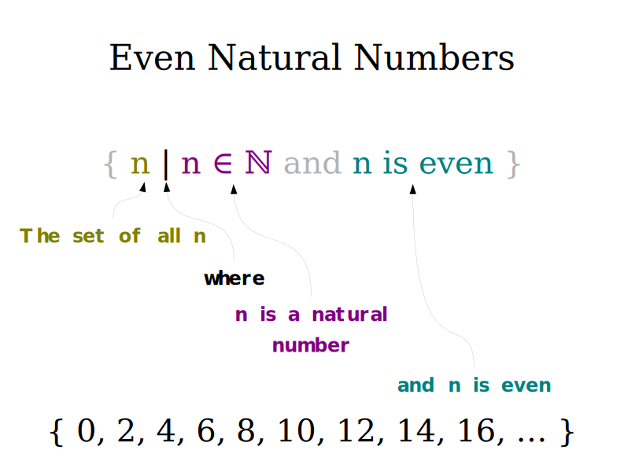
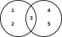
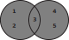
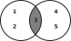
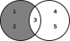
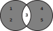
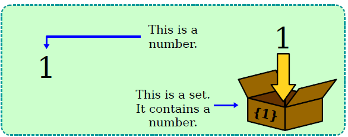
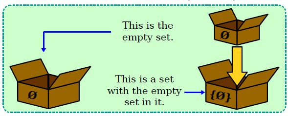

# 📝Definition  
A set is an **unordered** collection of **distinct** objects, which may be anything, including other sets.

# ⛈Characteristics
## ☁open
**📝Definition**
A region is **open** if it consists entirely of [[interior point]]s.

## 🌧closed
**📝Definition**
A region is closed if it contains all its [[boundary point]]s.

# 🌈Properties
## 🔴Cardinality
**📝Definition**
The cardinality of a set is the number of elements it contains.

**🗃Example**
$$
|\{1, 2, 3, 3, 3, 3, 3\}| = 3\\
|\emptyset|=0\\
|\{\emptyset\}|=1
$$

# 🏷(Sub)Categories  
What are the sub objects of this subject?
- 📌[[bounded set]]
- 📌[[unbounded set]]
- 📌Subset
    - For two sets $A$ and $B$, we say that $A$ is a subset of $B$, written $A\subseteq B$, if every member of $A$ also is a member of $B$.
    
- 📌Proper Subset
    - For two sets $A$ and $B$, if $A$ is a subset of $B$ and **not equal to** $B$.
    
- 📌Multiset
    - If want to take the number of occurrences of members into account, we call the group a multiset instead of a set. Thus $\{7\}$ and $\{7, 7\}$ are different as multisets but identical as sets.
    
- 📌Empty set
    - The empty set is the set with no elements.
    - We denote empty set using this symbol $\emptyset$.
    
- 📌Infinite set
    - An infinite set contains infinitely many elements.
    - set of natural numbers $\mathbb{N}=\{1,2,3,...\}$
    - set of integers $\mathbb{Z}=\{...,-2,-1,0,1,2,3,...\}$
    
- 📌Singleton set
    - A set with 1 member.
    
- 📌Unordered pair
    - A set with 2 members.
    
- 📌Power Set
    - Powerset is the set of **all subsets** of $S$. The order of a power set of a set of order n is $2^n$. That is
    - $$
      \wp(S)=\{T|T\subseteq S\}
      $$
    - $$
      S=\{1,2\}\\
      \wp(S)=\Bigg\{\emptyset,\{1\},\{2\},\{1,2\}\Bigg\}
      $$
    
# 🧮Notation
- 📌set-builder notation
    - To describe complex sets like these
        - “The set of all even natural numbers.”
        - “The set of all real numbers less than 137.”
        - “The set of all negative integers.”
        
    - Syntax
        - $$
          \{n|\text{rule about $n$}\}
          $$
        
    - Example
        - Even Natural Numbers
            - $$
              \{ n | n \in \mathbb{N} \text{ and $n$ is even} \}
              $$
            - explain
              {:height 500, :width 500}
            
- $\in$ means "is an element of"
    - $$
      3\in\{1,2,3,4,5\}
      $$
    
- $\notin$ means "is not an element of"
    - $$
      999\notin \{1,2,3,4,5\}
      $$
    
- $\subseteq$ means a subset
    - $$
      \{1,2,3\}\subseteq\{1,2,3,4\}\\
      \{1,2,3\}\subseteq\{1,2,3\}\\
      $$
    
- $\subsetneq$ means a proper subset
    - $$
      A\subsetneq B\text{ if A is a subset of B and not equal to B}
      $$
    
- $\cup$ means union operation
- $\cap$ means intersection operation
- $2^S$ or $\wp(S)$ means the power set of set $S$.
- $|S|$ is the cardinality of a set $S$.
- $\overline{S}$ is the complement of a set $S$.

# 💫Support Operation
- Suppose we have
    - $$
      A=\{1,2,3\}\\B=\{4,5,6\}
      $$
    - Venn Diagram
      {:height 200, :width 200}
    
- Union
    - $$
      A\cup B=\{1,2,3,4,5,6\}
      $$
    - {:height 200, :width 200}
    
- Intersection
    - $$
      A\cap B=\{1,2,3,4,5,6\}
      $$
    - {:height 200, :width 200}
    
- Difference
    - $$
      A- B=\{1,2\}\\
      A\backslash B=\{1,2\}\\
      $$
    - {:height 200, :width 200}
    
- Symmetric Difference
    - $$
      A\Delta B=\{1,2,4,5,6\}
      $$
    - {:height 200, :width 200}
    
- Cartesian product or Cross product
    - If $A=\{1,2\}$ and $B=\{x,y,z\}$
    - $$
      A\times B=\{(1,x),(1,y),(1,z),(2,x),(2,y),(2,z)\}
      $$
    - We can also take the Cartesian product of $k$ sets, $A_1, A_2, . . . , A_k$, written $A_1 \times A_2 \times \cdots \times A_k$. It is the set consisting of all $k$-[[tuple]]s $(a_1, a_2, . . . , a_k)$ where $a\in A_i$.
    - Therefore, the preceding $A\times B$ can be written as
    - $$
      A_1\times A_2
      $$
    - Where $k=2$, the $k$ is the **length of the tuple**!!
    
- Complement
    - The complement of $A$, written $\overline{A}$ is the set of **all elements** under consideration that **not in** $A$.
    
# 🕳Pitfalls / Cons
Be aware of the pitfalls when using this stuffs... (especially considering edge cases)
- 📌An element is NOT a set with an element
    - $1\neq\{1\}$
    - {:height 400, :width 400}
    
- 📌An empty set is NOT a set with empty set
    - $\emptyset\neq\{\emptyset\}$
    - {:height 400, :width 400}
    
# 🧀Applicability  
What are the situations in which this subject can be applied?
