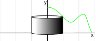
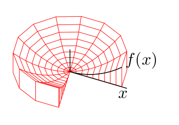
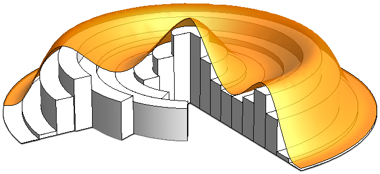
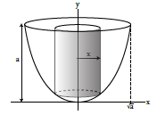
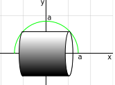
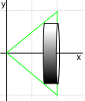
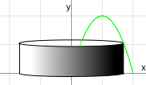
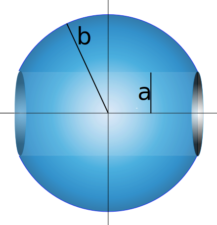

# 📝Definition
Shell integration (the shell method in [[definite integral|integral calculus]]) is a method for calculating the volume of a solid of revolution, when integrating along an axis perpendicular to the axis of revolution.
> [!info] Info
> The shell and cylinder are interchangebly used in this page.

# ✒Notation
$$
\begin{align}
dV = 2\pi x y\,  dx.
\end{align}
$$

# 🧠Intuition
The method of shells for a curve $y=f(x)$ rotated about the $y$-axis.
> [!tip] Tips
> Think about 4 major stuffs:
> - We only care about the **skin** of the cylinder and therefore you should imagine unrolling the ([[developable surface|developable]])cylinder to a tiny tiny cuboid. 
> - what is the circumference of the cylinder?
> - what is the height of the cylinder?
> - what is the thickness? (that's $\Delta$ or $d$)
# 📈Diagram

# 🌓Complement
[[Disc integration]]

# 🏹Strategy
The general strategy solving the revolution is the following:
- Draw a picture
- Identify limits of integration
- Identify integrand
- Integrate to solve (as needed)
# 🗃Example
### 📌A witch’s cauldron
- 💬Question:
	- what is the volume of the cauldron?
	- $y = x^2$ rotated around the $y$-axis.
	- 
- 🏹Strategy:
	- Think about how to slice this cauldron into shells?
	- Think about what is the radius of the shell(cylinder)?
	- Think about what is the thickness?
	- Think about what is the height?
- ✏Solution:
	- One slice of shell can be looked in the following figure.
		- 
	- The shell has following properties
		- radius of cylinder: $x$
		- thickness of the skin of the unrolled cylinder: $dx$
		- height of the cylinder: $a − y = a − x^2$.
	- Then the volume of the unrolled cylinder is
		- $$dV=(a-x^2)(2\pi x)dx$$
	- Then the whole volume is
		- $$\begin{align}V &=\int_{x=0}^{x=\sqrt{a}}(a-x^2)(2\pi x)dx=2\pi\int_{0}^{\sqrt{a}}(ax-x^3)dx\\&=2\pi\bigg(a\frac{x^2}{2}-\frac{x^4}{4}\bigg)\bigg|_{0}^{\sqrt{a}}=2\pi\bigg(\frac{a^2}{2}-\frac{a^2}{4}\bigg)=2\pi\bigg(\frac{a^2}{4}\bigg)=\frac{\pi a^2}{2}\end{align}$$

# 🕹Quiz
## 📌Shell practice 1
- 💬Question:
	- Set up the integrals for the volume of the solid generated by rotating the region bounded by $y=\sqrt{a^2-x^2} (a>0)$ and $y=0$ around the $x$-axis by the method of shells.
- ✏Solution:
	- Draw the picture
		- 
	- Identify the elements
		- thinkness: $dy$
		- height of cylinder: $2x$
		- circumference of the based circle: $2\pi y$
		- limit: integrate from $0$ to $a$
			- why not $-a$ to $a$?
			- because we set the height as $2x$ which is across $-a$ to $a$.
	- Volume is:
		- $$\int _0^{a} 2\pi y (2x) dy = 4\pi \int _0^{a} y\sqrt{a^2-y^2}dy$$

## 📌Shell practice 2
- 💬Question:
	- Set up the integrals for the volume of the solid generated by rotating the region bounded by $y=x, y=0$, and $x=1$ around the $x$-axis by the method of shells.
- ✏Solution:
	- Draw the picture
		- 
	- Identify the elements
		- thickness: $dy$
		- height of cylinder: $1-x$, because $y=x$, therefore $1-y$
		- circumference of the based circle: $2\pi y$
		- limit: integrate from $0$ to $1$
	- Volume is:
		- $$\int _0^1 2\pi y (1-y) dy$$
## 📌Shell practice 3
- 💬Question:
	- Set up the integrals for the volume of the solid generated by rotating the region bounded by $y=2x-x^2$ and $y=0$ around the $y$-axis by the method of shells.
- ✏Solution:
	- Draw the picture
		- 
	- Identify the elements
		- thickness: $dx$
		- height of the cylinder: $y=2x-x^2$
		- circumference of the based circle: $2\pi x$
		- limit: integrate from $0$ to $2$
	- Volume is:
		- $$\int _0^2 2\pi xydx = \int _0^2 2\pi x(2x-x^2)dx$$
## 📌cylindrical hole drilled out

> [!todo] TODO
> Make a diagram of this.

- 💬Question:
	- Let $0<a<b$. Consider a ball of radius $b$ and with a cylindrical hole drilled out of it of radius $a$ whose axis passes through the center of the ball.
	- 
- 🏹Strategy:
	- The strategy is not seeing from vertical but horizontal!! The shell is horizontal!! Why does it work? Because the hollow part is also with circular form.
- ✏Solution:
	- Identify the items:
		- radius of the based circle: $y$
		- circumference of the based circle: $2\pi y$
		- height of the cylinder: $2x$
		- thickness: $dy$
		- limit: $[a,b]$, because the center is hollow.
	- Then a slice of shell would be
		- $$dV= \underbrace{2\pi y}_{\text{circumference}}\cdot \underbrace{2x}_{\text{length}}\,  \underbrace{dy}_{\text{thickness}}.$$
	- Then volume is:
		- $$\int _a^b 2\pi y(2x) dy = \left. \int _a^b 2\pi y(2\sqrt{b^2-y^2})dy= -(4/3)\pi (b^2-y^2)^{3/2}\right|_{a}^b = \frac{4\pi }{3}(b^2-a^2)^{3/2}$$
