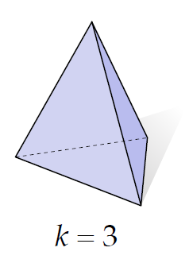
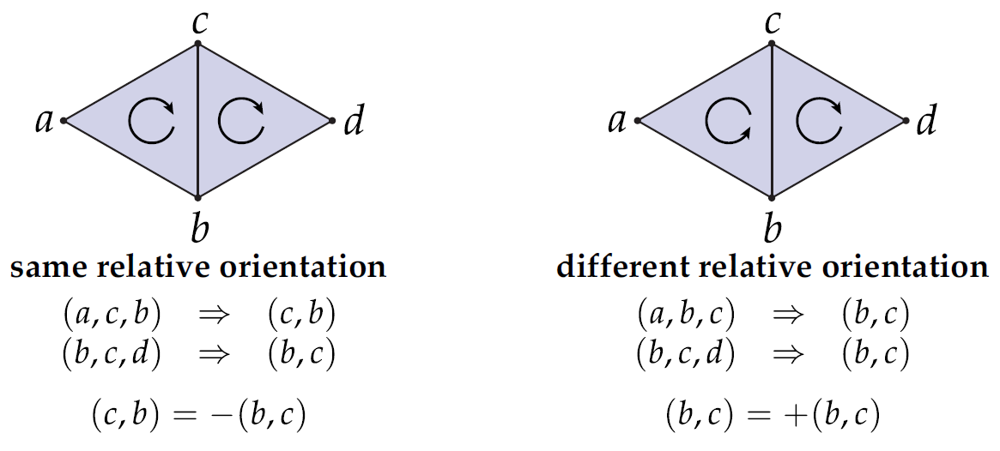
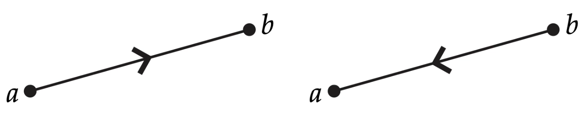
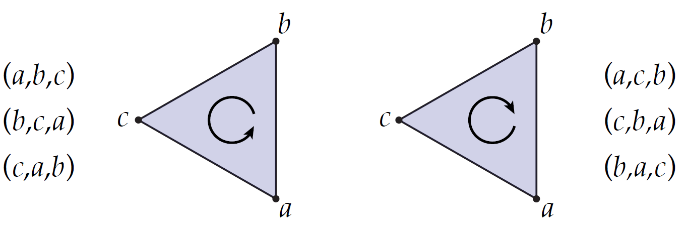
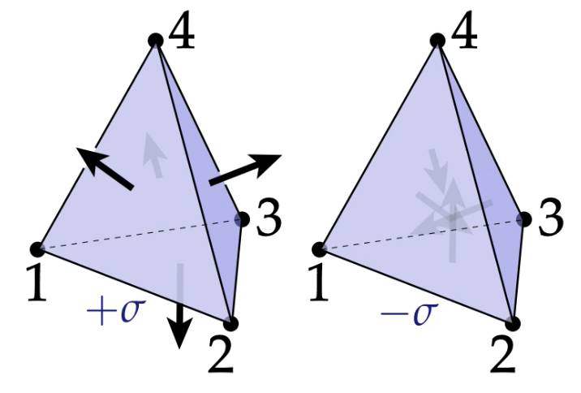
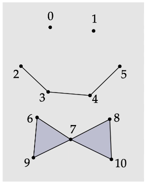

- ✒Notation
    - | Singular单数 | Plural复数 |
      | ------------ | ---------- |
      | Simplex      | Simplicies |
    
# 📝Definition
- (Geometric Definition) A ***k-simplex*** is the convex hull of *k+1* affinely-independent points, which also named ***vertices***.

# 📈Diagram
- (intuitive) From left to right, a *k-simplex* is a point, line segment, triangle, a tetrahedron...  Most of the time, we study $k\leq3$ .
- {:height 300, :width 500}

# 🧠Intuition
- The relation between $k$ and number of vertices
    - | k-simplex | How many vertices? | Image |
      | ---- | ---- | ---- |
      | 0-simplex | 1 = 0 + 1 | {:height 50, :width 50} |
      | 1-simplex | 2 = 1 + 1 | {:height 100, :width 100} |
      | 2-simplex | 3 = 2 + 1 | {:height 100, :width 100} |
      | 3-simplex | 4 = 3 + 1 | {:height 100, :width 100} |
    
- ⛈Characteristics / Properties
    - Orientation ^fc7728b5477d9d10
        - 📝Definition
            - The *orientation* of a simplex is an ordering of its vertices up to even permutation. One can specify an oriented simplex via one of its representative ordered [[tuple]]s.
           
        - ![[simplicial complex#^7cdbb5]]
        - ![[simplicial complex#^b0e241]]
        - 🌱Related Elements
            - The <u>oriented simplices</u> compose [[oriented simplicial complex]].
            
        - ⛈Characteristics / Properties
            - Relative Orientation ^2f1f3b6e0d3f5017
                - 📝Definition
                    - Two distinct oriented simplices have the same ***relative orientation*** if the two (maximal) faces in their intersection have **opposite** orientation.
                    
                - 📈Diagram
                    - 共面的边方向相冲，则为relative orientation.
                      The left is referred as **consistent orientation** while the right is referred as **inconsistent orientation**.
                      {:height 300, :width 400}
                    
        - 🏷Categories
            - Oriented 0-Simplex
                - What’s the orientation of a single vertex? Only one permutation of vertices(the zero-index), so only one orientation - $(a)$! (Positive).
                - {:height 200, :width 100}
                
            - Oriented 1-Simplex
                - 📝Definition
                    - $\{a,b\}$   is ***unordered set***.(NO direction)
                    - $(a,b)$ or $(b,a)$    is ***ordered tuples*** which can be illustrated as followed.
                    
                - 📈Diagram
                    - {:height 300, :width 300}
                    
                - 🎯Intent
                    - Why *orientation* matters? [[definite integral]].
                      $$
                      \int^b_a f(x)dx = -\int^a_b f(x)dx
                      $$
                    
            - Oriented 2-Simplex
                - 📝Definition
                    - For a 2-simplex, orientation given by "winding order" of vertices. An ***oriented 2-simplex*** can be specified by a 3-[[tuple]].
                    
                - 📈Diagram
                    - {:height 300, :width 400}
                    
            - Oriented 3-Simplex
                - 📝Definition
                    - Again... You see the pattern...
                    
                - 📈Diagram
                    - {:height 300, :width 300}
                    
                - ⌨Sample Code
                    - ``` python
                      >>> import itertools
                      >>> list(itertools.permutations([1,2,3,4]))
                      [(1, 2, 3, 4), (1, 2, 4, 3), (1, 3, 2, 4), (1, 3, 4, 2), (1, 4, 2, 3), (1, 4, 3, 2), 
                      (2, 1, 3, 4), (2, 1, 4, 3), (2, 3, 1, 4), (2, 3, 4, 1), (2, 4, 1, 3), (2, 4, 3, 1), 
                      (3, 1, 2, 4), (3, 1, 4, 2), (3, 2, 1, 4), (3, 2, 4, 1), (3, 4, 1, 2), (3, 4, 2, 1), 
                      (4, 1, 2, 3), (4, 1, 3, 2), (4, 2, 1, 3), (4, 2, 3, 1), (4, 3, 1, 2), (4, 3, 2, 1)]
                      ```
                    
            - Oriented $k$-Simplex
                - 🎯Intent
                    - To define orientation of simplex in general.
                    
                - 📝Definition
                    - An ***oriented k-simplex*** is an *ordered tuple*, up to **even** permutation.
                    - > ==**Note⚠**==: Why permutation is even? Because there are always **2** orientation **positive-negative** and **clockwise-counterclockwise**. Conventionally, we called the **even-index** permutation as "**positive**" while **odd-index** permutation as "**negative**".
                    
# 🏷Categories
## Probability Simplex
- 📝Definition
    - The *standard n-simplex* is the collection of points which is also known as ***probability simplex***.
    
- 🧠Intuition
    - Probability Simplex is just an alias for $n$-simplex since it can be used in probability...
    
- 📈Diagram
    - {:height 200, :width 200}
    - The above diagram is a *2-simplex* which lies in $\mathbb{R}^3$. Imagine all the possibilities of this simplex... No matter how, they all lie in the triangle $\sigma$ above. Therefore, it is called **probability simplex**.
    
# 🌱Related Elements
- [[simplicial complex]]

# 🛠Analogy

## 🔨Simplex  and Simplicial Complex in Rhino and PyTorch

| Discrete Differential Geometry | Rhino/Grasshopper Software | PyTorch Geometric                                            |
| ------------------------------ | -------------------------- | ------------------------------------------------------------ |
| 0-simplex                      | A point                    | ```x = torch.tensor([0,0,0], dtype=torch.float)```           |
| 1-simplex                      | An edge                    | ```edge_index = torch.tensor([[0, 1], [1, 0]], dtype=torch.long)``` |
| 2-simplex                      | A triangle                 | /                                                            |
| Abstract Simplicial Complex    | NA.                        | ```torch_geometric.data.Data```                              |
| Geometric Simplicial Complex   | `Rhino.Geometry.Mesh`      | `read_ply` or `read_obj`                                     |

> [!info] Remark
> 可以把0-simplex, 1-simplex和2-simplex理解为构建几何世界的基本元素，(只有一个点才是0-simplex，2个点是simplicial complex)。而把基本元素拼凑起来才是Mesh。
    
# 🗃Example
- 📌Small quiz on simplices
    - 💬Question: What are all the simplices?
    - 📈Diagram
        - {:height 200, :width 200}
        
    - ✏Answer: {6,7,9} {7,10,8} {2,3} {3,4} {4,5} {0} {1} {6,7} {7,9} {9,6} {7,8} {8,10} {10,7} {2} {3} {4} {5} {6} {7} {8} {9} {10} - simply write down all the **vertices**, **edges** and **faces**.
    
- ![[Barycentric Coordinates#^79cf4ca6f13358e9]]
- ![[Barycentric Coordinates#^61be35eb121706b7]]
