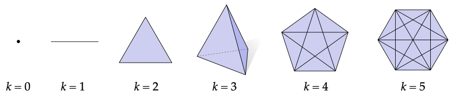

alias:: simplices

- ✒Notation
	- | Singular单数 | Plural复数 |
	  | ------------ | ---------- |
	  | Simplex      | Simplicies |
- # 📝Definition
	- (Geometric Definition) A ***k-simplex*** is the convex hull of *k+1* affinely-independent points, which also named ***vertices***.
- # 📈Diagram
	- (intuitive) From left to right, a *k-simplex* is a point, line segment, triangle, a tetrahedron...  Most of the time, we study $k\leq3$ .
	- {:height 300, :width 500}
- # 🧠Intuition
	- The relation between $k$ and number of vertices
		- | k-simplex | How many vertices? | Image |
		  | ---- | ---- | ---- |
		  | 0-simplex | 1 = 0 + 1 | {:height 50, :width 50} |
		  | 1-simplex | 2 = 1 + 1 | {:height 100, :width 100} |
		  | 2-simplex | 3 = 2 + 1 | {:height 100, :width 100} |
		  | 3-simplex | 4 = 3 + 1 | {:height 100, :width 100} |
- # 🏷Categories
	- ## Probability Simplex
		- 📝Definition
			- The *standard n-simplex* is the collection of points which is also known as ***probability simplex***.
		- 🧠Intuition
			- Probability Simplex is just an alias for $n$-simplex since it can be used in probability...
		- 📈Diagram
			- {:height 200, :width 200}
			- The above diagram is a *2-simplex* which lies in $\mathbb{R}^3$. Imagine all the possibilities of this simplex... No matter how, they all lie in the triangle $\sigma$ above. Therefore, it is called **probability simplex**.
- # 🗃Example
	- {{embed ((ec6b335c-c89b-49d0-b5d2-86520b26e5d9))}}
	- {{embed ((63477037-0c5c-4886-9751-b67f7aa1de7b))}}