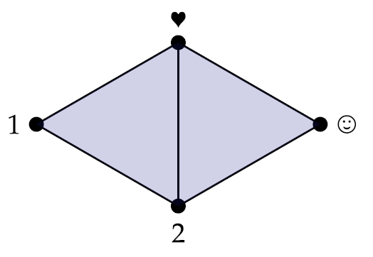
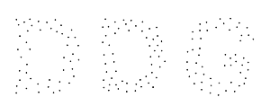
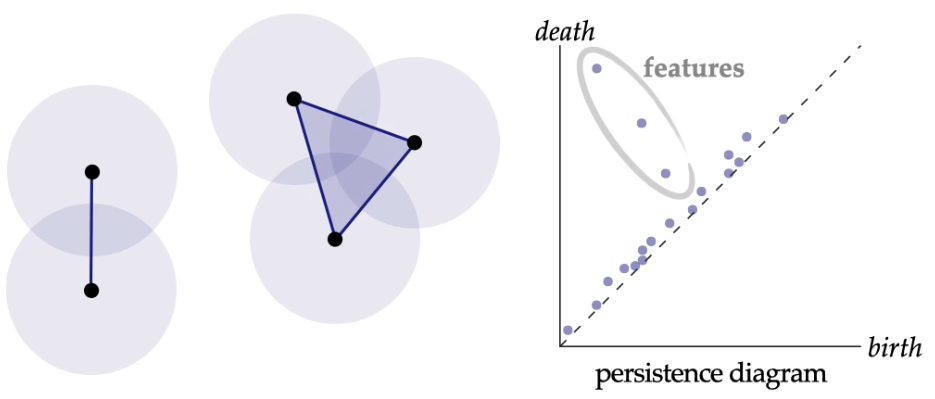
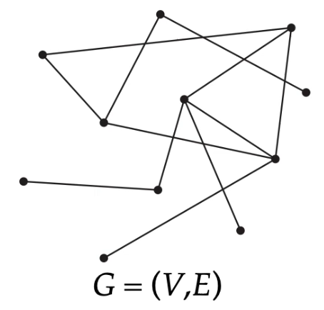

alias:: (Abstract) Simplicial Complex, (Geometric) Simplicial Complex

- 🧠Intuition
	- Simplicial Complex = a bunch of [[simplices]].
- 📝Definition
	- ==(Geometric) Simplicial Complex==
	  A (***geometric***) simplicial complex is a *collection* of simplices where (a) the *intersection* of any two simplices is a simplex, and every face of (b) every simplex in the complex is also in the complex.
	- ==(Abstract) Simplicial Complex==
	  Let $S$ be a collection of sets. If for each set $\sigma\in S$ all subsets of $\sigma$ are contained in $S$, then $S$ is an *abstract simplicial complex*. A set $\sigma\in S$ of size $k+1$ is an (***abstract***) simplicial complex.
	- {:height 200, :width 600}
		- 💡You can see these two as
			- the left is *with* coordinates and the right is *without* coordinates in the perspective of [torch_geometric.data.Data](https://pytorch-geometric.readthedocs.io/en/latest/modules/data.html#torch_geometric.data.Data).
			- the left as "**fabrication**" which requires everything lines up while the right as "**connectivity**" only.
- 🗃Example
	- 📌Abstract Simplicial Complex—Example
		- 💬Question: Consider the set $S:=$ {{1,2,🖤}, {2,🖤,🙂},{1,2},{2,🖤},{🖤,1},{2,🙂},{🖤,🙂},{1},{2},{🖤},{🙂}} Is this set an abstract simplicial complex? If so, what does it look like?
		- ✏Answer: Yes—it’s a pair of 2-[[simplices]] (triangles) sharing a single edge:
		- 📈Diagram
			- {:height 200, :width 200}
- 🧬Related Elements
	- [[Graph]]
		- Any *(undirected) graph* $G = (V,E)$ is an abstract simplicial (1-)complex. Because 0-simplices are vertices, 1-simplices are edges.
		- {:height 200, :width 200}
	-
- 🤳Applicability
	- 📌Topological Data Analysis
		- There are many applications of simplicial complex, one of which is persistent homology.
		- {:height 200, :width 300}
		- The idea is that
			- 1. increase the radius of vertices
			  2. if overlapped, then connect
			  3. track "birth" and "death" of features like connected components, holes, etc
			  4. features that persist for a long time are likely "real"
		- {:height 200, :width 400}
			- As the radius increasing(axis of birth), the "D", "O", "G" are created(**birth**) and **exist for a certain amount of time** until they are connected(**dead**) with excessive radius.
- 🛠Analogy
	- Research shows connecting what already know to new concepts and ideas sharpens their focus and deepens their understanding.
	- {{embed ((6348ad24-5fee-4b6f-838b-64d71ff6df08))}}
- 🏷(Sub)Categories
	- $1$-Complexes & $2$-Complexes
		- Most of the time, **1-complexes** and **2-complexes** are 2 entities been researched the most. The former is called **graphs** which relates to [[Graph Machine Learning]], [[Graph Theory]], Space Syntax, etc. The later is called **[[triangle mesh]]**(trimesh) which relates to Architecture, design, manufacturing, everything!
		- | simplicial k-complexes | alias         | notation      | Image                                                        |
		  | ---------------------- | ------------- | ------------- | ------------------------------------------------------------ |
		  | simplicial 1-complexes | graph         | $G = (V,E)$   | {:height 200 :width 200} |
		  | simplicial 2-complexes | triangle mesh | $K = (V,E,F)$ | {:height 200 :width 200} |
		- Notation above
			- $V$ = vertices
			- $E$ = edges
			- $F$ = faces
			- $K$ = komplex(in German)