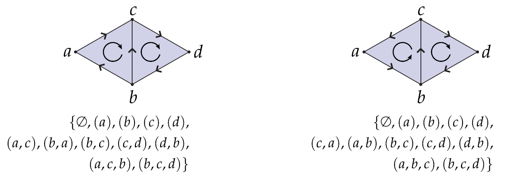
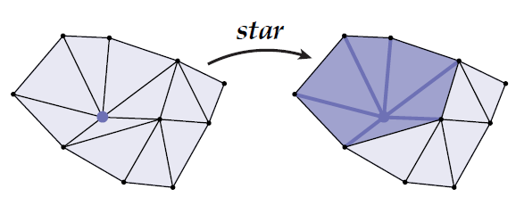
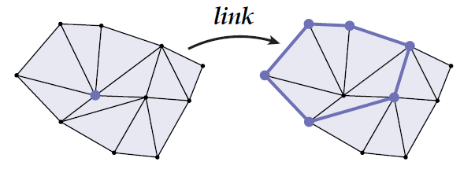
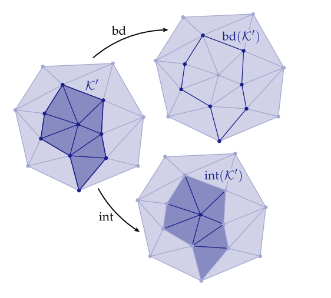

alias:: (Abstract) Simplicial Complex, (Geometric) Simplicial Complex

- 🧠Intuition
	- Simplicial Complex = a bunch of [[simplices]].
- 📝Definition
	- ==(Geometric) Simplicial Complex==
	  A (***geometric***) simplicial complex is a *collection* of simplices where (a) the *intersection* of any two simplices is a simplex, and every face of (b) every simplex in the complex is also in the complex.
	- ==(Abstract) Simplicial Complex==
	  Let $S$ be a collection of sets. If for each set $\sigma\in S$ all subsets of $\sigma$ are contained in $S$, then $S$ is an *abstract simplicial complex*. A set $\sigma\in S$ of size $k+1$ is an (***abstract***) simplicial complex.
	- {:height 200, :width 600}
		- 💡You can see these two as
			- the left is *with* coordinates and the right is *without* coordinates in the perspective of [torch_geometric.data.Data](https://pytorch-geometric.readthedocs.io/en/latest/modules/data.html#torch_geometric.data.Data).
			- the left as "**fabrication**" which requires everything lines up while the right as "**connectivity**" only.
- ⛈Characteristics / Properties
	- 📌Orientation on Simplicial Complex
	  id:: 634ff995-0c5f-4c6d-bcb4-cb0669206cba
		- 🧬Related Elements
			- For the orientation in [[simplices]], see [here](((88cc3933-a6ec-4333-9f4f-2defc94f7756))).
		- 📝Definition
			- In terms of the ability of orientation, the property of simplicial complex lies on (1)==orientable== and (2)==unorientable==.
		- > ==**Note on wording⚠**== Note the distinction between an "**orientable** manifold" and an "**oriented** manifold," where the former implies the possibility of giving the manifold in question an orientation, while the latter implies that the manifold has already been given an orientation.
		- id:: 63535aaf-3005-40c0-b6cf-64b75ae5f45e
		  > ==**Note on convention⚠**==: By convention, the vertices of face are *ordered* counter-clockwise around the triangle. Using the right-hand rule, we can define the normal of each triangle as the vector that points *most away* from the surface. {:height 200, :width 200}
		- Unorientable Simplicial Complex
			- 📝Definition
				- Unorientable simplicial complex is the opposite. The famous [[Möbius Band]] is one of the cases.
			- 📈Diagram
				- {:height 300, :width 300}
		- Orientable Simplicial Complex
			- 📝Definition
				- Orientable simplicial complex is an abstract simplicial complex where we can assign a **consistent orientation** to every triangle.
		- Oriented Simplicial Complex
		  id:: 634cd03e-8b16-4c78-912c-ff12ad1dc136
			- 📝Definition
				- An ***oriented simplicial complex*** is a simplicial complex where each [[Simplex]] is assigned an orientation.
			- 🧪Composition
				- An oriented simplicial complex is composed by [oriented simplices](((88cc3933-a6ec-4333-9f4f-2defc94f7756))).
			- 📈Diagram
				- {:height 300, :width 600}
	- 📌 [[manifold]] ⭐⭐⭐
		- 📝Definition
		  id:: 7194425b-b12b-4200-a441-4a5e60af1270
			- A simplicial $k$-complex is ***manifold*** if the [*link*](((634cb1d4-10c8-4101-ba78-6ca9f0d80a9d))) of every vertex looks like a $(k-1)$-dimensional sphere.
			- {:height 300, :width 600}
- 🗃Example
	- 📌Abstract Simplicial Complex—Example
		- 💬Question: Consider the set $S:=$ {{1,2,🖤}, {2,🖤,🙂},{1,2},{2,🖤},{🖤,1},{2,🙂},{🖤,🙂},{1},{2},{🖤},{🙂}} Is this set an abstract simplicial complex? If so, what does it look like?
		- ✏Answer: Yes—it’s a pair of 2-[[simplices]] (triangles) sharing a single edge:
		- 📈Diagram
			- {:height 200, :width 200}
- 🧬Related Elements
	- [[Graph]]
		- Any *(undirected) graph* $G = (V,E)$ is an abstract simplicial (1-)complex. Because 0-simplices are vertices, 1-simplices are edges.
		- {:height 200, :width 200}
	-
- 🤳Applicability
	- 📌Topological Data Analysis
		- There are many applications of simplicial complex, one of which is persistent homology.
		- {:height 200, :width 300}
		- The idea is that
			- 1. increase the radius of vertices
			  2. if overlapped, then connect
			  3. track "birth" and "death" of features like connected components, holes, etc
			  4. features that persist for a long time are likely "real"
		- {:height 200, :width 400}
			- As the radius increasing(axis of birth), the "D", "O", "G" are created(**birth**) and **exist for a certain amount of time** until they are connected(**dead**) with excessive radius.
- 🛠Analogy
	- Research shows connecting what already know to new concepts and ideas sharpens their focus and deepens their understanding.
	- {{embed ((6348ad24-5fee-4b6f-838b-64d71ff6df08))}}
- 🏷(Sub)Categories
	- Simplicial $1$-Complexes & Simplicial $2$-Complexes
		- > ==**Note⚠**==: Most of the time, **1-complexes** and **2-complexes** are 2 entities been researched the most. The former is called **graphs** which relates to [[Graph Machine Learning]], [[Graph Theory]], Space Syntax, etc. The later is called **[[triangle mesh]]**(trimesh) which relates to Architecture, design, manufacturing, everything!
		- | simplicial k-complexes | alias         | notation      | Image                                                        |
		  | ---------------------- | ------------- | ------------- | ------------------------------------------------------------ |
		  | [[simplicial 1-complexes]] | graph         | $G = (V,E)$   | {:height 200 :width 200} |
		  | [[simplicial 2-complexes]] | triangle mesh | $K = (V,E,F)$ | {:height 200 :width 200} |
		- Notation above
			- $V$ = vertices
			- $E$ = edges
			- $F$ = faces
			- $K$ = komplex(in German)
- 💫Operation
	- Suppose $S$ is a given set of simplices, the following are the operations.
	- Closure
		- 📝Definition
			- ***Closure*** $Cl(S)$ is the smallest (i.e., fewest elements) subcomplex of $K$ that contains $S$. In the following diagram, $S$ is a set of 1×triangle and an 1×edge.
		- 📈Diagram
			- {:height 300, :width 300}
	- Star
		- 📝Definition
			- ***Star*** $St(S)$ is the collection of all simplices in $K$ that contain any simplex in $S$. In the following diagram, $S$ is a vertex.
		- 📈Diagram
			- {:height 300, :width 300}
	- Link
	  id:: 634cb1d4-10c8-4101-ba78-6ca9f0d80a9d
		- 📝Definition
			- ***Link*** $Lk(S)$ is equal to $Cl(St(S)) \backslash St(Cl(S))$ which means taking out the $star\space St(s)$ from $closure\space Cl(S)$. In the following diagram, $S$ is a vertex.
		- 📈Diagram
			- {:height 300, :width 300}
	- Boundary
		- 📝Definition
			- ***Boundary*** $bd(K')$ is a pure $k$-subcomplex $K' \subseteq K$. The boundary is the closure of the set of all simplices $\sigma$ that are proper faces of exactly one simplex of $K'$.
		- 📈Diagram
			- TODO add diagram
	- Interior
		- 📝Definition
			- ***Interior*** $int(K') = K' \backslash  bd(K')$ is then everything but the boundary (as pictured above)
		- 📈Diagram
			- {:height 300, :width 300}
	- > ==**Note⚠**== Difference between Link and Boundary, Closure and Interior. The difference is that ***Link*** and ***Closure*** are referring to **[[Simplex]]** while ***Boundary*** and ***Interior*** are referring to **Complex/Subcomplex**.