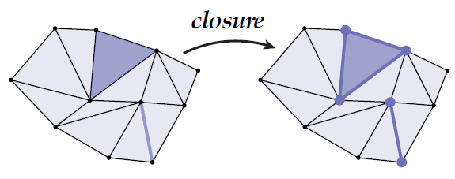

# 🧠Intuition
Simplicial Complex = a bunch of [[simplex|simplices]].
    
# 📝Definition
==(Geometric) Simplicial Complex==
A (***geometric***) simplicial complex is a *collection* of simplices where (a) the *intersection* of any two simplices is a simplex, and every face of (b) every simplex in the complex is also in the complex.
==(Abstract) Simplicial Complex==
Let $S$ be a collection of sets. If for each set $\sigma\in S$ all subsets of $\sigma$ are contained in $S$, then $S$ is an *abstract simplicial complex*. A set $\sigma\in S$ of size $k+1$ is an (***abstract***) simplicial complex.

> [!info] Remark
> - the left is *with* coordinates and the right is *without* coordinates in the perspective of [torch_geometric.data.Data](https://pytorch-geometric.readthedocs.io/en/latest/modules/data.html#torch_geometric.data.Data).
> - the left as "**fabrication**" which requires everything lines up while the right as "**connectivity**" only.

# 🌈Properties
## 🔴Orientation
### 📝Definition
In terms of the ability of orientation, the property of simplicial complex lies on
- (1)==orientable== 
- (2)==unorientable==.

> [!info] Remark
> Note the distinction between an "**orientable** manifold" and an "**oriented** manifold," where the former implies the possibility of giving the manifold in question an orientation, while the latter implies that the manifold has already been given an orientation.

^7cdbb5

> [!info] Remark
> By convention, the vertices of face are *ordered* counter-clockwise around the triangle. Using the right-hand rule, we can define the normal of each triangle as the vector that points *most away* from the surface. 

^b0e241

### 🌱Related Elements
For the orientation in [[simplices]], see [[simplex#^fc7728b5477d9d10|here]].

### 🏷Categories
There are several subjects derived from the concept of orientation.
- [[unorientable simplicial complex]]
- [[orientable simplicial complex]]
- [[oriented simplicial complex]]

## 🟠manifold
A simplicial $k$-complex is said to be manifold must satisfy certain conditions. see [[manifold#📝Definition]]

# 🗃Example
- 📁simplicial complex example
	- 💬Question: Consider the set $S:=$ {{1,2,🖤}, {2,🖤,🙂},{1,2},{2,🖤},{🖤,1},{2,🙂},{🖤,🙂},{1},{2},{🖤},{🙂}} Is this set an abstract simplicial complex? If so, what does it look like?
	- 🏹Strategy: xxx
	- 🗣Answer: Yes—it’s a pair of 2-[[simplex|simplices]] (triangles) sharing a single edge.
		- 

# 🌱Related Elements

## 🍏Graph
Any *(undirected) [[graph]]* $G = (V,E)$ is an abstract simplicial (1-)complex. Because 0-simplices are vertices, 1-simplices are edges.

	

  
# 🧀Applicability
## 🥯Topological Data Analysis

There are many applications of simplicial complex, one of which is persistent homology.

 The idea is that
1. increase the radius of vertices
2. if overlapped, then connect
3. track "birth" and "death" of features like connected components, holes, etc
4. features that persist for a long time are likely "real"
	

> [!info] Remark
> As the radius increasing(axis of birth), the "D", "O", "G" are created(**birth**) and **exist for a certain amount of time** until they are connected(**dead**) with excessive radius.

            
# 🛠Analogy

![[simplex#🛠Analogy#🔨Simplex and Simplicial Complex in Rhino and PyTorch]]

    
- 🏷(Sub)Categories
    - Simplicial $1$-Complexes & Simplicial $2$-Complexes
        - > ==**Note⚠**==: Most of the time, **1-complexes** and **2-complexes** are 2 entities been researched the most. The former is called **graphs** which relates to [[Graph Machine Learning]], [[Graph Theory]], Space Syntax, etc. The later is called **[[triangle mesh]]**(trimesh) which relates to Architecture, design, manufacturing, everything!
        - | simplicial k-complexes | alias         | notation      | Image                                                        |
          | ---------------------- | ------------- | ------------- | ------------------------------------------------------------ |
          | [[simplicial 1-complexes]] | graph         | $G = (V,E)$   | {:height 200 :width 200} |
          | [[simplicial 2-complexes]] | triangle mesh | $K = (V,E,F)$ | {:height 200 :width 200} |
        - Notation above
            - $V$ = vertices
            - $E$ = edges
            - $F$ = faces
            - $K$ = komplex(in German)

# 💫Operation
Suppose $S$ is a given set of simplices, the following are the operations.
## 🌠Closure
### 📝Definition
***Closure*** $Cl(S)$ is the smallest (i.e., fewest elements) subcomplex of $K$ that contains $S$. In the following diagram, $S$ is a set of 1×triangle and an 1×edge.

### 📈Diagram

## 🔮Star
### 📝Definition
***Star*** $St(S)$ is the collection of all simplices in $K$ that contain any simplex in $S$. In the following diagram, $S$ is a vertex.

### 📈Diagram

## ☄Link
### 📝Definition
***Link*** $Lk(S)$ is equal to $Cl(St(S)) \backslash St(Cl(S))$ which means taking out the $star\space St(s)$ from $closure\space Cl(S)$. In the following diagram, $S$ is a vertex.
### 📈Diagram

## 🌌Boundary
### 📝Definition
***Boundary*** $bd(K')$ is a pure $k$-subcomplex $K' \subseteq K$. The boundary is the closure of the set of all simplices $\sigma$ that are proper faces of exactly one simplex of $K'$.
### 📈Diagram
#TODO 

## 🥏Interior
### 📝Definition
***Interior*** $int(K') = K' \backslash  bd(K')$ is then everything but the boundary.
### 📈Diagram

> [!info] Remark
> Difference between Link and Boundary, Closure and Interior. The difference is that ***Link*** and ***Closure*** are referring to **[[simplex]]** while ***Boundary*** and ***Interior*** are referring to **Complex/Subcomplex**.
    
