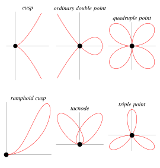

https://mathworld.wolfram.com/SingularPoint.html
# 📝Definition
In general, a singularity is a point at which an equation, surface, etc., blows up or becomes degenerate. Singularities are often also called singular points.

# 🏷Categories

| singularity       | curve                                                            | equation                            |
| ----------------- | ---------------------------------------------------------------- | ----------------------------------- |
| [[acnode]]        |                                                                  | $y^2+x^2+x^3=0$                     |
| [[cusp]]          | cusp curve                                                       | $x^3-y^2=0$                         |
| [[crunode]]       | [cardioid](https://mathworld.wolfram.com/Cardioid.html)          | $a^2y^2=2ax(x^2+y^2)+(x^2+y^2)^2$   |
| quadruple point   | [quadrifolium](https://mathworld.wolfram.com/Quadrifolium.html)  | $(x^2+y^2)^3=4a^2x^2y^2$            |
| [[ramphoid cusp]] | [keratoid cusp](https://mathworld.wolfram.com/KeratoidCusp.html) | $x^4+x^2y^2-2x^2y-xy^2+y^2=0$       |
| [[tacnode]]       | [capricornoid](https://mathworld.wolfram.com/Capricornoid.html)  | $a^2x^2(x^2+y^2)-b(ay-x^2-y^2)^2=0$ |
| triple point      | [trifolium](https://mathworld.wolfram.com/Trifolium.html)        | $(x^2+y^2)^2=a(x^3-3xy^2)$          |

