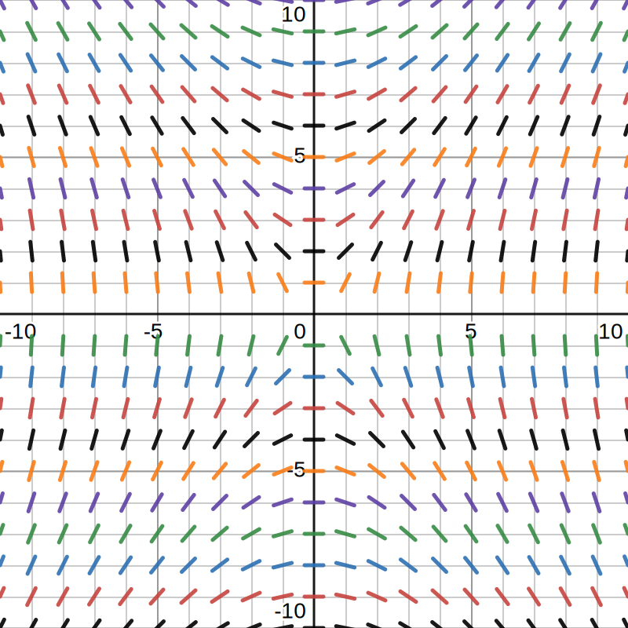
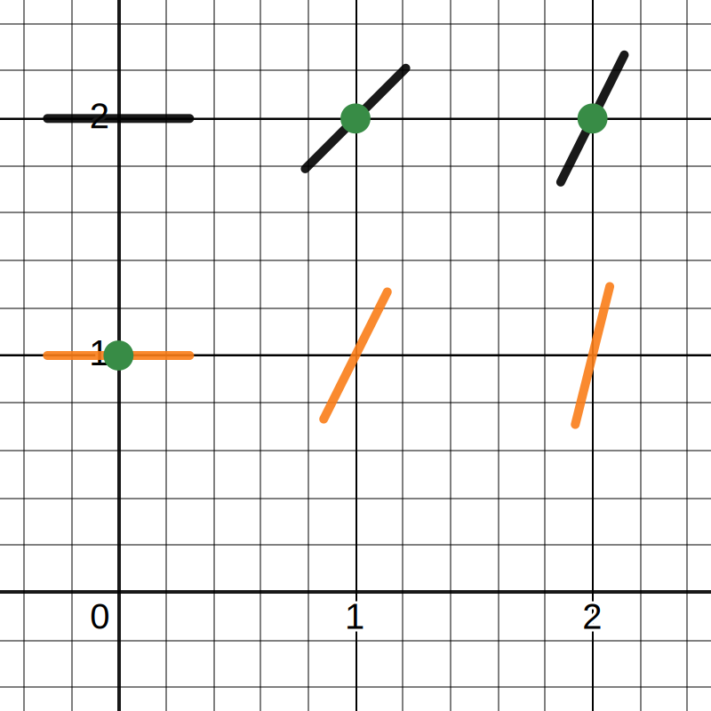

# 📝Definition
- The **slope field** is a diagram that helps us to visualize the information in a first order [[differential equation]] . The slope field is obtained as follows. At each point $(x,y)$, you draw a short segment whose slope is the *value* of $y'$ at the point $(x,y)$. The solution curves must be tangent to the slope field at all points.

# 📈Diagram
- The following is the slope field of
    - $$
      \frac{dy}{dx}=\frac{2x}{y}
      $$
    
- {:height 500, :width 500}
- Let's examine the following points for convincing
    - $$
      \begin{align}
      (1, 2)\Rightarrow\frac{dy}{dx}&=\frac{2x}{y}=\frac{2\cdot1}{2}=1\\
      (0, 1)\Rightarrow\frac{dy}{dx}&=\frac{2x}{y}=\frac{2\cdot0}{1}=0\\
      (2, 2)\Rightarrow\frac{dy}{dx}&=\frac{2x}{y}=\frac{2\cdot2}{2}=2\\
      &\text{when $y=0$, there is no slope field since it is undefined.}
      \end{align}
      $$
    - The zoom-in for the preceding dots in green
      {:height 300, :width 300}

# 🔗Link
https://math.mit.edu/~jmc/mathlets-mitx-18.01/slopeFields.html
