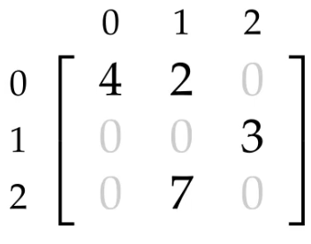

- 📝Definition
    - A sparse matrix is a matrix that allows special techniques to take advantage of the large number of "background" (commonly zero) elements.
    
- 🧠Intuition
    - A [[matrix]] with [[Sparsity]].
    
- 📈Diagram
    - {:height 100, :width 100}
    
- 🚀Benefit / Pros
    - can be stored and manipulated efficiently.
    
- ⛈Characteristics / Properties
    - Most entries are $0$.
    
- 💫Operation
    - $\bold{nnz}(A)$ is number of nonzero entries
    
- 🤳Applicability
    - Sparse Matrix as Topological Data Structure
        - 📝Definition
            - In practice, it’s essential to use a **sparse matrix**, i.e., a data structure that efficiently stores only the location and value of nonzero entries.
            
      -
      