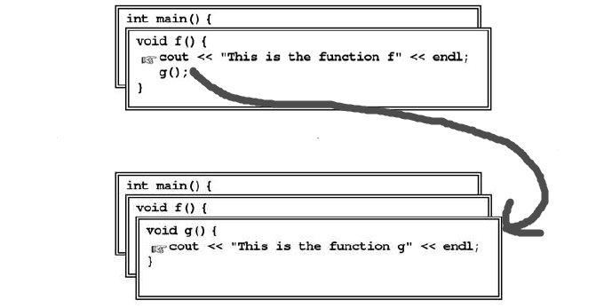

- # 😎Quick Digest -> Stack
	- ## 📝Definition
	  The name is the essence of this topic.
	- ## 🎯Intent
	   A short description what does this thing do?
	- ## ⭐Why it is important?
		- For the generic term of "stack"
			- The primary reason that stacks are important in programming is that nested function calls behave in a **stack-oriented fashion**!
			  {:height 229, :width 434}
			  Like the preceding diagram, the function calls are invoked in a stack frame.
	- ## 😲Intuitive Explanation
	  Find an intuitive way of explanation of this concept.
	- ## 🚀Benefit
	   A scenario that illustrates the benefit this object provides.
	- ## ⌨Sample Code
	   Code fragments
	- ## 🌓Complement
	  What is the complement of this subject? e.g. vector-covector, constructor-destructor
	- ## 🤳Applicability
	   What are the situations in which this subject can be applied?
	- ## 🧪Composition
	  What kind of stuffs composite this subject?
	- ## 🏷(Sub)Categories
	  What are the sub objects of this subject?
	- ## 🔎Implementation
	   The code or technical stuffs implement this.
	- ## 🕳Pitfalls
	  Be aware of the pitfalls when using this stuffs... (especially considering edge cases)
	- ## 🙋‍♂️Related Elements
	   The closest pattern to current one, what are their differences?
	- ## 🧱Structure
	  Any other hierarchical issues?