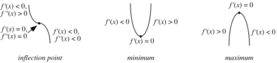

# 📝Definition
- A stationary point is a point $x_0$ at which the [[Derivative]] of a function $f(x)$ vanishes,
    - $$
      f'(x_0)=0.
      $$
    
# 🏷Categories
- A stationary point may be a #minimum, #maximum, or [[Inflection Point]].

# 📈Diagram
- {:height 300, :width 600}

# 🧬Related Elements
## 📌Stationary Point vs. Critical Point
- 📝Definition
    - All stationary points are critical points but not all critical points are stationary points.
    
- ✒Notation
    - $$
      \begin{align}
      \text{stationary points}\quad\subset\quad\text{critical points}
      \end{align}
      $$
    
- 🥂Comparison
    - Critical Point
        - [[differentiable]]✅
        - [[DNE]]✅
        
    - Stationary Point
        - [[differentiable]]✅
        - ~~DNE~~
        