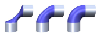

# 🗺Big Picture
- The exact mathematical model of a surface is usually intractable. Therefore, the word "surface" is smooth and it is only smooth in the world of #Mathematics but not the real world! Because in the real world, everything is discrete! This is the philosophy and this is when [[DDG]] steps in.
    
# 📝Definition
- In general,
	- 📝Definition
		- The word "surface" can be used to denote an $(n-1)$-dimensional submanifold of an $n$-dimensional [[manifold]] .
		
- In most common sense in #Mathematics ,
	- 📝Definition
		- The most common and straightforward use of the word is to denote a two-dimensional [submanifold](https://mathworld.wolfram.com/Submanifold.html) of three-dimensional [Euclidean space](https://mathworld.wolfram.com/EuclideanSpace.html).
		
- In #[[Computer Graphics]],
	- 📝Definition⭐
		- The common definition of a *surface* in the context of computer graphics application is "an [[Simplicial Complex#^2453002026d67ffe|orientable]] [[Continuous]] 2D [[manifold]] embedded in $\mathbb{R}^3$.
            
# ⛈Characteristics / Properties
## Smoothness
### 📝Definition
- Smoothness is measured by the number $k$ of [[Continuous]] [[Derivative]]s that the function have.
- 👑Importance
	- A surface SHOULD be smooth in general, except for a well-defined set of sharp feature-(curves, )
- > ==**Note⚠**==: This analytical definition of $C^k$ smoothness coincides with the intuitive geometrical understanding of smoothness only if the [[partial derivative]]s and the [[gradient]] do not vanish locally(regularity).
## Fairness
### 📝Definition
- This is the stricter requirement for surface, where not only the [[Continuity]] of the [[Derivative]]s but also their magnitude and variation is considered. No general definition of this properties but *a surface is fair* if the [[curvature]] or its variation is globally minimized.
### 📈Diagram
- {:height 200, :width 200}
  Three examples of fair surfaces, which define a blend between two cylinders:
	- *left*: a membrane surface that minimizes the surface area,
	- *center*: a thin-plate surface that minimizes total curvature,
	- *right*: a surface that minimizes the variation of mean curvature

# 💫Operation
> ==**Note⚠**==: Different representation has their own advantage on this.
## Evaluation
- This entails the [[sampling]] of the surface geometry or of other surface attributes, e.g., the surface normal field. A typical application example is surface [[rendering]].
	
## Query
- Spatial queries are used to determine whether or not a given point $p\in\mathbb{R}^3$ is inside or outside of the solid bounded by a surface $S$, which is a key component for solid [[modeling]] operations. Another typical query is the computation of a point's distance to a surface.
	
## Modification
- A surface can be modified either in terms of geometry or in terms of topology.
- The modification on **geometry** means the surface deformation.
- The modification on **topology** means the different parts of the surface are to be merged, cut, or deleted.
        
# 📏Surface Approximation
- 📋Prerequisite
	- For more complex shapes, a single function is not enough to define a surface.
	- A digital surface representation can only be an ==approximation== in general.
	- > ==**Note⚠**==: whether you like it or not, approximation is **mandatory**.
	
- 📝Definition
	- To solve the constraint of "a single function can't define a surface accurately", the function domain is usually split into smaller sub-regions and an individual function(surface patch) is defined for each segment. That's where approximation comes in.
		- For parametric representation, the "surface patch" is [[triangle mesh]] / polygon mesh.
		- For implicit representation, the "surface patch" is hexahedral [[voxel]]s or tetrahedral cells.
		
	- > ==**Note⚠**==: In this piecewise definition, each function needs to approximate the given shape only **locally**, while the **global** approximation tolerance is controlled by the size and number of segments.
	
- 🚿Common source of surface
	- The raw information about the input surface is obtained by **discrete** [[sampling]] (i.e., by evaluation if there already exists a digital representation, or by probing if the input comes from a real object).
	
- 🏹Strategy
	- 1️⃣Generate a mathematical surface representation by establishing [[Continuity]] to guarantee a consistent transition from each patch to its neighboring ones.
	- 2️⃣Restrict functions to the class of [[polynomial]]s.
		- (1/2 benefits) polynomial can be evaluated by elementary arithmetic operation
		- (2/2) the [[Karl Weierstrass#Weierstrass Approximation Theorem|Weierstrass Approximation Theorem]] guarantees that each smooth([[differentiable]]) function can be approximated by a polynomial up to desired precision.
		
	- 3️⃣Improve the accuracy of an approximation with piecewise polynomial.
		- Methods
			- method 1 *p-refinement*: raise the degree of the polynomial.
				- 🕳**Cons**
					- Can't make reasonable assumptions about the boundedness of higher-order [[Derivative]]s since our input is discretely sampled.
					- the $C^k$ smoothness condition between segments is hard to satisfy in higher order piece-wise function.
					
			- method 2 *h-refinement*: reduce the size of the individual segments and use more segments. (preferred in [[Geometry Processing]]👍)
				- 🚀**Pros**
					- With today's computer architecture([[GPU]], [[parallel computing]]), processing a large number of very simple objects is often more efficient than processing a smaller number of more complex ones.
					- > ==**Note⚠**==: That's why choice of $C^0$ piecewise linear surface representation, i.e. [[triangle mesh]] have become the widely established standard in geometry processing!!
                        
# 🎨Surface Representation
- 🔭Overview
	- From a high level point of view, there are 2 major classes of surface representations:
		- parametric representation
		- implicit representation
		
- 🎯Intent
	- Why does representation matter? For each specific problem in [[Geometry Processing]], we can identify a characteristic set of operations by which the computation is dominated, and hence we have to choose an appropriate representation that supports the efficient implementation of these operation.
	
- 🌓Comparison
	- > ==**Note⚠**==: Both parametric and implicit representation have their particular strengths and weakness, such that for each geometric problem the better suited one should be chosen.
	
- parametric representation
	- 📝Definition
		- Parametric surfaces are defined by a vector-valued parameterization function $f$ that maps a 2D parameter domain $\Omega$ to the surface $S$.
			- $$
			  f: \Omega\to S
			  $$
			- $\Omega$: the 2D parameter domain that $\Omega\subset\mathbb{R}^2$
			- $S$: the surface that $S=f(\Omega)\subset\mathbb{R}^3$.
			
	- 🗃Example
		- Define [[curve]] in parametric representation
			- $$
			  f: \Omega\to C \text{ with }\Omega=[a,b]\subset\mathbb{R}
			  $$
			- $C$: a planar curve.
			
		- Define a [[unit circle]] in parametric representation
			- $$
			  f:[0,2\pi]\to\mathbb{R}^2,\quad t\mapsto\begin{pmatrix}\cos t\\\sin t\end{pmatrix}
			  $$
			
- implicit representation
	- 📝Definition
		- Implicit (or volumetric) surface representation is defined to be the zero set of a scalar-valued function $F$
			- $$
			  F:\mathbb{R}^3\to\mathbb{R},\text{ i.e., }S=\{x\in\mathbb{R}^3|F(x)=0\}
			  $$
			
	- 🗃Example
		- Define [[curve]] in implicit representation
			- $$
			  C=\{x\in\mathbb{R}^2|F(x)=0\}\text{ with }F:\mathbb{R}^2\to\mathbb{R}
			  $$
			- $C$: a planar curve.
			
		- Define a [[unit circle]] in implicit representation
			- $$
			  F: \mathbb{R}^2\to\mathbb{R},\quad(x,y)\mapsto\sqrt{x^2+y^2}-1
			  $$
			