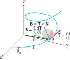

# 👑Importance
It is super important in #DifferentialGeometry .

# 📝Definition
In differential geometry, the TNB frame describes the #kinematic properties of a particle moving along a [[smooth curve|differentiable curve]] in three-dimensional Euclidean space $\mathbb {R} ^{3}$, or the geometric properties of the curve itself irrespective of any motion.

The tangent, normal, and binormal unit vectors, often called $\mathbf{T}, \mathbf{N}$, and $\mathbf{B}$ together form an orthonormal basis spanning $\mathbb{R}^3$ and are defined as follows:
- $\mathbf{T}$ - [[tangent vector|unit tangent vector]]
- $\mathbf{N}$ - [[normal vector|principal unit normal vector]]
- $\mathbf{B}$ - [[binormal vector]]

# 🧠Intuition
Find an intuitive way of understanding this concept.

# 🧪Composition
Actually, the TNB frame can be decomposed into twofold.

## 🧫normal plane
see [[normal plane]]
## ⚗osculating plane
see [[osculating plane]]

# 🗃Example
Example is the most straightforward way to understand a mathematical concept.

# 🌱Related Elements
The closest pattern to current one, what are their differences?

# 🍂Unorganized