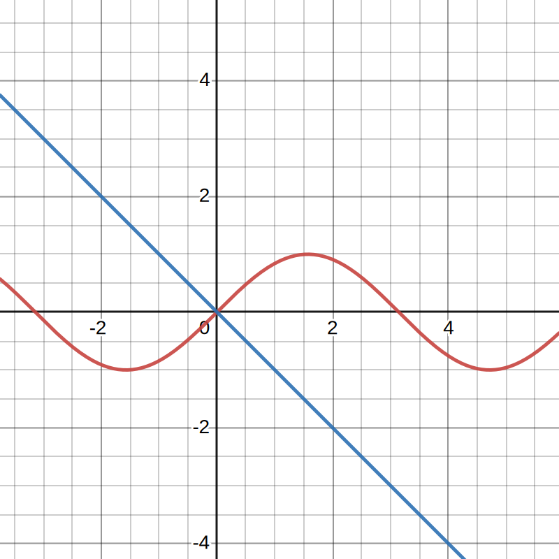
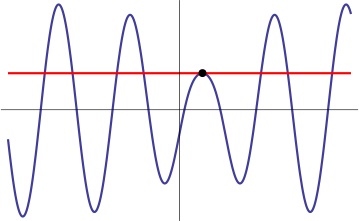
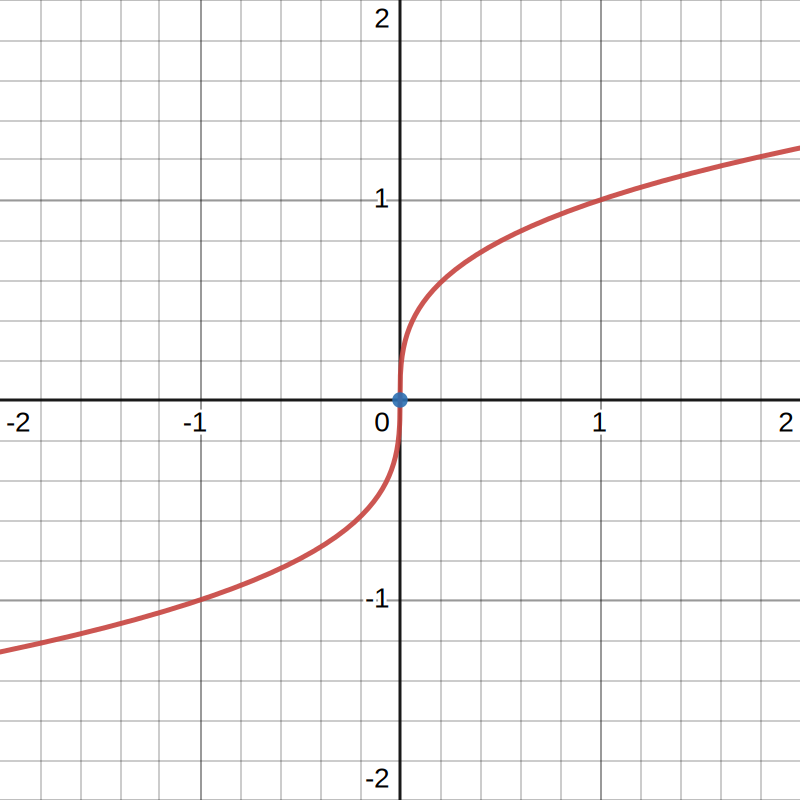

alias:: 切线

- # 🍴Quick Digest -> Tangent Line
	- ## 📝Definition
	  The **tangent line** to a function $f(x)$ at the point $x=a$ is the line that passes through the point $(a,f(a))$, and whose slope is the instantaneous rate of change of $f(x)$ at the point $x=a$. This slope is the slope of the line you get <u>if you imagine zooming in on the function until it looks like a line</u>.
	- ## 🧠Intuition
	  Find an intuitive way of understanding this concept.
	- ## 🧪Composition
	  How do you define a tangent line?
		- Point $(a,f(a))$
		- Slope $m, \text{where }m=f'(a)$
	- ## 🧮Expression
	  $$
	  \begin{align}
	  f(x)&=
	  \end{align}
	  $$
	- ## 📈Diagram
		- {{embed ((630dd42f-05af-4871-9d9c-b1234f6d866f))}}
		- 📌Diagram of "Is Not" a tangent line
		  {:height 300, :width 300}
		- 📌Diagram of "Is" a tangent line
		  {:height 300, :width 300}
	- ## ✒Descriptive Explanation
	  A narrative... a descriptive words subject on the concept... 描述性解释…
	- ## 🌓Complement
	  What is the complement of this subject? e.g. vector-covector, constructor-destructor
	- ## 🗃Example
	  Example is the most straightforward way to understand a mathematical concept.
	- ## 🤳Applicability
	   What are the situations in which this subject can be applied?
	- ## 🏷(Sub)Categories
	  What are the sub objects of this subject?
	- ## ⚖Laws
	  The laws related to this math concepts.
	- ## 🎯Intent
	   A short description what does this thing do?
	- ## 🙋‍♂️Related Elements
	   The closest pattern to current one, what are their differences?
		- 📌Relationship: Tangent Line vs. [[Derivative]]
			- The following is true:
				- ✅Function has derivative  at $x=a$, therefore👉 function has a tangent line at $x=a$
			- The following is wrong:
				- ❌Function has a tangent line at $x=a$, therefore👉 function has derivative  at $x=a$
			- Graph:
				- For function $f(x)=\sqrt[3]{x}$
				- {:height 300, :width 300}
				- at $x=0$ at
					- ✅has a tangent line
					- ❌not [[differentiable]], the derivative is [[DNE]]