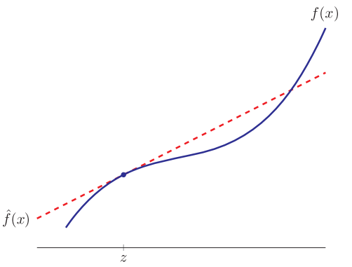

# 🧠Intuition
- Taylor's Theorem: a theorem that Brook Taylor stated containing Taylor Series.
- Taylor Series: an expression that Brook Taylor wrote.
- Taylor Polynomial: a function written in a polynomial form using Taylor Series.
- Taylor Approximation: a technique to do an approximation using Taylor Series.

# 📝Definition
## Taylor's Theorem
- Taylor's theorem states that any function satisfying certain conditions may be represented by a Taylor series.
- If $f$ has enough [[Derivative]]s in a $n$ hood of the point $a$, then $f$ is the sum of a [[polynomial]] and a remainder/error written as Taylor Series.

## Taylor Series
- A Taylor series is a series expansion of a function about **a point**. A one-dimensional Taylor series is an expansion of a real function $f(x)$ about a point $x=a$ is given by
    - Note: The right most $\cdots$ in the following equation is the "remainder" or "error".
      $$
      f(x)=f(a)+f'(a)(x-a)+\frac{f''(a)}{2!}(x-a)^2+\frac{f^{(3)}(a)}{3!}(x-a)^3+\cdots+\frac{f^{(n)}(a)}{n!}(x-a)^n+\cdots
      $$
    - Note: The right most $R$ in the following equation is the "remainder" or "error" which equal to the dots in the preceding.
      $$
      f(x)=\sum_{k=0}^{n}\frac{f^{(k)}(a)}{k!}(x-a)^k+R_k(x)
      $$
    
## Taylor Polynomial
- Function written in [[polynomial]] form using Taylor Series.
$$
f(x)\approx \text{a polynomial}
$$

## Taylor Approximation
- Suppose that $f: \mathbb{R^n} \to \mathbb{R}$ is differentiable, which means that its partial derivatives exist. Let $z$ be an $n$-vector. The (first-order) *Taylor Approximation* of $f$ near (or at) the point $z$ is the function $\hat{f}(x)$ of $x$ defined as:
  $$
  \hat{f}(x)=f(z)+\frac{\partial f}{\partial x_1}(z)(x_1-z_1)+\cdots+\frac{\partial f}{\partial x_n}(z)(x_n-z_n)
  $$
- $\frac{\partial f}{\partial x_i}(z)$ , denotes the [[partial derivative]] of $f$ with respect to its $i$th argument, evaluated at the $n$-vector $z$.
- $\hat{f}$  ,  the hat is a hint that it is an approximation of the function $f$.
- $\hat{f}(x;z)$  , is written with 2nd argument to show the point  $z$ at which the approximation is developed.
- $f(z)$  , the first item of Taylor is **constant**, while others can be seen as the contributions to the change(from $f(z)$) due to the changes in the component of $x$ (from $z$).

# 🎯Intent
- The intent is to do a scalar-valued operation of $n$ variables, or **relations** between $n$ variables and a scalar.
  $$
  \begin{bmatrix}
  x_1\\x_2\\\vdots\\x_n 
  \end{bmatrix}
  \to a
  $$
- Normally, this relation is **approximated** by
    - [[Linear Function]]
    - [[Affine Function]]
    
- Sometime these 2 functions are called **model**.
- Taylor series are extremely powerful tools for approximating functions that can be difficult to compute otherwise, as well as evaluating infinite sums and integrals by recognizing Taylor series.

# ⛈Characteristics
- 📌$\hat{f}$ **is** an [[Affine Function]] of $x$
    - Apparently, since there is always a $f(z)$ ,which is a constant, in the beginning, $\hat{f}(x)$ is therefore an **affine function**. It could be written as followed:
      $$
      \hat{f}(x)=f(z)+\nabla f(z)^T(x-z)
      $$
        - $f(z)$, it is a constant which is the value of this function when $x=z$
        - $\nabla f(z)$  , is a $n$-vector, the **gradient** of $f$ at the point $z$ is:
          
          $$
          \nabla f(z)=\begin{bmatrix}\frac{\partial f}{\partial x_1}(z)\\\vdots\\\frac{\partial f}{\partial x_n}(z)\end{bmatrix}
          $$
        - $(x-z)$, the **deviation/perturbation(偏差/扰动)** of $x$ respect to $z$
        
    - Therefore we can write the Taylor Approximation in the form of affine function
        - $$
          \hat{f}(x)=f(z)+\nabla f(z)^T(x-z)=\underbrace{\nabla f(z)^T}_\text{"a"}x+\underbrace{f(z)-\nabla f(z)^Tz}_\text{"b"}
          $$
        
- 📌elaboration on "approximation"
    - A simple example, for $n = 1$, is shown in the following figure. Over the full $x$-axis scale shown, the Taylor approximation $\hat{f}$ does not give a good approximation of the function $f$. But for $x$ near $z$, the Taylor approximation is very **good**.
    - {:height 300, :width 300}
    - A function $f$ of one variable is called the first-order Taylor approximation $\hat{f}(x)=f(z)+f'(z)(x-z)$ which exactly is [[Linear Approximation]]. The word "linear" emphasizes that the graph of that function is a straight line.
    
# 🌱Related Elements
## 📌Linear Approximation vs. Quadratic Approximation vs. Taylor Approximation
- [[Linear Approximation]], first **2** terms of Taylor Series. a.k.a. the highest derivative is to $f^{(1)}$ or $f'$
- [[Quadratic Approximation]] , first **3** terms of Taylor Series. a.k.a. the highest derivative is to $f^{(2)}$ or $f''$
- ==Taylor Approximation==, can be up to $n$! a.k.a. the highest derivative is to $f^{(n)}$

# 🗃Example
- 📌Example of using first 3 terms of the Taylor Series expansion ^51ad388a391cadb
    - Question
        - Using the first 3 terms of the Taylor series expansion of $f(x) = \frac{1}{x^2}$​ approximate the value of $\frac{1}{4.41}$
        
    - Note
        - This is actually [[Quadratic Approximation]].
        
    - Solution
        - The quadratic Taylor polynomial is
            - $$
              P_2​(x)=f(a)+\frac{f'(a)}{1!}​(x−a)+\frac{f''(a)}{2!}​(x−a)^2
              $$
            
        - First, write down the derivatives needed for the Taylor expansion:
            - $$
              f(x)=\frac{1}{x^2},\quad f'(x)=\frac{-2}{x^3},\quad f''(x)=\frac{6}{x^4}
              $$
            
        - Now we choose a good $a$ so that the values of the derivatives are easy to calculate. Rewriting the approximated value as
            - $$
              4.41=(2+0.1)^2
              $$
          -
            - implies $a = 2$ and $x = 2.1$
          -
          
        - Compute
            - $$
              \begin{align}
              P_2​(2.1)&=f(2)+\frac{f'(2)}{1!}​(2.1−2)+\frac{f''(2)}{2!}​(2.1-2)^2\\
              &=\frac{1}{4}+\frac{\frac{-2}{8}}{1!}​(2.1−2)+\frac{\frac{6}{16}}{2!}​(2.1-2)^2\\
              &=\frac{1}{4}+\frac{-1}{4}(0.1)+\frac{3}{16}(0.01)\\
              &=0.25-0.025+0.001875\\
              &=0.226875
              \end{align}
              $$
            
    - Result
        - The actual value of $\frac{1}{4.41}$ is
            - $$
              \frac{1}{4.41}=0.226757
              $$
            
        - so the approximation is only off by about 0.05% which is pretty good.
        
- 📌Example of using Taylor Approximation
    - Question
        - Consider the function $f : \mathbb{R}^2 \to \mathbb{R}$ given by $f(x) = x_1 + \text{exp}(x_2 − x_1 )$ , which is not linear or affine. The assignment is to **find** the Taylor Approximation $\hat{f}$ **near the point** $z=(1,2)$.
        
    - Solution
        - take the partial derivative of this function:
          
          $$
          \nabla f(z)=
          \begin{bmatrix}
          1-\text{exp}(z_2-z_1)\\
          \text{exp}(z_2-z_1)
          \end{bmatrix}
          $$
        - two, place $z_2=2, z_1=1$ in it
        - $\text{exp}=e,\quad e^1=2.7183$, therefore $\nabla f(z)$ at $z=(1,2)$ is:
          
          $$
          \nabla f(z)=
          \begin{bmatrix}
          1-e^1\\
          e^1
          \end{bmatrix}
          =
          \begin{bmatrix}
          -1.7183\\
          2.7183
          \end{bmatrix}
          $$
          
        - $f(z)$ at $z=(1,2)$ is:
          
          $$
          f(z)=x_1 + \text{exp}(x_2 − x_1 )=1+e^{2-1}=3.7183
          $$
        - the Taylor approximation therefore is:
          
          $$
          \begin{align}
          \hat{f}(x)&=f(z)+\nabla f(z)^T(x-z)\\
          &=3.7183+\begin{bmatrix}-1.7183&
          2.7183\end{bmatrix}^T(x-\begin{bmatrix}1\\2\end{bmatrix})\\
          &=3.7183+\begin{bmatrix}-1.7183&
          2.7183\end{bmatrix}^T(\begin{bmatrix}x_1\\x_2\end{bmatrix}-\begin{bmatrix}1\\2\end{bmatrix})\\
          &=3.7183-1.7183(x_1 -1)+2.7183(x_2-2)
          \end{align}
          $$
        
    - Result
        - Use a table to measure the performance of Taylor Approximation at $x=1.00, y=2.00$
        - | $x$           | $f(x)$ | $\hat{f}(x)$ | $\lvert\hat{f}(x)-f(x)\rvert$ |
          | ------------- | ------ | ------------ | ----------------------- |
          | (1.00, 2.00)  | 3.7183 | 3.7183       | 0.000                   |
          | (0.96, 1.98)  | 3.7332 | 3.7326       | 0.0005                  |
          | (1 .10, 2.11) | 3.8456 | 3.8455       | 0.0001                  |
          | (0.85, 2.05)  | 4.1701 | 4.1119       | 0.0582                  |
          | (1.25, 2.41)  | 4.4399 | 4.4032       | 0.0367                  |
        
