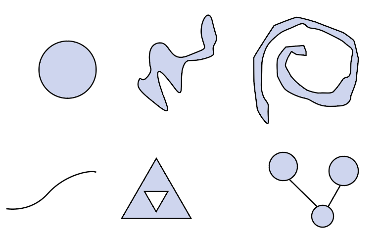

- 📝Definition
	- A topological disk is **any shape** you can get **by deforming the unit disk** in the plane **without** *tearing* it, *puncturing* it, or *gluing* its edges together. Some examples of shapes that are disks include a flag, a leaf. Some examples of shapes that are not disks include a circle (i.e., *a disk without its interior*), a *hollow* sphere, a *donut*, a fidget *spinner*, and a *teapot*.
- 📈Diagram
	- {:height 300, :width 300}
	  The objects in the first row **are** manifolds while the second row **aren't**.