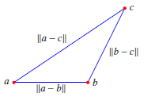

- ✒Notation
    - $$
      \begin{align}
      \lVert v+w \rVert\leq\lVert v \rVert \lVert w \rVert
      \end{align}
      $$
    
- 📝Definition
    - For triangle with vertices at positions $a,b,c$
    - edge lengths are
        - $$
          \lVert a-b \rVert, \lVert b-c \rVert, \lVert a-c \rVert
          $$
        
    - by triangle inequality
        - $$
          \lVert a-c \rVert = \lVert (a-b)+(b-c) \rVert\leq \lVert a-b \rVert + \lVert b-c \rVert
          $$
        
- 🧠Intuition
    - third edge length is no longer than sum of other two
        - {:height 200, :width 200}
        
- 🗃Example
    - 📌example of inequalities of vector
        - 💬Question: Find $\cos\theta$ for $v=\begin{bmatrix}2\\1\end{bmatrix}$ and $w=\begin{bmatrix}1\\2\end{bmatrix}$ and check both inequalities.
        - ✏Solution
            - Compute all the needed elements
                - $v\cdot w=4, \lVert v \rVert=\sqrt{5}, \lVert w \rVert=\sqrt{5}, v+w=\begin{bmatrix}3\\3\end{bmatrix}$
                
            - For Schwarz inequality
                - $$
                  \begin{align}
                  \lvert v\cdot w\rvert&\leq\lVert v\rVert\lVert w\rVert\\
                  4&<\sqrt{5}\sqrt{5}\\
                  4&<5
                  \end{align}
                  $$
                
            - For Triangle inequality
                - $$
                  \begin{align}
                  \lVert v+w \rVert&\leq\lVert v \rVert \lVert w \rVert\\
                  \sqrt{3^2+3^2}&<\sqrt{5}+\sqrt{5}\\
                  3\sqrt{2}&<2\sqrt{5}
                  \end{align}
                  $$
                
  -
  