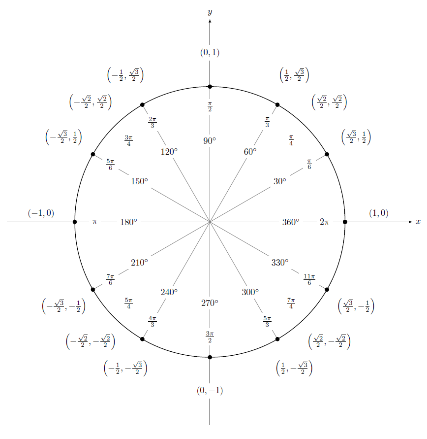
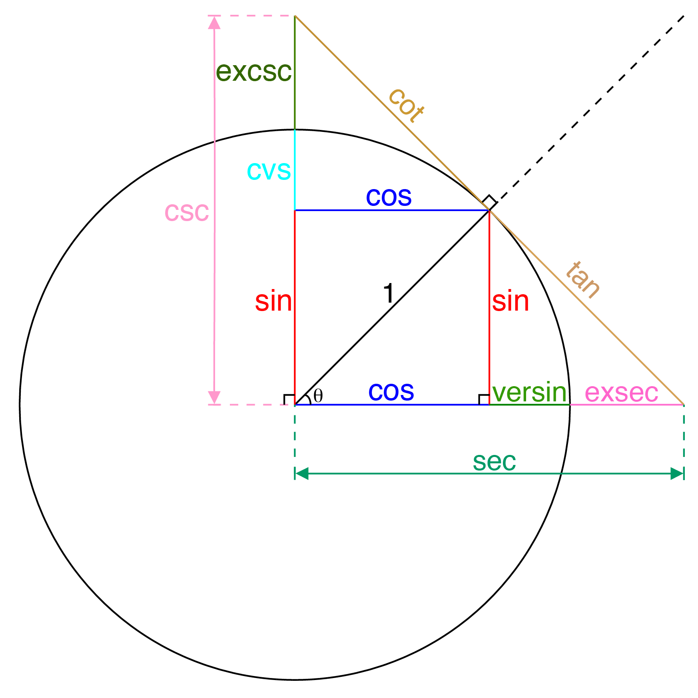
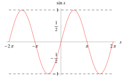
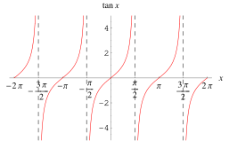

# 🧾 Cheat Sheet
**📌 Degrees**
$x$ is for $\cos(\theta)$ and $y$ is for $\sin(\theta)$

| Radian    | Degree | $\sin(\theta)$ | $\cos(\theta)$ | $\tan(\theta)$     | $\csc(\theta)$     | $\sec(\theta)$     | $\cot(\theta)$     |
| --------- | ------ | -------------- | -------------- | ------------------ | ------------------ | ------------------ | ------------------ |
| $0/2\pi$  | 0      | $0$            | $1$            | $0$                | $\text{undefined}$ | $1$                | $\text{undefined}$ |
| $\pi/6$   | 30     | $1/2$          | $\sqrt{3}/2$   | $\sqrt{3}/3$       | $2$                | $2\sqrt{3}/3$      | $\sqrt{3}$         |
| $\pi/4$   | 45     | $\sqrt{2}/2$   | $\sqrt{2}/2$   | $1$                | $\sqrt{2}$         | $\sqrt{2}$         | $1$                |
| $\pi/3$   | 60     | $\sqrt{3}/2$   | $1/2$          | $\sqrt{3}$         | $2\sqrt{3}/3$      | $2$                | $\sqrt{3}/3$       |
| $\pi/2$   | 90     | $1$            | $0$            | $\text{undefined}$ | $\sqrt{2}$         | $\text{undefined}$ | $0$                |
| $2\pi/3$  | 120    | $\sqrt{3}/2$   | $-1/2$         | $-\sqrt{3}$        | $2$                | $-2$               | $-\sqrt{3}/3$      |
| $3\pi/4$  | 135    | $\sqrt{2}/2$   | $-\sqrt{2}/2$  | $-1$               | $\text{undefined}$ | $-\sqrt{2}$        | $-1$               |
| $5\pi/6$  | 150    | $1/2$          | $-\sqrt{3}/2$  | $-\sqrt{3}/3$      | $-2$               | $-2\sqrt{3}/3$     | $-\sqrt{3}$        |
| $\pi$     | 180    | $0$            | $-1$           | $0$                | $-\sqrt{2}$        | $-1$               | $\text{undefined}$ |
| $7\pi/6$  | 210    | $-1/2$         | $-\sqrt{3}/2$  | $\sqrt{3}/3$       | $-2\sqrt{3}/3$     | $-2\sqrt{3}/3$     | $\sqrt{3}$         |
| $5\pi/4$  | 225    | $-\sqrt{2}/2$  | $-\sqrt{2}/2$  | $1$                | $-1$               | $-\sqrt{2}$        | $1$                |
| $4\pi/3$  | 240    | $-\sqrt{3}/2$  | $-1/2$         | $\sqrt{3}$         | $-2\sqrt{3}/3$     | $-2$               | $\sqrt{3}/3$       |
| $3\pi/2$  | 270    | $-1$           | $0$            | $\text{undefined}$ | $-1$               | $\text{undefined}$ | $0$                |
| $5\pi/3$  | 300    | $-\sqrt{3}/2$  | $1/2$          | $-\sqrt{3}$        | $-2\sqrt{3}/3$     | $2$                | $-\sqrt{3}/3$      |
| $7\pi/4$  | 315    | $-\sqrt{2}/2$  | $\sqrt{2}/2$   | $-1$               | $-\sqrt{2}$        | $\sqrt{2}$         | $-1$               |
| $11\pi/6$ | 330    | $-1/2$         | $\sqrt{3}/2$   | $-\sqrt{3}/3$      | $-2$               | $2\sqrt{3}/3$      | $\sqrt{3}$         |

**📌 [[unit circle]]**

**📌 Domain and Range**
$$
\begin{align}
\cdot&\space\sin:\mathbb{R}\longrightarrow[-1,1]\\
\cdot&\space\cos:\mathbb{R}\longrightarrow[-1,1]\\
\cdot&\space\tan:\left\{x \in \mathbb{R} \ \middle| \ x \neq \frac{\pi}{2} + k\pi\right\}\longrightarrow\mathbb{R}\\
\cdot&\space\cot:\left\{x \in \mathbb{R} \ \middle| \ x \neq k\pi\right\}\longrightarrow\mathbb{R}\\
\cdot&\space\csc:\left\{x \in \mathbb{R} \ \middle| \ x \neq k\pi\right\}\longrightarrow\mathbb{R} \setminus \left(-1,1\right)\\
\cdot&\space\sec:\left\{x \in \mathbb{R} \ \middle| \ x \neq \frac{\pi}{2} + k\pi\right\}\longrightarrow\mathbb{R} \setminus \left(-1,1\right)\\
\cdot&\space\sin^{-1}: \left[-1,1\right] \longrightarrow \left[-\frac{\pi}{2},\frac{\pi}{2}\right]\\
\cdot&\space\cos^{-1}: \left[-1,1\right] \longrightarrow \left[0,\pi\right]\\
\cdot&\space\tan^{-1}: \mathbb{R} \longrightarrow \left[-\frac{\pi}{2},\frac{\pi}{2}\right]\\
\end{align}
$$

**📌 Pythagorean Identities**
$$
\begin{align}
\cos ^2(\theta )+\sin ^2(\theta )&=1\\
1+\tan ^2(\theta )&=\sec ^2(\theta )\qquad \left(\theta \neq \frac{\pi }{2}+n\pi \right)\\
\cot ^2(\theta )+1&=\csc ^2(\theta ) \qquad \left(\theta \neq n\pi \right)
\end{align}
$$

**📌 Periodicity Identities**
$$
\begin{align}
\text{(i)}\quad&\sin(x \pm 2\pi) = \sin(x)\\
\text{(ii)}\quad&\cos(x \pm 2\pi) = \cos(x)\\
\text{(iii)}\quad&\tan(x \pm \pi) = \tan(x)\\
\text{(iv)}\quad&\cot(x \pm \pi) = \cot(x)\\
\text{(v)}\quad&\csc(x \pm 2\pi) = \csc(x)\\
\text{(vi)}\quad&\sec(x \pm 2\pi) = \sec(x)\\
\end{align}
$$

**📌 Reciprocal Identities**
$$
\begin{align}
\text{(i)}\quad&\cot(x) = \frac{1}{\tan(x)}\\
\text{(ii)}\quad&\csc(x) = \frac{1}{\sin(x)}\\
\text{(iii)}\quad&\sec(x) = \frac{1}{\cos(x)}\\
\end{align}
$$

**📌 Quotient Identities**
$$
\begin{align}
\text{(i)}\quad&\tan(x) = \frac{\sin(x)}{\cos(x)}\\
\text{(ii)}\quad&\cot(x) = \frac{\cos(x)}{\sin(x)}\\
\end{align}
$$

**📌 Sum Identities**
$$
\begin{align}
\text{(i)}\quad&\sin(x + y) = \sin(x)\cos(y) + \cos(x)\sin(y)\\
\text{(ii)}\quad&\cos(x + y) = \cos(x)\cos(y) - \sin(x)\sin(y)\\
\text{(iii)}\quad&\tan(x + y) = \frac{\tan(x) + \tan(y)}{1-\tan(x)\tan(y)}\\
\end{align}
$$

**📌 Difference Identities**
$$
\begin{align}
\text{(i)}\quad&\sin(x - y) = \sin(x)\cos(y) - \cos(x)\sin(y)\\
\text{(ii)}\quad&\cos(x - y) = \cos(x)\cos(y) + \sin(x)\sin(y)\\
\text{(iii)}\quad&\tan(x - y) = \frac{\tan(x) - \tan(y)}{1 + \tan(x)\tan(y)}\\
\end{align}
$$
**📌 Double Angle Identities**
$$
\begin{align}
\text{(i)}\quad&\sin(2x) = 2\sin(x)\cos(x)\\
\text{(ii)}\quad&\cos(2x) = \cos^2(x) - \sin^2(x) \\
\text{(iii)}\quad&\cos(2x) = 2\cos^2(x) - 1 \Rightarrow \cos^2(x) = \frac{\cos(2x)+1}{2}\\
\text{(iv)}\quad&\cos(2x) = 1 - 2\sin^2(x) \Rightarrow \sin^2(x) = \frac{1-\cos(2x)}{2}\\
\text{(v)}\quad&\tan(2x) = \frac{2\tan(x)}{1-\tan^2(x)} \\
\end{align}
$$

**📌 Co-Function Identities**
$$
\begin{align}
\text{(i)}\quad&\sin\left(\frac{\pi}{2}-x\right) = \cos(x)\\
\text{(ii)}\quad&\cos\left(\frac{\pi}{2}-x\right) = \sin(x)\\
\text{(iii)}\quad&\tan\left(\frac{\pi}{2}-x\right) = \cot(x)\\
\text{(iv)}\quad&\cot\left(\frac{\pi}{2}-x\right) = \tan(x)\\
\text{(v)}\quad&\csc\left(\frac{\pi}{2}-x\right) = \sec(x)\\
\text{(vi)}\quad&\sec\left(\frac{\pi}{2}-x\right) = \csc(x)\\
\end{align}
$$

**📌 Even-Odd Identities**
$$
\begin{align}
\text{(i)}\quad&\sin(-x) = -\sin(x)\\
\text{(ii)}\quad&\cos(-x) = \cos(x)\\
\text{(iii)}\quad&\tan(-x) = -\tan(x)\\
\text{(iv)}\quad&\cot(-x) = -\cot(x)\\
\text{(v)}\quad&\csc(-x) = -\csc(x)\\
\text{(vi)}\quad&\sec(-x) = \sec(x)\\
\end{align}
$$

**📌 Half-Angle Identities**
$$
\begin{align}
\text{(i)}\quad&\sin\left(\frac{x}{2}\right) = \pm\sqrt{\frac{1-\cos(x)}{2}}\\
\text{(ii)}\quad&\cos\left(\frac{x}{2}\right) = \pm\sqrt{\frac{1+\cos(x)}{2}}\\
\text{(iii)}\quad&\tan\left(\frac{x}{2}\right) = \pm\sqrt{\frac{1-\cos(x)}{2}}\\
\text{(iv)}\quad&\tan\left(\frac{x}{2}\right) = \frac{1-\cos(x)}{\sin(x)}\\
\text{(v)}\quad&\tan\left(\frac{x}{2}\right) = \frac{\sin(x)}{1+\cos(x)}\\
\end{align}
$$

**📌 Sum-to-Product Formulas**
$$
\begin{align}
\text{(i)}\quad&\sin(x) + \sin(y) = 2\sin\left(\frac{x+y}{2}\right)\cos\left(\frac{x-y}{2}\right)\\
\text{(ii)}\quad&\sin(x) - \sin(y) = 2\sin\left(\frac{x-y}{2}\right)\cos\left(\frac{x+y}{2}\right)\\
\text{(iii)}\quad&\cos(x) + \cos(y) = 2\cos\left(\frac{x+y}{2}\right)\cos\left(\frac{x-y}{2}\right)\\
\text{(iv)}\quad&\cos(x) - \cos(y) = -2\sin\left(\frac{x+y}{2}\right)\cos\left(\frac{x-y}{2}\right)\\
\end{align}
$$

**📌 Product-to-Sum Formulas**
$$
\begin{align}
\text{(i)}\quad&\sin(x)\sin(y) = \frac{1}{2}\left[\cos(x-y)-\cos(x+y)\right]\\
\text{(ii)}\quad&\cos(x)\cos(y) = \frac{1}{2}\left[\cos(x-y)+\cos(x+y)\right]\\
\text{(iii)}\quad&\sin(x)\cos(y) = \frac{1}{2}\left[\sin(x+y)+\sin(x-y)\right]\\
\text{(iv)}\quad&\cos(x)\sin(y) = \frac{1}{2}\left[\sin(x+y)-\sin(x-y)\right]\\
\end{align}
$$

**📌 Tangent expression**
$$
\begin{align}
\text{(i)}\quad&\cos(x) = \frac{1-u^2}{1+u^2}\\
\text{(ii)}\quad&\sin(x) = \frac{2u}{1+u^2}\\
\text{(iii)}\quad&\tan(x) = \frac{2u}{1-u^2}\\
\end{align}
$$

**📌 Hyperbolic Functions**
$$
\begin{align}
\text{(i)}\quad&\sinh(x) = \frac{e^x-e^{-x}}{2}\\
\text{(ii)}\quad&\cosh(x) = \frac{e^x+e^{-x}}{2}\\
\text{(iii)}\quad&\tanh(x) = \frac{e^x-e^{-x}}{e^x+e^{-x}}\\
\end{align}
$$

**📌 Laws of Sines**
$$
\begin{align}
\frac{\sin(\alpha)}{a} = \frac{\sin(\beta)}{b} = \frac{\sin(\gamma)}{c}
\end{align}
$$

**📌 Laws of Cosines**
$$
\begin{align}
\text{(i)}\quad&a^2 = b^2 + c^2 - 2bc\cos(\alpha)\\
\text{(ii)}\quad&b^2 = a^2 + c^2 - 2ac\cos(\beta)\\
\text{(iii)}\quad&c^2 = a^2 + b^2 - 2ab\cos(\gamma)\\
\end{align}
$$

# 📝Definition
The functions (also called the circular functions) comprising trigonometry: the cosecant $\csc x$, cosine $\cos x$, cotangent $\cot x$, secant $\sec x$, sine $\sin x$, and tangent $\tan x$.

# 🏷Categories
- [[sine]]
- [[cosine]]

# Sine
- 📝Definition
    - $$
      \sin\theta=\frac{\text{opposite}}{\text{hypotenuse}}
      $$
    
- 📈Diagram
    - {:height 300, :width 300}{:height 300, :width 300}
    # Cosine ^9b59e69500dc4a98
    
    

    
# Tangent
- 📝Definition
    - $$
      \tan\theta=\frac{\text{opposite}}{\text{adjacent}}\equiv\frac{\sin\theta}{\cos\theta}
      $$
    
- 📈Diagram
    - {:height 300, :width 300}
    
# inverse cosine
- 📝Definition
    - The name is the essence of this topic.
    