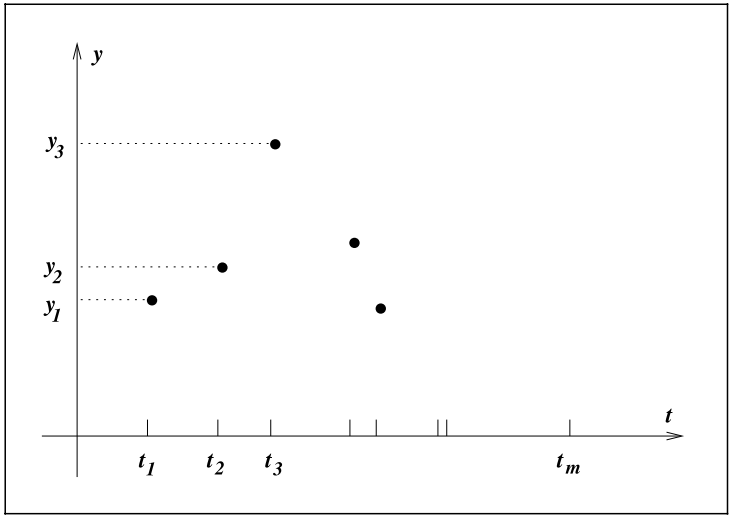

- 📝Definition
	- TODO verify if this belongs to "definition" or "composition"
	- ​variable: real number$\mathbb{R}$​ with no restrictions(infinite)
	- ​formula: $\text{min}_xf(x)$​
	- ​$x\in \mathbb{R}^n$ : is a real vector, $n\geq 1$
	- ​$f:\mathbb{R}^n \to \mathbb{R}$​ , is a smooth function
- ⛈Characteristics
	- ​lack of global perspective on the function(due to the unconstrained domain), only some scope on $x_1,x_2,...$
- 🗃Example
	- 📌Least Square Data Fitting Problem
		- {:height 200, :width 350}
		- Solution:
			- inspect the data
			- deduce the signal with possible solution
			- detect exponential and oscillatory behavior
			- write a formula
			- $\phi(t;x)=x_1+x_2e^{-(x_3-t^2)/4}+x_5cos(x_6t)$
			- $t$: times at $x$ axis, (input)
			- y: output
			- $x_i,i=1,2,...6$ : the parameter of the model
			- therefore $x_i$ can also be written as a vector: $x=(x_1,x_2,...,x_6)^T$
			- What to do? Minimize the discrepancy between $\phi(t;x)$ and $y_t$
			- $r_j(x)=y_j-\phi(t_j;x),\quad j=1,2,...,m$    m is the amount of input data
		- Written formally:
			- $$
			  \min_{x\in\mathbb{R}^6} f(x)=r_1^2(x)+r_2^2(x)+...+r_m^2(x)
			  $$
		- Note
			- This is so-called **non-linear least-squares problems**(非线性最小二乘问题).
			- Quick question why **square** the $r_i$? Because the residual can be negative.