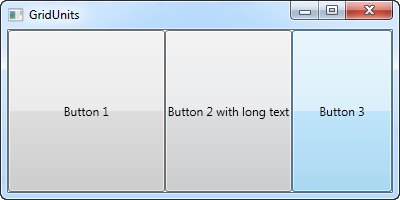

# WPF
# 📝Definition
- WPF, which stands for Windows Presentation Foundation, is Microsoft's latest approach to a GUI framework, used with the .NET **framework**.

# 🧪Composition
- 📌In terms of files level
    - Whether you're creating a Window or a Page, it will consist of
    - a [[XAML]] document.
        - extension with `xxx.xaml`
        - The XAML file describes the interface with all its elements
        
    - a CodeBehind file, which together creates the Window/Page.
        - extension with `xxx.xaml.cs`
        - The CodeBehind handles all the events and has access to manipulate with the XAML **controls**.
        
# ⛈Characteristics / Properties
- 📌Event-driven
    - Most modern UI frameworks are event driven. All of the controls exposes a range of **events** that you may **subscribe to**.
    
# 🌓Complement
- 📌WPF vs. WinForm
    - https://wpf-tutorial.com/about-wpf/wpf-vs-winforms/
    
# Style
- 📝Definition
    - WPF introduces styling, which is to [[XAML]] what CSS is to HTML. Using styles, you can group a set of properties and assign them to specific controls or all controls of a specific type, and just like in CSS, a style can inherit from another style.
    
- 🚀Benefit / Pros
    - Modify the style of a group of controls rather than copy/paste the style from control to control.
    
- ⌨Sample Code
    - Basic style example ^f631e50c538cbc9c
        - ``` xaml
          <Window x:Class="WpfTutorialSamples.Styles.SimpleStyleSample"
                  xmlns="http://schemas.microsoft.com/winfx/2006/xaml/presentation"
                  xmlns:x="http://schemas.microsoft.com/winfx/2006/xaml"
                  Title="SimpleStyleSample" Height="200" Width="250">
              <StackPanel Margin="10">
                  <StackPanel.Resources>
                      <Style TargetType="TextBlock">
                          <Setter Property="Foreground" Value="Gray" />
                          <Setter Property="FontSize" Value="24" />
                      </Style>
                  </StackPanel.Resources>
                  <TextBlock>Header 1</TextBlock>
                  <TextBlock>Header 2</TextBlock>
                  <TextBlock Foreground="Blue">Header 3</TextBlock>
              </StackPanel>
          </Window>
          ```
        - 
        - Things to be observed:
            - `TargetType` - It specifies what control you want to modify.
            - `.Resources` - It declares the styles in the resources of a control.
            - `Setter Property` - It explicitly set what properties of a control.
            - `Foreground="Blue"` - The style can be override. The "Header 3" has different color than others.
            
- 🏷(Sub)Categories
    - However, styles can be defined in several different scopes, depending on where and how you want to use them. There are bunch of them:
        - Local control specific style
        - Local child control style
        - Window-wide styles
        - Application-wide styles
        - Explicitly using styles ⭐ (control what kinds of style you want to use, e.g. for the same control `TextBox`, you may have `Heading` style and `Normal` style).
        
    - Local control specific style
        - ⌨Code
            - ``` xaml
              <Window x:Class="WpfTutorialSamples.Styles.ControlSpecificStyleSample"
                      xmlns="http://schemas.microsoft.com/winfx/2006/xaml/presentation"
                      xmlns:x="http://schemas.microsoft.com/winfx/2006/xaml"
                      Title="ControlSpecificStyleSample" Height="100" Width="300">
                  <Grid Margin="10">
                      <TextBlock Text="Style test">
                          <TextBlock.Style>
                              <Style>
                                  <Setter Property="TextBlock.FontSize" Value="36" />
                              </Style>
                          </TextBlock.Style>
                      </TextBlock>
                  </Grid>
              </Window>
              ```
            
        - 📈Diagram
            - 
            
    - Local child control style
        - See the [[#^f631e50c538cbc9c|simple code example]]
        
    - Window-wide styles
        - 🎯Intent
            - To control the style in a "page/window/user control".
            
        - ⌨Code
            - ``` xaml
              <Window x:Class="WpfTutorialSamples.Styles.WindowWideStyleSample"
                      xmlns="http://schemas.microsoft.com/winfx/2006/xaml/presentation"
                      xmlns:x="http://schemas.microsoft.com/winfx/2006/xaml"
                      Title="WindowWideStyleSample" Height="200" Width="300">
                  <Window.Resources>
                      <Style TargetType="TextBlock">
                          <Setter Property="Foreground" Value="Gray" />
                          <Setter Property="FontSize" Value="24" />
                      </Style>
                  </Window.Resources>
                  <StackPanel Margin="10">
                      <TextBlock>Header 1</TextBlock>
                      <TextBlock>Header 2</TextBlock>
                      <TextBlock Foreground="Blue">Header 3</TextBlock>
                  </StackPanel>
              </Window>
              ```
            
        - 📈Diagram
            - 
            
    - Application-wide style
        - 🔍Implementation
            - For an application-wide style, you have to explicitly set the styles in `App.xaml` file.
            
        - ⌨Code
            - `App.xaml`
              ``` xaml
              <Application x:Class="WpfTutorialSamples.App"
                           xmlns="http://schemas.microsoft.com/winfx/2006/xaml/presentation"
                           xmlns:x="http://schemas.microsoft.com/winfx/2006/xaml"
              	 StartupUri="Styles/WindowWideStyleSample.xaml">
                  <Application.Resources>
                      <Style TargetType="TextBlock">
                          <Setter Property="Foreground" Value="Gray" />
                          <Setter Property="FontSize" Value="24" />
                      </Style>
                  </Application.Resources>
              </Application>
              ```
            - Windows
              
              ``` xaml
              <Window x:Class="WpfTutorialSamples.Styles.WindowWideStyleSample"
                      xmlns="http://schemas.microsoft.com/winfx/2006/xaml/presentation"
                      xmlns:x="http://schemas.microsoft.com/winfx/2006/xaml"
                      Title="ApplicationWideStyleSample" Height="200" Width="300">
                  <StackPanel Margin="10">
                      <TextBlock>Header 1</TextBlock>
                      <TextBlock>Header 2</TextBlock>
                      <TextBlock Foreground="Blue">Header 3</TextBlock>
                  </StackPanel>
              </Window>
              ```
            
        - 📈Diagram
            - 
            
    - Explicitly using styles
        - 🎯Intent
            - Telling WPF that you only want to use this style when you explicitly reference it on a specific control.
            
        - ⌨Code
            - ``` xaml
              <Window x:Class="WpfTutorialSamples.Styles.ExplicitStyleSample"
                      xmlns="http://schemas.microsoft.com/winfx/2006/xaml/presentation"
                      xmlns:x="http://schemas.microsoft.com/winfx/2006/xaml"
                      Title="ExplicitStyleSample" Height="150" Width="300">
                  <Window.Resources>
                      <Style x:Key="HeaderStyle" TargetType="TextBlock">
                          <Setter Property="Foreground" Value="Gray" />
                          <Setter Property="FontSize" Value="24" />
                      </Style>
                  </Window.Resources>
                  <StackPanel Margin="10">
                      <TextBlock>Header 1</TextBlock>
                      <TextBlock Style="{StaticResource HeaderStyle}">Header 2</TextBlock>
                      <TextBlock>Header 3</TextBlock>
                  </StackPanel>
              </Window>
              ```
            
        - 📈Diagram
            - 
            
        - 📋Notes
            - Use `x:Key="xxx"` to give a name to certain style.
            - Use `Style="{StaticResource xxxStyleName}"` to explicitly use such style.
            
# Panel
- 📝Definition
    - Panels **act as containers** for other controls and **control the layout of your windows/pages**.
    
- 🎯Intent
    - Since a window can only contain ONE child control, a panel is often used to divide up the space into areas, where each area can contain a control or another panel (which is also a control, of course).
    
- 🥼Expert's Advice
    - Picking the right panel is therefore essential to getting the behavior and layout you want, and especially in the start of your WPF career, this can be a difficult job.
    
- 🏷(Sub)Categories
    - Canvas
        - 📝Definition
            - A simple panel, which mimics the WinForms way of doing things. It allows you to **assign specific coordinates** to each of the child controls, giving you total control of the layout.
            
        - 🚀Benefit / Pros
            - Give you all the freedom.
            
        - 🕳Pitfalls / Cons
            - Not flexible.
            
        - 🧀Applicability
            - Since its 所见即所得 nature, it is good at illustration and painting.
            
        - ⌨Sample Code
            - Code fragments
            - example 1
                - ``` xaml
                  <Window x:Class="WpfTutorialSamples.Panels.Canvas"
                          xmlns="http://schemas.microsoft.com/winfx/2006/xaml/presentation"
                          xmlns:x="http://schemas.microsoft.com/winfx/2006/xaml"
                          Title="Canvas" Height="200" Width="200">
                  	<Canvas>
                  		<Button>Button 1</Button>
                  		<Button>Button 2</Button>
                  	</Canvas>
                  </Window>
                  ```
                - 
                - As you can see, even though we have two buttons, they are both placed in the exact same place, so only the last one is visible.
                
            - example 2
                - ``` xaml
                  <Window x:Class="WpfTutorialSamples.Panels.Canvas"
                          xmlns="http://schemas.microsoft.com/winfx/2006/xaml/presentation"
                          xmlns:x="http://schemas.microsoft.com/winfx/2006/xaml"
                          Title="Canvas" Height="200" Width="200">
                  	<Canvas>
                  		<Button Canvas.Left="10">Top left</Button>
                  		<Button Canvas.Right="10">Top right</Button>
                  		<Button Canvas.Left="10" Canvas.Bottom="10">Bottom left</Button>
                  		<Button Canvas.Right="10" Canvas.Bottom="10">Bottom right</Button>
                  	</Canvas>
                  </Window>
                  ```
                - 
                - If you explicitly state the distance, the layout is pretty much ok.
                
    - WrapPanel
        - 📝Definition
            - The WrapPanel will position each of its child controls next to the other, horizontally (default) or vertically, **until there is no more room**, where it will wrap to the next line and then continue.
            
        - 🔗 Link
            - https://learn.microsoft.com/en-us/dotnet/api/system.windows.controls.wrappanel?view=windowsdesktop-6.0
            - https://wpf-tutorial.com/panels/wrappanel/
            
        - 🧠Intuition
            - Like a stacking problem... It stops when it is full.
            
        - ⌨Sample Code
            - sample 1
                - ``` xaml
                  <Window x:Class="WpfTutorialSamples.Panels.WrapPanel"
                          xmlns="http://schemas.microsoft.com/winfx/2006/xaml/presentation"
                          xmlns:x="http://schemas.microsoft.com/winfx/2006/xaml"
                          Title="WrapPanel" Height="300" Width="300">
                  	<WrapPanel>
                  		<Button>Test button 1</Button>
                  		<Button>Test button 2</Button>
                  		<Button>Test button 3</Button>
                  		<Button Height="40">Test button 4</Button>
                  		<Button>Test button 5</Button>
                  		<Button>Test button 6</Button>
                  	</WrapPanel>
                  </Window>
                  ```
                - 
                - Few characteristics can be observed
                  **Length Alignment**. The specific height on `button 4` causes the entire row of buttons to have the same height instead of the default height.
                  **Wrapping**. The panel wraps the content when it can't fit any more of it in. In this case, the fourth button couldn't fit in on the first line, so it automatically wraps to the next line.
                  - If I shrink the window. The wrapping happens.
                  - 
                  
            - sample 2
                - ``` 
                  xaml
                  <Window x:Class="WpfTutorialSamples.Panels.WrapPanel"
                          xmlns="http://schemas.microsoft.com/winfx/2006/xaml/presentation"
                          xmlns:x="http://schemas.microsoft.com/winfx/2006/xaml"
                          Title="WrapPanel" Height="120" Width="300">
                  	<WrapPanel Orientation="Vertical">
                  		<Button>Test button 1</Button>
                  		<Button>Test button 2</Button>
                  		<Button>Test button 3</Button>
                  		<Button Width="140">Test button 4</Button>
                  		<Button>Test button 5</Button>
                  		<Button>Test button 6</Button>
                  	</WrapPanel>
                  </Window>
                  ```
                - Notice we change the "Orientation" to "Vertical". And it will be aligned vertically.
                  
                
    - StackPanel
        - 📝Definition
            - The StackPanel acts much like the WrapPanel, but instead of wrapping if the child controls take up too much room, it simply expands itself... The typical behavior is that it extends too much and hides part of it...
            
        - 🔗 Link
            - https://learn.microsoft.com/en-us/dotnet/api/system.windows.controls.stackpanel?view=windowsdesktop-6.0
            - https://wpf-tutorial.com/panels/stackpanel/
            
        - ⌨Sample Code
            - sample 1
                - ``` xaml
                  <Window x:Class="WpfTutorialSamples.Panels.StackPanel"
                          xmlns="http://schemas.microsoft.com/winfx/2006/xaml/presentation"
                          xmlns:x="http://schemas.microsoft.com/winfx/2006/xaml"
                          Title="StackPanel" Height="160" Width="300">
                  	<StackPanel>
                  		<Button>Button 1</Button>
                  		<Button>Button 2</Button>
                  		<Button>Button 3</Button>
                  		<Button>Button 4</Button>
                  		<Button>Button 5</Button>
                  		<Button>Button 6</Button>
                  	</StackPanel>
                  </Window>
                  ```
                - 
                - Few things can be observed
                  **Auto extend**. The StackPanel doesn't really care whether or not there's enough room for the content.
                  **Stretch by default**. Another thing you will likely notice is that the StackPanel stretches its child control by default anti direction. e.g. Orientation is vertical, then stretch is horizontal.
                  - You can modify the stretching direction.
                    
                    ``` xaml
                    <StackPanel Orientation="Horizontal">
                    ```
                  - 
                  
            - sample 2
                - ``` xaml
                  <Window x:Class="WpfTutorialSamples.Panels.StackPanel"
                          xmlns="http://schemas.microsoft.com/winfx/2006/xaml/presentation"
                          xmlns:x="http://schemas.microsoft.com/winfx/2006/xaml"
                          Title="StackPanel" Height="160" Width="300">
                  	<StackPanel Orientation="Horizontal">
                  		<Button VerticalAlignment="Top">Button 1</Button>
                  		<Button VerticalAlignment="Center">Button 2</Button>
                  		<Button VerticalAlignment="Bottom">Button 3</Button>
                  		<Button VerticalAlignment="Bottom">Button 4</Button>
                  		<Button VerticalAlignment="Center">Button 5</Button>
                  		<Button VerticalAlignment="Top">Button 6</Button>
                  	</StackPanel>
                  </Window>
                  ```
                - 
                - we can explicitly specify the alignment of each element under the stacking.
                
            - sample 3
                - ``` xaml
                  <Window x:Class="WpfTutorialSamples.Panels.StackPanel"
                          xmlns="http://schemas.microsoft.com/winfx/2006/xaml/presentation"
                          xmlns:x="http://schemas.microsoft.com/winfx/2006/xaml"
                          Title="StackPanel" Height="160" Width="300">
                  	<StackPanel Orientation="Vertical">
                  		<Button HorizontalAlignment="Left">Button 1</Button>
                  		<Button HorizontalAlignment="Center">Button 2</Button>
                  		<Button HorizontalAlignment="Right">Button 3</Button>
                  		<Button HorizontalAlignment="Right">Button 4</Button>
                  		<Button HorizontalAlignment="Center">Button 5</Button>
                  		<Button HorizontalAlignment="Left">Button 6</Button>
                  	</StackPanel>
                  </Window>
                  ```
                - 
                - Same thing we can do on the horizontal version.
                
    - DockPanel
        - 📝Definition
            - The name is the essence of this topic.
            
        - 🔗 Link
            - https://wpf-tutorial.com/panels/dockpanel/
            - https://learn.microsoft.com/en-us/dotnet/api/system.windows.controls.dockpanel?view=windowsdesktop-6.0
            
        - ⌨Sample Code
            - sample 1
                - ``` xaml
                  <Window x:Class="WpfTutorialSamples.Panels.DockPanel"
                          xmlns="http://schemas.microsoft.com/winfx/2006/xaml/presentation"
                          xmlns:x="http://schemas.microsoft.com/winfx/2006/xaml"
                          Title="DockPanel" Height="250" Width="250">
                  	<DockPanel>
                  		<Button DockPanel.Dock="Left">Left</Button>
                  		<Button DockPanel.Dock="Top">Top</Button>
                  		<Button DockPanel.Dock="Right">Right</Button>
                  		<Button DockPanel.Dock="Bottom">Bottom</Button>
                  		<Button>Center</Button>
                  	</DockPanel>
                  </Window>
                  ```
                - 
                
            - sample 2
                - ``` xaml
                  <Window x:Class="WpfTutorialSamples.Panels.DockPanel"
                          xmlns="http://schemas.microsoft.com/winfx/2006/xaml/presentation"
                          xmlns:x="http://schemas.microsoft.com/winfx/2006/xaml"
                          Title="DockPanel" Height="250" Width="250">
                  	<DockPanel>
                  		<Button DockPanel.Dock="Top" Height="50">Top</Button>
                  		<Button DockPanel.Dock="Bottom" Height="50">Bottom</Button>
                  		<Button DockPanel.Dock="Left" Width="50">Left</Button>
                  		<Button DockPanel.Dock="Right" Width="50">Right</Button>	
                  		<Button>Center</Button>
                  	</DockPanel>
                  </Window>
                  ```
                - 
                
            - sample 3
                - ``` xaml
                  <Window x:Class="WpfTutorialSamples.Panels.DockPanel"
                          xmlns="http://schemas.microsoft.com/winfx/2006/xaml/presentation"
                          xmlns:x="http://schemas.microsoft.com/winfx/2006/xaml"
                          Title="DockPanel" Height="300" Width="300">
                  	<DockPanel LastChildFill="False">
                  		<Button DockPanel.Dock="Top" Height="50">Top</Button>
                  		<Button DockPanel.Dock="Bottom" Height="50">Bottom</Button>
                  		<Button DockPanel.Dock="Left" Width="50">Left</Button>
                  		<Button DockPanel.Dock="Left" Width="50">Left</Button>
                  		<Button DockPanel.Dock="Right" Width="50">Right</Button>
                  		<Button DockPanel.Dock="Right" Width="50">Right</Button>
                  	</DockPanel>
                  </Window>
                  ```
                - 
                
    - Grid
        - 📝Definition
            - The Grid is probably the most complex of the panel types. A Grid can contain multiple rows and columns. You define a height for each of the rows and a width for each of the columns, in either an absolute amount of pixels, in a percentage of the available space or as auto, where the row or column will automatically adjust its size depending on the content.
            
        - 🔗 Link
            - https://learn.microsoft.com/en-us/dotnet/api/system.windows.controls.grid?view=windowsdesktop-6.0
            
        - ⛈Characteristics / Properties
            - Spanning
                - Code sample 1
                    - ``` xaml
                      <Window x:Class="WpfTutorialSamples.Panels.GridColRowSpan"
                              xmlns="http://schemas.microsoft.com/winfx/2006/xaml/presentation"
                              xmlns:x="http://schemas.microsoft.com/winfx/2006/xaml"
                              Title="GridColRowSpan" Height="110" Width="300">
                      	<Grid>
                      		<Grid.ColumnDefinitions>			
                      			<ColumnDefinition Width="1*" />
                      			<ColumnDefinition Width="1*" />
                      		</Grid.ColumnDefinitions>
                      		<Grid.RowDefinitions>
                      			<RowDefinition Height="*" />
                      			<RowDefinition Height="*" />
                      		</Grid.RowDefinitions>
                      		<Button>Button 1</Button>
                      		<Button Grid.Column="1">Button 2</Button>
                      		<Button Grid.Row="1" Grid.ColumnSpan="2">Button 3</Button>
                      	</Grid>
                      </Window>
                      ```
                    - 
                    - Things to be observed:
                        - The `Grid.ColumnSpan` property specifies the spanning.
                        
                - Code sample 2
                    - ``` xaml
                      <Window x:Class="WpfTutorialSamples.Panels.GridColRowSpanAdvanced"
                              xmlns="http://schemas.microsoft.com/winfx/2006/xaml/presentation"
                              xmlns:x="http://schemas.microsoft.com/winfx/2006/xaml"
                              Title="GridColRowSpanAdvanced" Height="300" Width="300">
                          <Grid>
                      		<Grid.ColumnDefinitions>
                      			<ColumnDefinition Width="*" />
                      			<ColumnDefinition Width="*" />
                      			<ColumnDefinition Width="*" />
                      		</Grid.ColumnDefinitions>
                      		<Grid.RowDefinitions>
                      			<RowDefinition Height="*" />
                      			<RowDefinition Height="*" />
                      			<RowDefinition Height="*" />
                      		</Grid.RowDefinitions>
                      		<Button Grid.ColumnSpan="2">Button 1</Button>
                      		<Button Grid.Column="3">Button 2</Button>
                      		<Button Grid.Row="1">Button 3</Button>
                      		<Button Grid.Column="1" Grid.Row="1" Grid.RowSpan="2" Grid.ColumnSpan="2">Button 4</Button>
                      		<Button Grid.Column="0" Grid.Row="2">Button 5</Button>
                      	</Grid>
                      </Window>
                      ```
                    - 
                    - Things to be observed:
                        - This is a `3*3` grid and it could be divided like this. Amazing!
                        
            - Units
                - ``` xaml
                  <Window x:Class="WpfTutorialSamples.Panels.GridUnits"
                          xmlns="http://schemas.microsoft.com/winfx/2006/xaml/presentation"
                          xmlns:x="http://schemas.microsoft.com/winfx/2006/xaml"
                          Title="GridUnits" Height="200" Width="400">
                  	<Grid>
                  		<Grid.ColumnDefinitions>
                  			<ColumnDefinition Width="1*" />
                  			<ColumnDefinition Width="Auto" />
                  			<ColumnDefinition Width="100" />
                  		</Grid.ColumnDefinitions>
                  		<Button>Button 1</Button>
                  		<Button Grid.Column="1">Button 2 with long text</Button>
                  		<Button Grid.Column="2">Button 3</Button>
                  	</Grid>
                  </Window>
                  ```
                - 
                  
                  
                - The preceding images are output from the same `XAML`:
                    - the 1️⃣ button has a star width `Width="1*"`
                        - it has the lowest priority.
                        
                    - the 2️⃣ button has its width set to Auto `Width="Auto"`
                        - it takes whatever rest.
                        
                    - the 3️⃣ button has a static width of 100 pixels. `Width="100"`
                        - it promises it only takes 100 pixels and no more.
                        
              -
              
            - Rows & Columns
                - ``` xaml
                  <Window x:Class="WpfTutorialSamples.Panels.TabularGrid"
                          xmlns="http://schemas.microsoft.com/winfx/2006/xaml/presentation"
                          xmlns:x="http://schemas.microsoft.com/winfx/2006/xaml"
                          Title="TabularGrid" Height="300" Width="300">
                      <Grid>
                  		<Grid.ColumnDefinitions>
                  			<ColumnDefinition Width="2*" />
                  			<ColumnDefinition Width="1*" />
                  			<ColumnDefinition Width="1*" />
                  		</Grid.ColumnDefinitions>
                  		<Grid.RowDefinitions>
                  			<RowDefinition Height="2*" />
                  			<RowDefinition Height="1*" />
                  			<RowDefinition Height="1*" />
                  		</Grid.RowDefinitions>
                  		<Button>Button 1</Button>
                  		<Button Grid.Column="1">Button 2</Button>
                  		<Button Grid.Column="2">Button 3</Button>
                  		<Button Grid.Row="1">Button 4</Button>
                  		<Button Grid.Column="1" Grid.Row="1">Button 5</Button>
                  		<Button Grid.Column="2" Grid.Row="1">Button 6</Button>
                  		<Button Grid.Row="2">Button 7</Button>
                  		<Button Grid.Column="1" Grid.Row="2">Button 8</Button>
                  		<Button Grid.Column="2" Grid.Row="2">Button 9</Button>
                  	</Grid>
                  </Window>
                  ```
                - 
                - Few things to be observed:
                    - Tabular Grid. We can easily mange a tabular view by specifying rows and columns.
                    - Explicitly assign the cell. You can use the `Grid.Column="1" Grid.Row="2"` syntax to specify the cell in the grid. The index starts from `0`.
                    
        - ⌨Sample Code
            - sample 1
                - ``` xaml
                  <Window x:Class="WpfTutorialSamples.Panels.Grid"
                          xmlns="http://schemas.microsoft.com/winfx/2006/xaml/presentation"
                          xmlns:x="http://schemas.microsoft.com/winfx/2006/xaml"
                          Title="Grid" Height="300" Width="300">
                      <Grid>
                  		<Button>Button 1</Button>
                  		<Button>Button 2</Button>
                  	</Grid>
                  </Window>
                  ```
                - 
                - default is `1x1` grid. As you can see, the last control gets the top position simply because there is only **1 cell** in this grid.
                
            - sample 2
                - ``` xaml
                  <Window x:Class="WpfTutorialSamples.Panels.Grid"
                          xmlns="http://schemas.microsoft.com/winfx/2006/xaml/presentation"
                          xmlns:x="http://schemas.microsoft.com/winfx/2006/xaml"
                          Title="Grid" Height="300" Width="300">
                      <Grid>
                  		<Grid.ColumnDefinitions>
                  			<ColumnDefinition Width="*" />
                  			<ColumnDefinition Width="*" />
                  		</Grid.ColumnDefinitions>
                  		<Button>Button 1</Button>
                  		<Button Grid.Column="1">Button 2</Button>
                  	</Grid>
                  </Window>
                  ```
                - 
                - Few things to be observed
                    - Divide space equally. Using a "star width" can divide the available space automatically.
                    - Default as taking up all the space. As you can see, the controls take up all the available space, which is the default behavior when the grid arranges its child controls. It does this by setting the `HorizontalAlignment` and `VerticalAlignment` on its child controls to `Stretch`.
                    
            - sample 3
                - ``` xaml
                  <Window x:Class="WpfTutorialSamples.Panels.Grid"
                          xmlns="http://schemas.microsoft.com/winfx/2006/xaml/presentation"
                          xmlns:x="http://schemas.microsoft.com/winfx/2006/xaml"
                          Title="Grid" Height="300" Width="300">
                      <Grid>
                  		<Grid.ColumnDefinitions>
                  			<ColumnDefinition Width="*" />
                  			<ColumnDefinition Width="*" />
                  		</Grid.ColumnDefinitions>		
                  		<Button VerticalAlignment="Top" HorizontalAlignment="Center">Button 1</Button>
                  		<Button Grid.Column="1" VerticalAlignment="Center" HorizontalAlignment="Right">Button 2</Button>
                  	</Grid>
                  </Window>
                  ```
                - 
                - If you modify the `VerticalAlignment` and `HorizontalAlignment` from `Stretch` to others, the child controls would not be stretched. However, you may also sense that there are `2` columns on the panel.
                
    - UniformGrid
    
