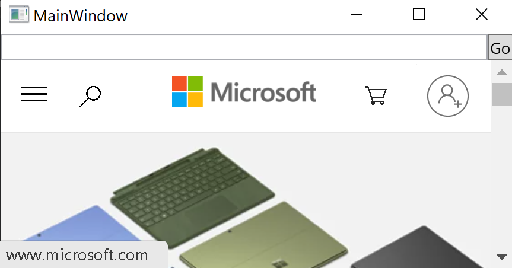

- 📝Definition
	- The Microsoft Edge WebView2 control allows you to embed web technologies (HTML, CSS, and JavaScript) in your native apps. The WebView2 control uses [Microsoft Edge](https://www.microsoftedgeinsider.com/) as the rendering engine to display the web content in native apps.
- 🔗Link
	- https://learn.microsoft.com/en-us/microsoft-edge/webview2/
	- https://learn.microsoft.com/en-us/microsoft-edge/webview2/concepts/overview-features-apis?tabs=dotnetcsharp
	- https://learn.microsoft.com/en-us/microsoft-edge/webview2/get-started/wpf
- ⌨Sample Code
	- [[WPF]] Simple Project
		- Diagram
			- Embed a browser in WPF!!
			  {:height 200, :width 200}
		- XAML `MainWindow.xaml`
			- ``` xaml
			  <Window x:Class="WPF_Getting_Started.MainWindow"
			        xmlns="http://schemas.microsoft.com/winfx/2006/xaml/presentation"
			        xmlns:x="http://schemas.microsoft.com/winfx/2006/xaml"
			        xmlns:d="http://schemas.microsoft.com/expression/blend/2008"
			        xmlns:mc="http://schemas.openxmlformats.org/markup-compatibility/2006"
			        xmlns:local="clr-namespace:{YOUR PROJECT NAME}"
			        xmlns:wv2="clr-namespace:Microsoft.Web.WebView2.Wpf;assembly=Microsoft.Web.WebView2.Wpf"
			        mc:Ignorable="d"
			        Title="MainWindow"
			        Height="450"
			        Width="800"
			  >
			     <DockPanel>
			      <DockPanel DockPanel.Dock="Top">
			          <Button x:Name="ButtonGo" DockPanel.Dock="Right" Click="ButtonGo_Click" Content="Go"/>
			          <TextBox Name = "addressBar"/>
			      </DockPanel>
			      <wv2:WebView2 Name = "webView"
			                    Source = "https://www.microsoft.com"
			      />
			  	</DockPanel>
			  </Window>
			  
			  ```
			- Few things to be observed.
				- 1️⃣Declare the `WebView2` namespace -> `xmlns:wv2`
				- 2️⃣Init an `WebView2` instance -> `wv2:WebView2`. a.k.a. the `webview` is an user control.
				-
		- Behind Code `MainWindow.xaml.cs`
			- ``` C#
			  using Microsoft.Web.WebView2.Core;
			  
			  namespace WpfApp1
			  {
			  
			     public partial class MainWindow : Window
			     {
			        public MainWindow()
			        {
			              InitializeComponent();
			              webView.NavigationStarting += EnsureHttps;  //👈from here you can tell webview is an instance
			        }
			        void ButtonGo_Click(object sender, RoutedEventArgs e)
			        {
			              if (webView != null && webView.CoreWebView2 != null)
			              {
			                 webView.CoreWebView2.Navigate(addressBar.Text);  //👈navigate to certain website
			              }
			        }
			        void EnsureHttps(object sender, CoreWebView2NavigationStartingEventArgs args)
			        {
			            String uri = args.Uri;
			            if (!uri.StartsWith("https://"))
			            {
			            	  webView.CoreWebView2.ExecuteScriptAsync($"alert('{uri} is not safe, try an https link')");
			                args.Cancel = true;
			            }
			        }
			     }
			  }
			  ```